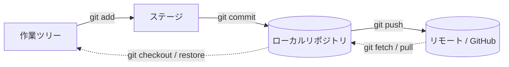

# Git の基本

チーム開発に入る前に、Git の中核となる「3 つの領域」と基本コマンドを押さえます。ここを理解しておくと、以降の操作の多くが応用として飲み込みやすくなります。

## 3 つの領域とコミットの流れ

Git は変更を 3 つの領域で管理します。

| 領域 | 役割 |
| --- | --- |
| **作業ツリー (Working Tree)** | 実際に編集しているファイル群 |
| **ステージ (Index)** | 次のコミットに含める変更を一時的に置く場所 |
| **リポジトリ (Repository)** | コミットとして履歴が確定する場所 |



`git add` で**コミットに含める変更を選び**、`git commit` で**履歴として確定する**。この 2 段階に分かれているので、「関連する変更だけをまとめてコミットする」ことができます。

## リポジトリを作る

```bash
# 新規作成
git init

# 既存のリポジトリを複製
git clone git@github.com:user/repo.git
```

## 基本サイクル

日々の作業は次のサイクルの繰り返しです。

```bash
# 1. 現在の状態を確認
git status

# 2. 変更内容を確認
git diff

# 3. コミットに含める変更を選ぶ
git add file.txt        # 特定のファイル
git add .               # すべての変更

# 4. コミット（履歴に確定）
git commit -m "ログイン機能を追加"

# 5. 履歴を確認
git log --oneline --graph
```

## 状態を確認するコマンド

| コマンド | 用途 |
| --- | --- |
| `git status` | 変更・ステージ状況を確認 |
| `git diff` | 作業ツリーとステージの差分 |
| `git diff --staged` | ステージとリポジトリの差分 |
| `git log --oneline` | コミット履歴を 1 行で表示 |
| `git show <commit>` | 特定コミットの詳細 |

## 次のステップ

ここまでで「Git がどう変更を記録するか」を押さえました。実際のチーム開発では、**どんな単位でコミットし、メッセージをどう書くか**が履歴の読みやすさを左右します。その作法は [コミットとコミットメッセージ](./commits) で扱います。
