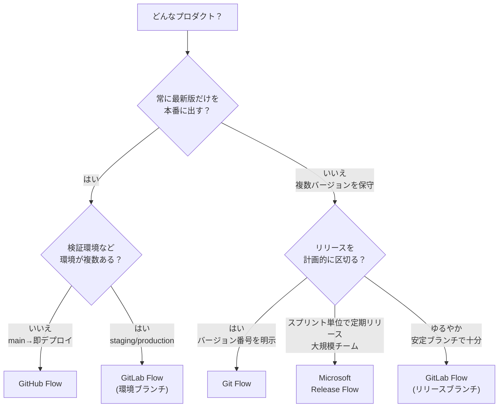

# ブランチ戦略の使い分け

[GitHub Flow](./github-flow) / [Git Flow](./other-flows#git-flow) / [GitLab Flow](./other-flows#gitlab-flow) / [Microsoft Release Flow](./other-flows#microsoft-release-flow) は、どれが「正解」ということはなく、**プロダクトの性質とデプロイの仕方**によって向き不向きが決まります。**普遍の「正解」は無い**ものの、本教材の既定（推奨）は最もシンプルな **GitHub Flow** で、迷ったらここから始めるのを勧めます。このページは、自チームに合った戦略を選ぶための判断材料をまとめます。

## 一覧で比較

| 観点 | GitHub Flow | GitLab Flow | Git Flow | Microsoft Release Flow |
| --- | --- | --- | --- | --- |
| 常設ブランチ | `main` のみ | `main` ＋環境/リリース | `main` ＋ `develop` | `main` ＋長命 `release` |
| ブランチの種類 | 少 | 中 | 多 | 中 |
| 学習コスト | 低 | 中 | 高 | 中 |
| デプロイ形態 | 継続的デプロイ | 継続的〜環境昇格 | 計画的リリース | スプリント単位のリリース |
| 複数バージョン保守 | 苦手（リリースブランチ運用で補完） | 得意 | 得意 | 得意（main-first + cherry-pick） |
| 向くプロダクト | Web サービス／SaaS | 環境が複数ある Web | パッケージ／モバイル／組込 | 大規模チーム／定期リリース |

## 判断フローチャート

## ユースケース別の推奨

### 継続的にデプロイする Web サービス／SaaS

**推奨: [GitHub Flow](./github-flow)**。`main` にマージしたら即デプロイ。短命ブランチ＋PR レビューだけで回り、最もシンプル。本チュートリアルのリポジトリもこれで運用しています。

### 検証環境・本番環境が分かれている Web アプリ

**推奨: [GitLab Flow](./other-flows#gitlab-flow)（環境ブランチ）**。「いま本番に何が出ているか」をブランチで表現でき、`main` → `staging` → `production` の昇格フローが作れます。

### バージョン番号を明示して出荷するソフトウェア

**推奨: [Git Flow](./other-flows#git-flow) または [GitLab Flow](./other-flows#gitlab-flow)（リリースブランチ）**。複数バージョンを並行して保守でき、`release/*` / 安定ブランチと `hotfix/*` で計画的なリリースと緊急修正を両立できます。実際の運用例は [複数バージョンの保守（リリースブランチ運用）](./release-branches) を参照。

### 大規模チームで定期リリースしつつ複数版を保守する

**推奨: [Microsoft Release Flow](./other-flows#microsoft-release-flow)**。GitHub Flow を土台に、リリースを**長命な `release` ブランチ**で表し、修正は **main-first + cherry-pick** で各版へ配ります。命名規則やブランチフォルダ強制で大人数の運用を機械的に揃えたいチームに向きます。

## 迷ったら小さく始める

最初から複雑な戦略を選ぶ必要はありません。**まず GitHub Flow で始め**、次のような「痛み」が出てきてから段階的に足すのが安全です。

- 出荷済みバージョンを保守する必要が出た → **リリース／安定ブランチ**を足す（GitLab Flow 相当）
- 環境ごとのデプロイ状態を管理したくなった → **環境ブランチ**を足す
- リリースを計画的に区切りたくなった → **`develop` / `release`** を導入（Git Flow 相当）

戦略はチームの成熟度に合わせて育てるもので、**乗り換えは可能**です。過剰な作り込みより、いま必要な最小構成から始めましょう。

## 関連ページ

- [GitHub Flow](./github-flow)
- [他のブランチ戦略（Git Flow / GitLab Flow / Release Flow）](./other-flows)
- [複数バージョンの保守（リリースブランチ運用）](./release-branches)
- [リリースとバージョン管理](./release)
