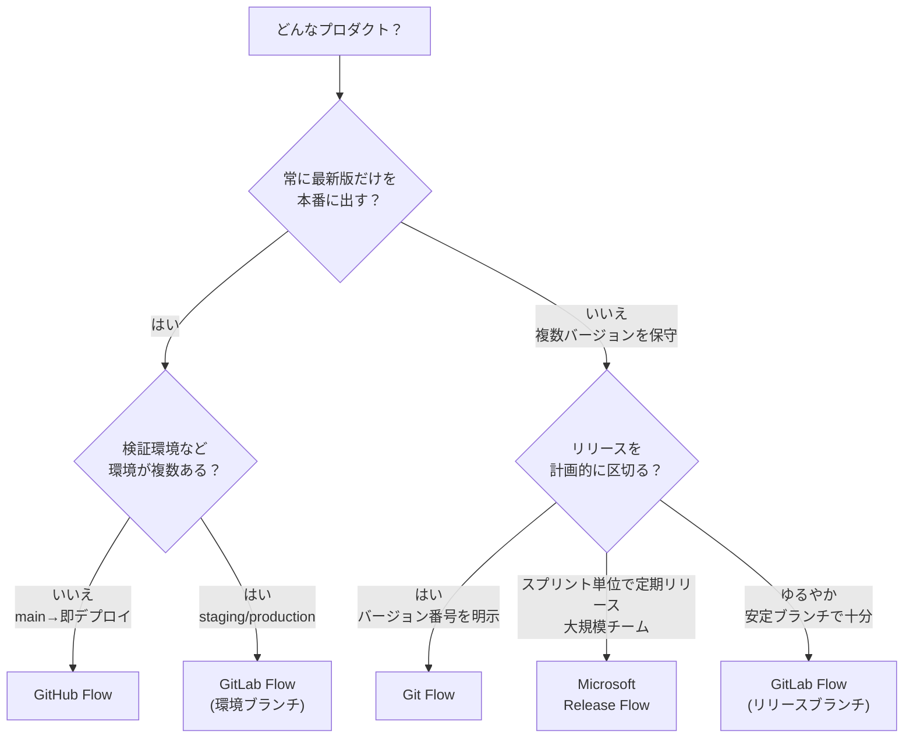

# ブランチ戦略の使い分け

[GitHub Flow](./github-flow) / [Git Flow](./other-flows#git-flow) / [GitLab Flow](./other-flows#gitlab-flow) / [Microsoft Release Flow](./other-flows#microsoft-release-flow) は、どれが「正解」ということはなく、**プロダクトの性質とデプロイの仕方**によって向き不向きが決まります。このページは、自チームに合った戦略を選ぶための判断材料をまとめます。

## 一覧で比較

| 観点 | GitHub Flow | GitLab Flow | Git Flow | Microsoft Release Flow |
| --- | --- | --- | --- | --- |
| 常設ブランチ | `main` のみ | `main` ＋環境/リリース | `main` ＋ `develop` | `main` ＋長命 `release` |
| ブランチの種類 | 少 | 中 | 多 | 中 |
| 学習コスト | 低 | 中 | 高 | 中 |
| デプロイ形態 | 継続的デプロイ | 継続的〜環境昇格 | 計画的リリース | スプリント単位のリリース |
| 複数バージョン保守 | 苦手（リリースブランチ運用で補完） | 得意 | 得意 | 得意（main-first + cherry-pick） |
| 向くプロダクト | Web サービス／SaaS | 環境が複数ある Web | パッケージ／モバイル／組込 | 大規模チーム／定期リリース |

## 判断フローチャート

## ユースケース別の向き不向き

### 継続的にデプロイする Web サービス／SaaS

**[GitHub Flow](./github-flow) が向きます**。`main` にマージしたら即デプロイ、という単線で回せるためです。常設ブランチは `main` だけで、短命ブランチと PR レビューがあれば足ります。ただし「マージ＝本番反映」なので、[タグや GitHub Release](./release) を別途残さない限り、出荷したバージョンを後から特定しにくくなります。監査や変更管理で「どの版が本番に出ているか」を追う必要があるなら、デプロイの起点を `main` への push ではなく**タグ / GitHub Release** に置く構成も検討します。

### 検証環境・本番環境が分かれている Web アプリ

**[GitLab Flow](./other-flows#gitlab-flow)（環境ブランチ）**を使うと、「いま本番に何が出ているか」をブランチで表現でき、`main` → `staging` → `production` の昇格フローが作れます。代償として、環境をブランチで表すと**環境間でコードがドリフトし、昇格のマージ経路が組み合わせで増えていく**問題を抱え込みます。ブランチを増やさず、**GitHub Environments とデプロイパイプライン**に「いまどの環境に何が出ているか」を持たせる構成も取れます。この場合、本番へ流す起点はブランチへの push ではなくタグになります。

### バージョン番号を明示して出荷するソフトウェア

**[Git Flow](./other-flows#git-flow) または [GitLab Flow](./other-flows#gitlab-flow)（リリースブランチ）**が向きます。複数バージョンを並行して保守でき、`release/*` / 安定ブランチと `hotfix/*` で計画的なリリースと緊急修正を両立できます。実際の運用例は [複数バージョンの保守（リリースブランチ運用）](./release-branches) を参照。

### 大規模チームで定期リリースしつつ複数版を保守する

**[Microsoft Release Flow](./other-flows#microsoft-release-flow)**が向きます。GitHub Flow を土台に、リリースを**長命な `release` ブランチ**で表し、修正は **main-first + cherry-pick** で各版へ配ります。命名規則やブランチフォルダ強制で大人数の運用を機械的に揃えたいチームに向きます。

## 戦略を足すきっかけ

常設ブランチが増えるほど、マージ経路とブランチ間の同期の手間も増えます。裏を返せば、次のような「痛み」が実際に出てから足す、という育て方ができます。

- 出荷済みバージョンを保守する必要が出た → **リリース／安定ブランチ**を足す（GitLab Flow 相当）
- 環境ごとのデプロイ状態を管理したくなった → **環境ブランチ**を足す（ドリフトと昇格経路の複雑化を引き受けることになるので、GitHub Environments で代替できないか先に検討する）
- リリースを計画的に区切りたくなった → **`develop` / `release`** を導入（Git Flow 相当）

戦略はチームの成熟度に合わせて育てるもので、**乗り換えは可能**です。まだ必要になっていない仕組みを先に入れると、その運用コストだけが先に発生します。

## 関連ページ

- [GitHub Flow](./github-flow)
- [他のブランチ戦略（Git Flow / GitLab Flow / Release Flow）](./other-flows)
- [複数バージョンの保守（リリースブランチ運用）](./release-branches)
- [リリースとバージョン管理](./release)
