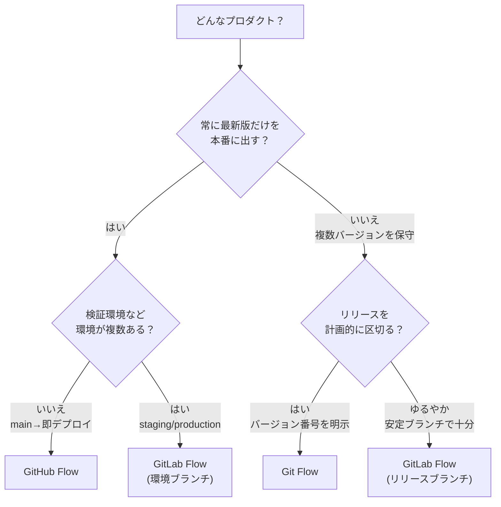

# ブランチ戦略の使い分け

[GitHub Flow](./github-flow) / [Git Flow](./git-flow) / [GitLab Flow](./gitlab-flow) は、どれが「正解」ということはなく、**プロダクトの性質とデプロイの仕方**によって向き不向きが決まります。このページは、自チームに合った戦略を選ぶための判断材料をまとめます。

## 一覧で比較

| 観点 | GitHub Flow | GitLab Flow | Git Flow |
| --- | --- | --- | --- |
| 常設ブランチ | `main` のみ | `main` ＋環境/リリース | `main` ＋ `develop` |
| ブランチの種類 | 少 | 中 | 多 |
| 学習コスト | 低 | 中 | 高 |
| デプロイ形態 | 継続的デプロイ | 継続的〜環境昇格 | 計画的リリース |
| 複数バージョン保守 | 苦手（release で補完） | 得意 | 得意 |
| 向くプロダクト | Web サービス／SaaS | 環境が複数ある Web | パッケージ／モバイル／組込 |

## 判断フローチャート

## ユースケース別の推奨

### 継続的にデプロイする Web サービス／SaaS

**推奨: [GitHub Flow](./github-flow)**。`main` にマージしたら即デプロイ。短命ブランチ＋PR レビューだけで回り、最もシンプル。本チュートリアルのリポジトリもこれで運用しています。

### 検証環境・本番環境が分かれている Web アプリ

**推奨: [GitLab Flow](./gitlab-flow)（環境ブランチ）**。「いま本番に何が出ているか」をブランチで表現でき、`main` → `staging` → `production` の昇格フローが作れます。

### バージョン番号を明示して出荷するソフトウェア

**推奨: [Git Flow](./git-flow) または [GitLab Flow](./gitlab-flow)（リリースブランチ）**。複数バージョンを並行して保守でき、`release` / 安定ブランチと `hotfix` で計画的なリリースと緊急修正を両立できます。実際の運用例は [複数バージョンの保守（リリースブランチ）](./release-branches) を参照。

## 迷ったら小さく始める

最初から複雑な戦略を選ぶ必要はありません。**まず GitHub Flow で始め**、次のような「痛み」が出てきてから段階的に足すのが安全です。

- 出荷済みバージョンを保守する必要が出た → **リリース／安定ブランチ**を足す（GitLab Flow 相当）
- 環境ごとのデプロイ状態を管理したくなった → **環境ブランチ**を足す
- リリースを計画的に区切りたくなった → **`develop` / `release`** を導入（Git Flow 相当）

戦略はチームの成熟度に合わせて育てるもので、**乗り換えは可能**です。過剰な作り込みより、いま必要な最小構成から始めましょう。

## 関連ページ

- [GitHub Flow](./github-flow)
- [Git Flow](./git-flow)
- [GitLab Flow](./gitlab-flow)
- [複数バージョンの保守（リリースブランチ）](./release-branches)
- [リリースとバージョン管理](./release)
