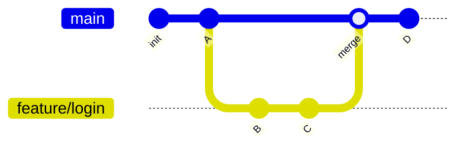
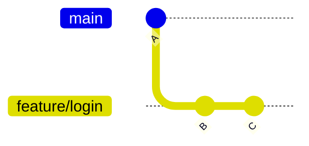
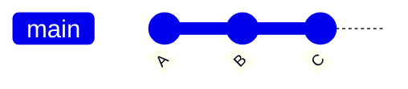
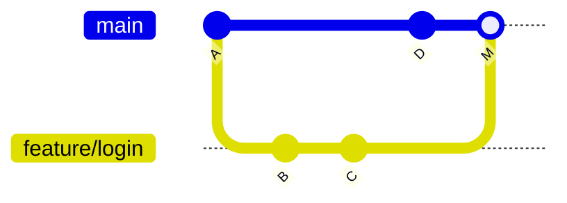

# ブランチとマージ

ブランチは Git の最大の武器です。**作業を分離し、並行開発を可能にする**ことで、チーム開発が成立します。

## ブランチとは

ブランチは「コミットの履歴の流れ」を分岐させる仕組みです。`main` から枝分かれして作業し、完成したら戻す（マージする）のが基本パターンです。



機能ごとにブランチを切ることで、`main` を常に動作する状態に保ちながら、複数人が同時に別々の機能を開発できます。

## ブランチの基本操作

```bash
# ブランチ一覧
git branch

# ブランチを作成して切り替え（推奨: 一発で行う）
git switch -c feature/login
# 旧来の書き方: git checkout -b feature/login

# 既存ブランチへ切り替え
git switch main

# ブランチを削除（マージ済み）
git branch -d feature/login
```

::: tip ブランチ命名規則
チームでは `feature/`, `fix/`, `hotfix/`, `chore/` などの接頭辞を付けると整理しやすくなります。例: `feature/user-profile`, `fix/login-error`
:::

## マージの 2 つの形

### Fast-forward マージ

分岐後に **`main` 側が進んでいない**場合、`main` のポインタを `feature/login` の先端まで進めるだけで取り込めます。**マージコミットは作られず**、履歴は一直線のままです。

取り込み前——`main` は `A` のまま、`feature/login` だけが `B`・`C` と先に進んでいる状態:



`main` に切り替えて `git merge feature/login` すると、`main` のポインタが `C` まで進むだけ（fast-forward）。枝分かれは残らず、下のように一直線になります:



### 3-way マージ（マージコミット）

分岐後に**両方のブランチが進んでいる**場合（`feature/login` が `B`・`C`、`main` が `D` と別々に進んだ状態）、両者を統合する「マージコミット `M`」が作られます。



```bash
# main に feature/login を取り込む
git switch main
git merge feature/login

# 常にマージコミットを作りたい場合
git merge --no-ff feature/login
```

::: info `--no-ff` の使いどころ
`--no-ff` を付けると fast-forward 可能な場合でも必ずマージコミットを作ります。「どの機能ブランチがいつ統合されたか」を履歴に残せるため、チームによってはこれを標準にしています。
:::

ここで見た**ローカルの merge の形（Fast-forward / 3-way）**を踏まえると、GitHub 上で PR をマージするときの **Merge commit / Squash and merge / Rebase and merge** の選び方が理解しやすくなります。その使い分けは [プルリクエストとレビュー（マージ方式の比較）](./pull-request#マージ方式の比較) を参照してください。

## マージとリベースの違い（予告）

履歴を一直線に整えたい場合は `merge` ではなく `rebase` を使う選択肢もあります。これは [rebase と履歴整理](./rebase) で詳しく扱います。

なお、作業の途中で別のブランチに切り替えたくなったら、変更を一時退避できる [git stash で一時退避](./stash) が便利です。

次は、ローカルのブランチを GitHub と同期する [リモートと GitHub](./remote) です。
