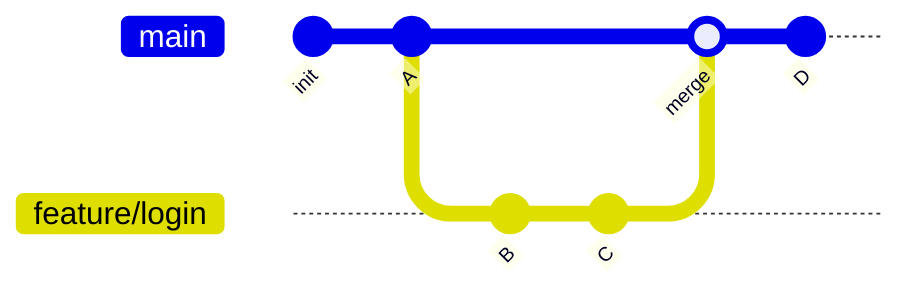

# ブランチ

ブランチは、**作業を分離して並行開発を可能にする**仕組みです。これがあることで、チームでの開発が成立します。

## ブランチとは

ブランチは「コミットの履歴の流れ」を分岐させる仕組みです。`main` から枝分かれして作業し、完成したら戻す（マージする）のが基本パターンです。



機能ごとにブランチを切ることで、`main` を常に動作する状態に保ちながら、複数人が同時に別々の機能を開発できます。

## ブランチの基本操作

```bash
# ブランチ一覧
git branch

# ブランチを作成して切り替え（推奨: 一発で行う）
git switch -c feature/login
# 旧来の書き方: git checkout -b feature/login

# 既存ブランチへ切り替え
git switch main

# ブランチを削除（マージ済み）
git branch -d feature/login
```

> [!TIP]
> **ブランチ命名規則**
>
> チームでは `feature/`, `fix/`, `hotfix/`, `chore/` などの接頭辞を付けると整理しやすくなります。例: `feature/user-profile`, `fix/login-error`

## 作業の途中でブランチを切り替えたいとき

作業の途中で別のブランチに切り替えたくなったら、変更を一時退避できる [git stash で一時退避](./stash) が便利です。
