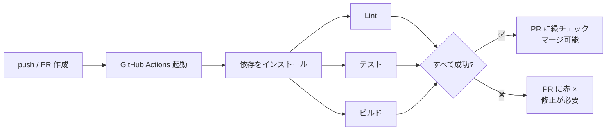
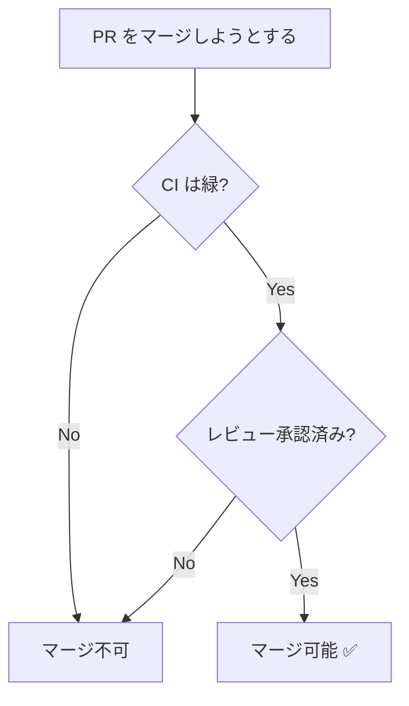

# CI 連携 (GitHub Actions)

CI（継続的インテグレーション）は、コードが push されるたびに**自動でテスト・ビルド・チェック**を走らせる仕組みです。GitHub Actions を使えば、リポジトリ内の設定ファイルだけで実現できます。

## なぜ CI が必要か

- PR ごとに自動でテストが走り、**壊れた変更がマージされるのを防ぐ**
- レビュアーは「CI が緑か」をまず確認でき、レビューの負荷が下がる
- フォーマット・Lint・型チェックを自動化し、議論を本質に集中できる

## PR を起点としたパイプライン

## どんな CI が走るのか

「CI」とひとくちに言っても、実際に走る中身はプロジェクトによってさまざまです。代表的な種類を挙げます。

| 種類 | 何をするか |
| --- | --- |
| Lint | 実行せずに規約違反を検出する |
| フォーマッター | コード整形を統一する |
| 自動テスト | 壊れた変更を検出する |
| ビルド | 成果物が作れることを保証する |
| 規約チェック | PR タイトルや設定の整合を検査する |
| 自動ラベル付け | 雑務を肩代わりする |
| AI レビュー | LLM が差分をレビューする |
| セキュリティ・依存監査 | 脆弱性や危険な設定を検出する |
| 定期実行・デプロイ | PR 以外を起点に自動化する |

### Lint（静的解析）

コードを実行せずに、構文・規約違反・怪しい書き方を検出します。ESLint（JavaScript）、RuboCop（Ruby）、markdownlint（Markdown）などが代表例です。人間がレビューで指摘するには細かすぎる点を機械に任せ、レビューを設計や仕様の議論に集中させるのが狙いです。

対象はコードだけではありません。ドキュメントが主成果物のプロジェクトなら、**textlint のようなツールで日本語そのものを Lint の対象**にできます。

### フォーマッター

インデント・改行・引用符といった見た目の統一を、機械的に整形して揃えます。Prettier、gofmt、Black などが代表例です。Lint が「違反を指摘する」のに対し、フォーマッターは「直してしまう」点が違います。整形が自動化されていれば、レビューで「スペースが 1 つ多い」といった指摘は不要になります。

CI では、整形済みかどうかを検査して差分があれば落とす使い方（`prettier --check`）が一般的です。CI が整形コミットを自動で積む方法もありますが、前者のほうが挙動を読みやすくなります。

### 自動テスト

コードの振る舞いを検証します。Jest、pytest、Go の `go test` などが代表例です。CI の中核であり、「テストが通らない変更はマージできない」という状態をつくることで、`main` を常に動く状態に保ちます。

### ビルド

成果物が実際に作れることを確認します。コンパイルエラーはもちろん、設定ミスや壊れた参照もここで見つかります。ドキュメントサイトにおける「ビルドが通る」は、「全ページが生成でき、内部リンクが切れておらず、図が描画できる」という意味になります。

### 規約チェック

チームで決めたルールが守られているかを検査します。コミットメッセージの形式、PR タイトルの命名、設定ファイルの整合性などが対象です。

とくに Squash Merge を使う場合、**PR タイトルがそのまま `main` のコミットメッセージ**になります。タイトルの検証は履歴の品質に直結します。

### 自動ラベル付け・雑務の自動化

CI は「検査して落とす」だけではありません。**人手でやると忘れがちな作業を肩代わりする**用途も同じくらい重要です。PR の種別に応じたラベル付け、リリースノートの下書き、クローズ済み Issue からの作業中ラベルの除去などがこれにあたります。

どれも人間がやっても構わない作業ですが、忘れると一覧の意味が薄れます。機械に任せれば確実です。

### AI レビュー

近年は、PR の差分を LLM に読ませてレビューコメントを投稿するワークフローも一般的になりました。GitHub Actions 上でモデルに差分を渡し、返ってきた指摘を Reviews API 経由で行単位のコメントとして投稿する構成です。Claude Code Action や CodeRabbit などのツールがあります。

人間のレビュアーが見る前に明らかなミスを潰せる一方、指摘の精度は完璧ではありません。**人間のレビューを置き換えるものではなく、前段のフィルタ**として位置づけるのが現実的です。

### セキュリティ・依存監査

依存ライブラリの脆弱性や、CI 設定そのものの危険な書き方を検出します。ワークフローは外部から与えられた入力を扱い、強い権限で動くことがあります。**CI 設定そのものが監査の対象になる**、という点は見落とされがちです。

### 定期実行とデプロイ（CD）

CI のトリガーは PR だけではありません。cron による定期実行や、`main` への push も起点になります。たとえば外部リンクの死活検査は、外部サイトがこちらの都合と無関係に消える以上、PR 時ではなく定期実行が向いています。

`main` への push をきっかけにしたデプロイは、正確には CI ではなく **CD（継続的デリバリー / デプロイ）** です。CI が「マージしてよい状態か」を検査するのに対し、CD は「検査を通った変更を届ける」役割を担います。GitHub Actions は両方を同じ仕組みで書けるため、実務ではまとめて「CI/CD」と呼ばれます。

::: tip 実際に動かしてみる
[実習 ⑦ CI を動かす](../hands-on/ci-lab) では、Lint とビルドが PR で実際に走る様子を確認し、成功（緑）と失敗（赤）の読み解き方を練習します。
:::

## OSS ではどう使われているか

大規模な OSS ほど、CI は「テストを走らせる装置」から離れていきます。**レビューとマージの進行そのものを CI が引き受ける**ようになるためです。規模の違う 3 例を見てみます。

### React — 1 つの PR で 20 以上のジョブが走る

React の [runtime_build_and_test.yml](https://github.com/facebook/react/blob/main/.github/workflows/runtime_build_and_test.yml) は、1 本のワークフローに 20 以上のジョブを並べています。型チェック（Flow）、Lint、ユニットテスト、複数ビルド構成の検証、DevTools の E2E テストなどです。

目を引くのは **`sizebot`** というジョブです。バンドルサイズの増減を測って PR に報告します。React はブラウザに配信されるライブラリなので、「動くこと」に加えて「重くなっていないこと」も守るべき品質だからです。**何を CI で守るかは、そのプロジェクトが何を大事にしているかの表明**でもあります。

### Rust — マージ前に「マージ後の状態」をテストする

CI が緑の PR を 2 つ、それぞれ独立にマージしたら `main` が壊れる。この現象は普通に起こります。各 PR は「自分が分岐した時点の `main`」でしかテストされていないからです。

Rust は [bors](https://github.com/rust-lang/bors) というマージボットでこれを防いでいます。レビュアーが `@bors r+` と書くと、bors は PR を `main` にマージした結果を `automation/bors/auto` ブランチに置き、**そのマージ結果に対してフル CI を回します**。緑になって初めて `main` へ進みます。[rust-lang/rust の ci.yml](https://github.com/rust-lang/rust/blob/main/.github/workflows/ci.yml) がこのブランチへの push で起動するのは、そのためです。

「マージ後の `main` は必ず緑」を保証するこの考え方は、GitHub の **merge queue** 機能として一般にも使えます。後述のブランチ保護をさらに一歩進めたものと考えてください。

### Kubernetes — CI がレビューとマージのガバナンスになる

Kubernetes は規模が大きすぎて、そもそも GitHub Actions を使っていません。[Prow](https://docs.prow.k8s.io/docs/overview/) という自前の CI/CD システム（Kubernetes 上で動く）が PR を捌きます。Prow が担うのはテスト実行だけではありません。

- **`/lgtm`・`/approve` のチャットコマンド** — レビュアーが PR にコメントを書くと、ボットがラベルを付け替える
- **OWNERS ファイル** — ディレクトリごとに承認できる人をリポジトリ内で宣言し、Prow が権限を照合する
- **Tide による自動マージ** — 条件を満たした PR をまとめてテストし、通れば自動でマージする

レビュー・承認・マージという**プロセスそのものがコードとして書かれ、ボットが実行**しています。人間は判断だけを担当します。Prow は OpenShift や Istio、Knative などでも使われています。

### 規模とともに CI の役割は変わる

3 つを並べると、CI の重心が移っていくのが分かります。

| 規模 | CI の主な役割 |
| --- | --- |
| 小〜中 | 壊れた変更を弾く（Lint・テスト・ビルド） |
| 大 | プロジェクト固有の品質を守る（React の `sizebot`） |
| 超大規模 | マージ順序とレビュー権限を統制する（Rust の bors、Kubernetes の Prow） |

いきなり Prow を導入する必要はありません。ただ、**手作業が増えてきたら「これは CI に任せられないか」と考える**習慣は、規模を問わず有効です。

## ブランチ保護と組み合わせる

CI の効果を最大化するには、GitHub の **Branch protection rules** で `main` を保護します。

- ✅ **Require status checks to pass** — CI が緑でないとマージできない
- ✅ **Require a pull request before merging** — 直接 push を禁止
- ✅ **Require approvals** — レビュー承認を必須にする

これにより「テストが通り、レビューを受けた変更だけが `main` に入る」という安全な状態を強制できます。

::: tip 段階的に導入する
チェックを増やすほど CI は遅くなり、フィードバックが返るまでの待ち時間が伸びます。最初はテスト実行だけにして、Lint・型チェック・カバレッジ計測を少しずつ足していけば、どのチェックが実行時間を占めているかを把握しながら育てられます。CI が遅すぎると開発の足かせになるため、依存のキャッシュも重要になります。
:::

ここまでがチーム開発の基本フローです。`main` の変更を出荷単位として確定する [リリースとバージョン管理](./release) は、発展的なトピックとして後の章で扱います。困ったときは [トラブルシューティング](./troubleshooting)、操作を忘れたら [コマンド早見表](./commands) を参照してください。
