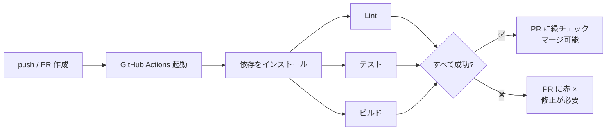
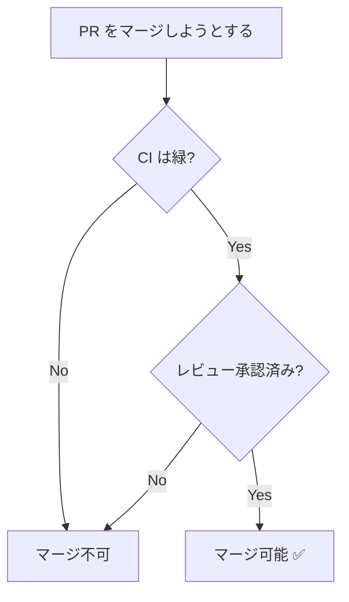

# CI 連携 (GitHub Actions)

CI（継続的インテグレーション）は、コードが push されるたびに**自動でテスト・ビルド・チェック**を走らせる仕組みです。GitHub Actions を使えば、リポジトリ内の設定ファイルだけで実現できます。

## なぜ CI が必要か

- PR ごとに自動でテストが走り、**壊れた変更がマージされるのを防ぐ**
- レビュアーは「CI が緑か」をまず確認でき、レビューの負荷が下がる
- フォーマット・Lint・型チェックを自動化し、議論を本質に集中できる

## PR を起点としたパイプライン



## どんな CI が走るのか

「CI」とひとくちに言っても、実際に走る中身はプロジェクトによってさまざまです。ここでは代表的な種類を挙げ、あわせて**このリポジトリで実際に動いているワークフロー**を紹介します。設定ファイルは [.github/workflows/](https://github.com/ykgw-daiki-nakamura/nakamura-git-tutorial/tree/main/.github/workflows) にあり、PR を出すたびに動いています。

| 種類 | 何をするか | このリポジトリの実例 |
| --- | --- | --- |
| Lint | 実行せずに規約違反を検出 | `ci.yml` の `lint` ジョブ |
| フォーマッター | コード整形の統一 | 独立したジョブは持たない |
| 自動テスト | 壊れた変更の検出 | `ci.yml` の `test-hooks` ジョブ |
| ビルド | 成果物が作れることの保証 | `ci.yml` の `build` ジョブ |
| 規約チェック | PR タイトル・設定の整合 | `pr-title.yml` / `ci.yml` の `config-check` |
| 自動ラベル付け | 雑務の肩代わり | `pr-label.yml` / `issue-label-cleanup.yml` |
| AI レビュー | LLM による差分レビュー | ワークフローとしては未導入 |
| セキュリティ・依存監査 | 脆弱性・危険な設定の検出 | `ci.yml` の `dependency-review` / `workflow-lint.yml` |
| 定期実行・デプロイ | PR 以外を起点にした自動化 | `links.yml` / `deploy.yml` |

### Lint（静的解析）

コードを実行せずに、構文・規約違反・怪しい書き方を検出します。ESLint（JavaScript）、RuboCop（Ruby）、markdownlint（Markdown）などが代表例です。人間がレビューで指摘するには細かすぎる点を機械に任せ、レビューを設計や仕様の議論に集中させるのが狙いです。

このリポジトリでは [ci.yml](https://github.com/ykgw-daiki-nakamura/nakamura-git-tutorial/blob/main/.github/workflows/ci.yml) の `lint` ジョブが 2 種類の Lint を走らせます。

- `npm run lint:md` — markdownlint による Markdown の整形チェック
- `npm run lint:text` — textlint による日本語の文章チェック（表記ゆれ・冗長表現）

文章を主成果物とするドキュメントサイトなので、コードだけでなく**日本語そのものを Lint の対象にしている**のが特徴です。

### フォーマッター

インデント・改行・引用符といった見た目の統一を、機械的に整形して揃えます。Prettier、gofmt、Black などが代表例です。Lint が「違反を指摘する」のに対し、フォーマッターは「直してしまう」点が違います。整形が自動化されていれば、レビューで「スペースが 1 つ多い」といった指摘は不要になります。

CI での使い方は 2 通りあります。整形済みかどうかを検査して差分があれば落とす方法（`prettier --check`）と、CI が整形コミットを自動で積む方法です。前者のほうが挙動を読みやすく、広く採られています。

このリポジトリは Markdown が中心で、整形の役割は markdownlint が兼ねているため、独立したフォーマッタージョブは持っていません。

### 自動テスト

コードの振る舞いを検証します。Jest、pytest、Go の `go test` などが代表例です。CI の中核であり、「テストが通らない変更はマージできない」という状態をつくることで、`main` を常に動く状態に保ちます。

このリポジトリのテスト対象は、アプリケーションのコードではなく**開発ハーネス自体**です。`ci.yml` の `test-hooks` ジョブが `npm run test:hooks` を実行し、コミットや push を検査するガードフックの回帰テストを走らせます。ガードが誤って正当な操作を止めたり、逆に危険な操作を見逃したりしないことを確認します。

### ビルド

成果物が実際に作れることを確認します。コンパイルエラーはもちろん、設定ミスや壊れた参照もここで見つかります。

このリポジトリでは `build` ジョブが次の 2 つを実行します。

- `npm run docs:check-nav` — サイドバー設定と実ファイルの整合を検査
- `npm run docs:build` — VitePress によるビルド。**内部リンク切れと Mermaid の構文エラーを検知する**

ドキュメントサイトにおける「ビルドが通る」は、「全ページが生成でき、リンクが切れておらず、図が描画できる」という意味になります。ローカルで `npm run docs:build` を通してから push すれば、CI で落ちる回数を減らせます。

### 規約チェック

チームで決めたルールが守られているかを検査します。コミットメッセージの形式、PR タイトルの命名、設定ファイルの整合性などが対象です。

このリポジトリには 2 つあります。

- [pr-title.yml](https://github.com/ykgw-daiki-nakamura/nakamura-git-tutorial/blob/main/.github/workflows/pr-title.yml) — **PR タイトルが Conventional Commits 準拠か**を検証する。Squash Merge では PR タイトルがそのまま `main` のコミットメッセージになるため、履歴の品質に直結する
- `ci.yml` の `config-check` ジョブ — 設定ファイルと実体（フックの配線、実在するラベル）がずれていないかを検査する

### 自動ラベル付け・雑務の自動化

CI は「検査して落とす」だけではありません。**人手でやると忘れがちな作業を肩代わりする**用途も同じくらい重要です。ラベル付け、リリースノートの下書き、Issue の自動クローズなどがこれにあたります。

- [pr-label.yml](https://github.com/ykgw-daiki-nakamura/nakamura-git-tutorial/blob/main/.github/workflows/pr-label.yml) — PR タイトルの type から `type: feat` などのラベルを自動付与する
- [issue-label-cleanup.yml](https://github.com/ykgw-daiki-nakamura/nakamura-git-tutorial/blob/main/.github/workflows/issue-label-cleanup.yml) — Issue がクローズされたら、着手中を示す `status: in-progress` ラベルを自動で外す

どちらも人間がやっても構わない作業ですが、忘れると一覧の意味が薄れます。機械に任せれば確実です。

### AI レビュー

近年は、PR の差分を LLM に読ませてレビューコメントを投稿するワークフローも一般的になりました。GitHub Actions 上でモデルに差分を渡し、返ってきた指摘を Reviews API 経由で行単位のコメントとして投稿する構成です。Claude Code Action や CodeRabbit などのツールがあります。

人間のレビュアーが見る前に明らかなミスを潰せる一方、指摘の精度は完璧ではありません。**人間のレビューを置き換えるものではなく、前段のフィルタ**として位置づけるのが現実的です。

::: warning このリポジトリでは
AI レビューを **GitHub Actions のワークフローとしては導入していません**。代わりに、ローカルの Claude Code から `.claude/skills/pr-review-watch` を起動し、新規 PR を検知したらレビューを投稿する運用にしています。自動化の置き場所は CI だけではない、という例です。
:::

### セキュリティ・依存監査

依存ライブラリの脆弱性や、CI 設定そのものの危険な書き方を検出します。

- `ci.yml` の `dependency-review` ジョブ — PR で追加・更新された依存に既知の脆弱性がないか検査する
- [workflow-lint.yml](https://github.com/ykgw-daiki-nakamura/nakamura-git-tutorial/blob/main/.github/workflows/workflow-lint.yml) — ワークフロー自体を検査する。**actionlint**（YAML や式の静的解析）はマージをブロックし、**zizmor**（Actions のセキュリティ監査）は段階導入のため結果の可視化のみ

ワークフローは外部から与えられた入力を扱い、強い権限で動くことがあります。CI 設定そのものが監査の対象になる、という点は見落とされがちです。

### 定期実行とデプロイ（CD）

CI のトリガーは PR だけではありません。cron による定期実行や、`main` への push も起点になります。

- [links.yml](https://github.com/ykgw-daiki-nakamura/nakamura-git-tutorial/blob/main/.github/workflows/links.yml) — **週次**で外部リンクの死活を検査し、切れていたら Issue を自動作成する。外部サイトはこちらの都合と無関係に消えるため、PR 時ではなく定期実行が向いている
- [pr-links.yml](https://github.com/ykgw-daiki-nakamura/nakamura-git-tutorial/blob/main/.github/workflows/pr-links.yml) — PR 時にも外部リンクを検査する。ただし外部サイトの一時的な不調で落ちうるため、マージはブロックしない
- [deploy.yml](https://github.com/ykgw-daiki-nakamura/nakamura-git-tutorial/blob/main/.github/workflows/deploy.yml) — `main` への push をきっかけに GitHub Pages へ自動デプロイする

最後のデプロイは、正確には CI ではなく **CD（継続的デリバリー / デプロイ）** です。CI が「マージしてよい状態か」を検査するのに対し、CD は「検査を通った変更を届ける」役割を担います。GitHub Actions は両方を同じ仕組みで書けるため、実務ではまとめて「CI/CD」と呼ばれます。

::: tip 実際に動かしてみる
[実習 ⑦ CI を動かす](../hands-on/ci-lab) では、ここで紹介したワークフローが PR で実際に走る様子を確認し、成功（緑）と失敗（赤）の読み解き方を練習します。
:::

## ワークフローの書き方（最小例）

`.github/workflows/` 配下に YAML ファイルを置くだけで動きます。Node.js プロジェクトの例です。

```yaml
# .github/workflows/ci.yml
name: CI

on:                    # 起動条件（トリガー）
  pull_request:        # PR が作成・更新されたとき
  push:
    branches: [main]   # main への push 時

jobs:
  test:                       # ジョブ（複数書くと並列実行される）
    runs-on: ubuntu-latest    # 実行環境
    steps:                    # 上から順に実行
      - uses: actions/checkout@v4     # uses: 既製のアクションを使う
      - uses: actions/setup-node@v4
        with:
          node-version: 20
          cache: npm

      - run: npm ci                   # run: シェルコマンドを実行
      - run: npm run lint
      - run: npm test
      - run: npm run build
```

覚えることは、**いつ動くか**（`on`）・**どこで動くか**（`runs-on`）・**何をするか**（`steps`）の 3 つです。あとは必要に応じて公式ドキュメントを引けば足ります。

## ブランチ保護と組み合わせる

CI の効果を最大化するには、GitHub の **Branch protection rules** で `main` を保護します。

- ✅ **Require status checks to pass** — CI が緑でないとマージできない
- ✅ **Require a pull request before merging** — 直接 push を禁止
- ✅ **Require approvals** — レビュー承認を必須にする



これにより「テストが通り、レビューを受けた変更だけが `main` に入る」という安全な状態を強制できます。

::: tip 段階的に導入する
最初はテスト実行だけ、慣れてきたら Lint・型チェック・カバレッジ計測…と少しずつ増やすのがおすすめです。CI が遅すぎると開発の足かせになるため、キャッシュ（`cache: npm`）の活用も重要です。
:::

ここまでがチーム開発の基本フローです。`main` の変更を出荷単位として確定する [リリースとバージョン管理](./release) は、発展的なトピックとして後の章で扱います。困ったときは [トラブルシューティング](./troubleshooting)、操作を忘れたら [コマンド早見表](./commands) を参照してください。
