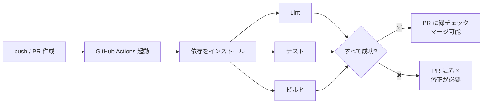
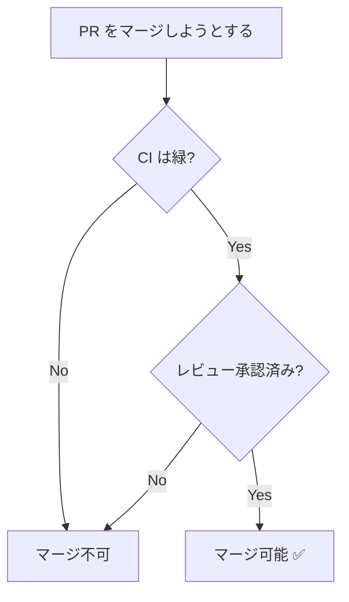

# CI 連携 (GitHub Actions)

CI（継続的インテグレーション）は、コードが push されるたびに**自動でテスト・ビルド・チェック**を走らせる仕組みです。GitHub Actions を使えば、リポジトリ内の設定ファイルだけで実現できます。

## なぜ CI が必要か

- PR ごとに自動でテストが走り、**壊れた変更がマージされるのを防ぐ**
- レビュアーは「CI が緑か」をまず確認でき、レビューの負荷が下がる
- フォーマット・Lint・型チェックを自動化し、議論を本質に集中できる

## PR を起点としたパイプライン



## ワークフローの基本

`.github/workflows/` 配下に YAML ファイルを置くだけで動きます。Node.js プロジェクトの例です。

```yaml
# .github/workflows/ci.yml
name: CI

on:
  pull_request:        # PR が作成・更新されたとき
  push:
    branches: [main]   # main への push 時

jobs:
  test:
    runs-on: ubuntu-latest
    steps:
      - uses: actions/checkout@v4

      - uses: actions/setup-node@v4
        with:
          node-version: 20
          cache: npm

      - run: npm ci
      - run: npm run lint
      - run: npm test
      - run: npm run build
```

### 主要なキーワード

| キー | 意味 |
| --- | --- |
| `on` | ワークフローを起動する**トリガー**（push, pull_request など） |
| `jobs` | 実行する**ジョブ**の集まり（並列実行される） |
| `runs-on` | 実行環境（OS） |
| `steps` | ジョブ内の処理を順に実行 |
| `uses` | 既製のアクションを利用（`actions/checkout` など） |
| `run` | シェルコマンドを実行 |

## ブランチ保護と組み合わせる

CI の効果を最大化するには、GitHub の **Branch protection rules** で `main` を保護します。

- ✅ **Require status checks to pass** — CI が緑でないとマージできない
- ✅ **Require a pull request before merging** — 直接 push を禁止
- ✅ **Require approvals** — レビュー承認を必須にする



これにより「テストが通り、レビューを受けた変更だけが `main` に入る」という安全な状態を強制できます。

::: tip 段階的に導入する
最初はテスト実行だけ、慣れてきたら Lint・型チェック・カバレッジ計測…と少しずつ増やすのがおすすめです。CI が遅すぎると開発の足かせになるため、キャッシュ（`cache: npm`）の活用も重要です。
:::

次は、`main` の変更を出荷単位として確定する [リリースとバージョン管理](./release) に進みます。困ったときは [トラブルシューティング](./troubleshooting)、操作を忘れたら [コマンド早見表](./commands) を参照してください。
