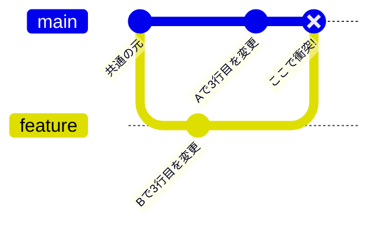
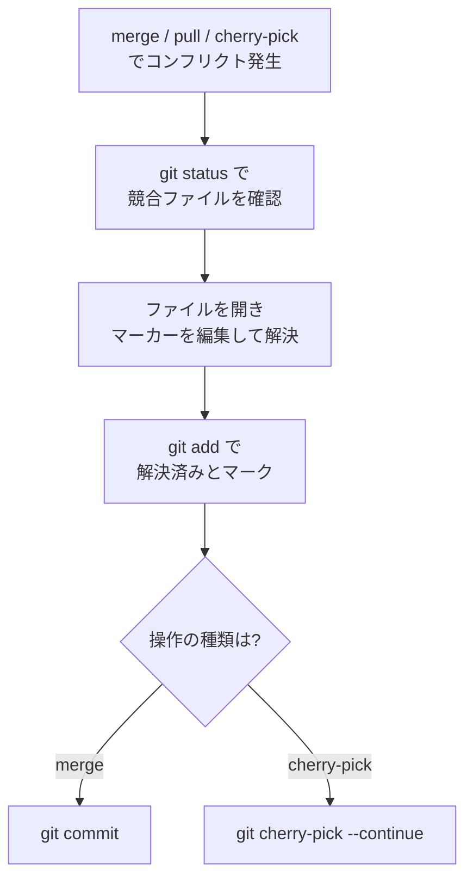

# コンフリクト解決

コンフリクト（競合）は、**同じ箇所を複数人が別々に変更**したときに発生します。チーム開発では避けられないので、慌てず対処できるようになりましょう。

## なぜ起きるのか

2 つのブランチが同じファイルの同じ行を変更すると、Git はどちらを採用すべきか判断できません。



`main` と `feature` がどちらも同じ 3 行目を変更しているため、マージ時に競合します。

## コンフリクトの見た目

マージや pull を実行すると、Git が該当箇所にマーカーを書き込みます。

```text
<<<<<<< HEAD
const timeout = 3000;
=======
const timeout = 5000;
>>>>>>> feature/login
```

- `<<<<<<< HEAD` 〜 `=======` … **現在のブランチ**側の内容
- `=======` 〜 `>>>>>>> feature/login` … **取り込もうとしている**側の内容

## 解決の手順



```bash
# 1. どのファイルが競合しているか確認
git status

# 2. エディタで各ファイルを開き、マーカーを取り除いて
#    正しい内容に編集する（両方を活かす場合も多い）

# 3. 解決したファイルをステージ
git add src/config.js

# 4-a. マージの場合はコミットして完了
git commit

# 4-b. cherry-pick 中の場合は続行
git cherry-pick --continue
```

::: tip cherry-pick でコンフリクトに出会う場面
リリースブランチへ修正を移植するとき（main-first + cherry-pick）にコンフリクトが起きます。手順は [複数バージョンの保守（リリースブランチ運用）](./release-branches) を参照してください。
:::

## 途中でやめたいとき

操作を中断して元の状態に戻せます。

```bash
git merge --abort        # マージを中止
git cherry-pick --abort  # cherry-pick を中止
```

## コンフリクトを減らすコツ

- **こまめに `main` を取り込む** — 作業ブランチで定期的に `git fetch origin` して `git merge origin/main`
- **小さく・短命なブランチ** — 差分が小さいほど競合も小さい
- **ファイル/責務を分ける** — 同じ巨大ファイルを全員が触る状況を避ける
- **フォーマッタを統一** — 自動整形の差分による無用な競合を防ぐ

::: tip マージツールの活用
VS Code には 3-way マージのエディタが組み込まれており、「現在」「受信」「結果」を見比べながら解決できます。`git mergetool` でも各種ツールを起動できます。
:::
