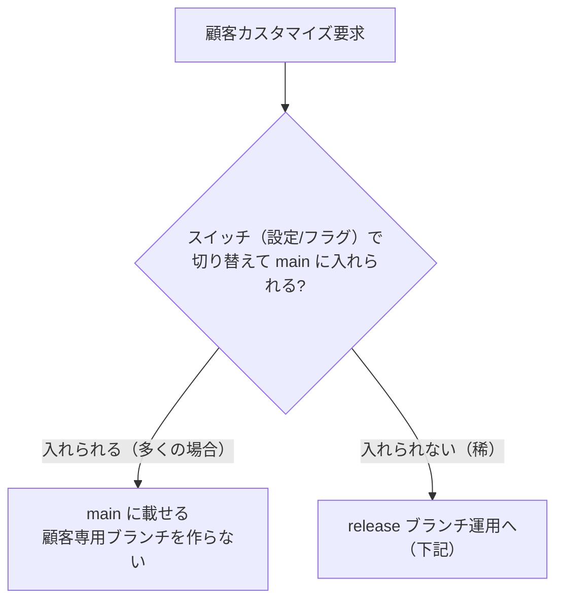
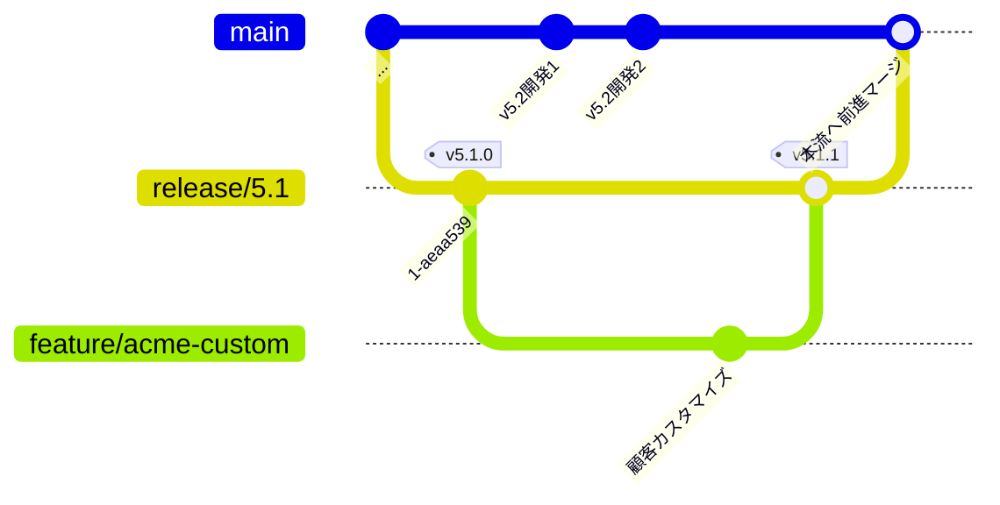

# 顧客カスタマイズとバージョン運用（発展）

同じ製品を複数の顧客へ提供していると、ときどき「この顧客だけ、この振る舞いを変えたい」というカスタマイズ要求が来ます。さらに難しいのが、**特定バージョンを土台に開発・出荷しなければならない案件**です。ここでは、これまでの [GitHub Flow](./github-flow) と [リリースとバージョン管理](./release) を土台に、その運用の考え方を整理します。

::: tip このページの位置づけ
これは**発展トピック**です。唯一絶対の正解はなく、**実運用は個別案件ごとに判断する**のが前提になります。ここでは判断の土台となる選択肢とトレードオフを示します。
:::

## 基本方針：単一コードベースを保ち、差分は「載せる」

顧客カスタマイズで最も苦しむ原因は、顧客専用の変更が **`main` とは別の長命ブランチに住んでいる**ことです。別ブランチにあるほど、`main` の更新を取り込むたびにその変更とぶつかります。

そこで基本は、**顧客ごとの長命ブランチを作らず、差分を単一コードベース（`main`）の中にスイッチ（設定・フィーチャーフラグ）越しで載せる**ことを目指します。

- 本流に取り込む前提の要望は、**顧客名を出さない短命ブランチ（`feature/...`）** で実装する
- たとえ初手が「その場での書き換え」でも、**別ブランチではなく `main` の中にスイッチ越しで入れる**。こうすれば上流の更新はそのまま乗り、コンフリクトが起きにくい（同じ箇所を双方で変更した場合などは起こり得ます）
- 同じ箇所に二度目の要望が来たら、その `if` を**汎用的な設定・部品に昇格**させる

## 難しいケース：特定バージョンを土台にする案件

**例：`v5.2` を開発中に受注した案件が、`v5.1` のコードをベースに開発・リリースしなければならない。**

このとき `main` は既に `v5.2` へ進んでいるので、**`main` から枝を切ると `v5.2` のコードが土台に混ざってしまいます**。要件（`v5.1` ベース）を満たせません。

答えは、**`main` ではなく `release/5.1` から開発する**ことです。`v5.1` 出荷時に切ってある保守線（無ければ `v5.1.0` タグから切る）を土台にします。

1. **土台は `release/5.1`**（`v5.2` のコードを含まない保守線）
2. 顧客案件は **`release/5.1` から枝を切って開発**する（`main` からは切らない）→ **`v5.2` 混入なし**。この案件ブランチは特定バージョン固定の受注案件そのものなので、識別のため案件名を含めてよい（例 `feature/acme-custom`）。本流へ一般化して返す段階で、顧客名に依存しない形へ整えます
3. **出荷は `release/5.1` 線上のタグ**（例 `v5.1.1`）。`v5.1` ＋顧客差分で `v5.2` を含まない
4. 本流化は **「前進マージ」（`release/5.1` → `main`）** で行う（[リリースとバージョン管理](./release) の hotfix と同じ向き）

::: tip この顧客にとっての「上流」は main ではない
「常に上流を取り込む」と言うとき、この案件が取り込むべき上流は **`main`（`v5.2`）ではなく `release/5.1` の保守修正**です。`v5.1` 線に当たったバグ修正は取り込み、`v5.2` の新機能は取り込まない——これが正しい追従先です。
:::

## 論点：前進マージで顧客固有の差分をどう返すか

`release/5.1` → `main` へ前進マージするとき、差分は 2 種類に分かれます。**汎用的な改善（バグ修正・どの顧客にも良い機能）は、迷わず `main` へ前進マージ**します。判断が要るのは**その顧客固有の振る舞い**です。ここに **2 つの基本案（＋折衷案）** があります。

### 案1：スイッチ越しで main に返す

顧客固有部分も、設定・フラグ越しに**既定オフ**で `main` に入れる。

| | 内容 |
| --- | --- |
| ✅ メリット | 全顧客が**単一コードベースに収束**／その顧客が将来 `v5.2` に上がるとき**カスタマイズが既に `main` にある**（アップグレードが楽）／差分を吸収済みなので **`release/5.1` 線を将来畳める** |
| ⚠️ デメリット | `main` に**使うか分からない顧客固有コード＋スイッチ**が増える／放置すると `if`・フラグだらけに（**棚卸し運用が必須**）／コア肥大・テスト増 |

### 案2：汎用分だけ前進マージ

顧客固有差分は `release/5.1` 線に留め、`main` には返さない。

| | 内容 |
| --- | --- |
| ✅ メリット | **`main` が汚れない**（本体スリム）／「全員得」なものだけ確実に共有 |
| ⚠️ デメリット | 顧客固有差分が **`release/5.1` 線に取り残される**（その顧客を `v5.2` に上げるとき**移植し直し**）／**`release/5.1` 線を長く保守**する負債／その顧客だけ事実上「別線で塩漬け」 |

### 折衷：タイミングで分ける

二者択一にせず、こう分けると多くのチームの落としどころになります。

- **汎用分（バグ修正・共通改善）は即・前進マージ**
- **顧客固有分は、その顧客が `v5.2` に上がると決まった時点で、スイッチ越しに前進マージ**

「**汎用は今、固有は上げる時**」。`main` を早々に汚さず、アップグレード時の移植地獄も避けられます。

## どちらを選ぶか：判断の 3 問

案は**個別案件ごとに**、次の 3 問で判断することを推奨します。

1. **この顧客は将来 `v5.2` 以降にアップグレードする見込みがあるか？** → する見込みなら案1 寄り
2. **その顧客固有機能は、他顧客にも将来展開しうるか？** → しうるなら案1 寄り
3. **`release/5.1` 線をいつ畳みたいか？** → 早く畳みたいなら案1 寄り

いずれも「いいえ／単発で使い捨て」に寄るほど、案2（`release/5.1` 線に留める）で十分です。

## まとめ

- 基本は**単一コードベース**。顧客差分は**顧客専用の長命ブランチにせず**、`main` にスイッチ越しで載せる
- **特定バージョン起点の案件**は、`main` ではなく **`release/5.1` から開発**し、その線のタグで出荷、`main` へは**前進マージ**する
- 前進マージの扱いは**案1（スイッチ越しで返す）／案2（汎用分だけ返す）／折衷**の 3 択。**唯一先に固定してよいのは「汎用修正は即・前進マージ」**
- どの案を採るかは、**個別案件ごとに上の 3 問で判断**する。案1 を採る場合は**フラグ・分岐の棚卸し**をセットで運用する

::: warning フラグは増やしたら減らす
案1 の唯一にして最大の注意点は、`main` が顧客スイッチだらけになることです。使われなくなったフラグ・顧客固有分岐は、定期的に**削除するか汎用機能へ昇格**させ、コードベースを痩せさせ続けてください。
:::

---

これでガイドの本編は一通りです。手を動かして定着させるなら [実習（ハンズオン）](../hands-on/) へ。困ったときは [トラブルシューティング](./troubleshooting)、操作を忘れたら [コマンド早見表](./commands) を参照してください。
