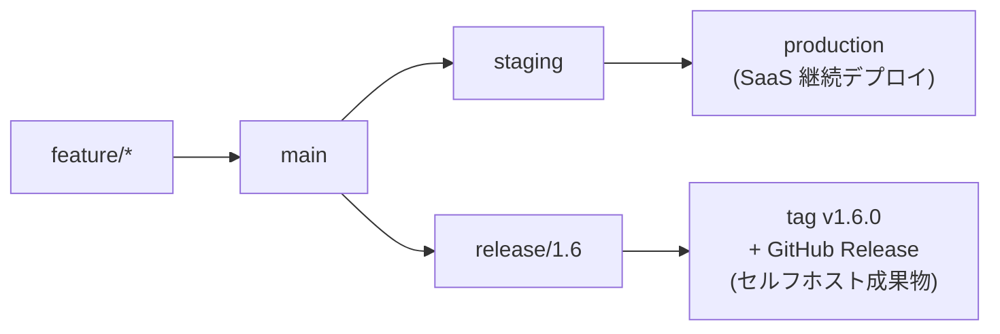
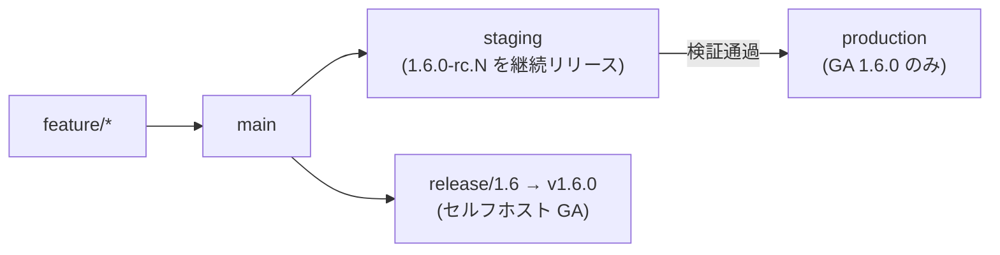
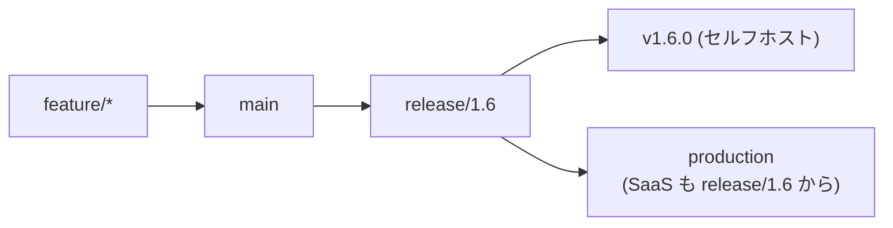
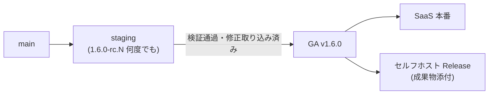
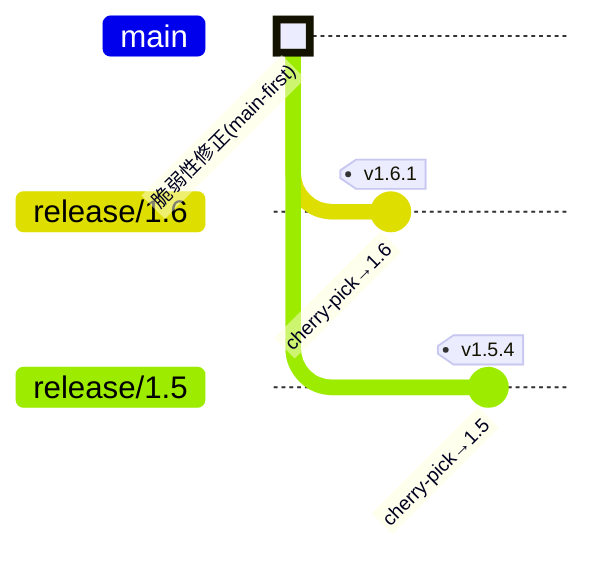

# デュアル配布（SaaS + セルフホスト）でのリリース運用

同じプロダクトを **SaaS 版**（自社が運用してホスト）と **セルフホスト版**（顧客が自分の環境に導入して運用。オンプレミスや持ち込み VM など）の両方で提供するとき、「リリース」の意味が 2 つに割れます。このページは、[GitLab Flow](./gitlab-flow) を土台に、**対外バージョン（セルフホスト）と環境自動リリース（SaaS）を、単一の `main` の上で両立**させる設計をまとめます。

## デプロイとリリースは別のこと

まず用語を分けます。混ぜると設計が破綻します。

| | 環境自動リリース（SaaS） | 対外バージョン（セルフホスト） |
| --- | --- | --- |
| 本質 | **デプロイ**（コードを環境に載せる） | **リリース**（出荷単位に版を確定する） |
| 主体 | 自社 | 顧客（自前 VM に導入） |
| 起点 | `main` / 環境ブランチへの push | 版を切る意思決定 |
| 頻度 | 継続的（毎マージ） | 節目（週次・月次など） |
| バージョン | 顧客に見えない（`1.6.0-rc.3` 等） | **顧客が指定する GA の SemVer**（`1.6.0`） |
| 成果物 | なし（環境に反映されるだけ） | **Release にインストーラ／イメージを添付** |
| GitHub 機能 | Deployments / Environments | **タグ + GitHub Release** |

要点は、**[GitHub Release](./release#github-release) はタグに紐づく＝出荷点にだけ打つもの**だということです。セルフホストは版を出荷単位として顧客に見せるので必ず要ります。SaaS は、バージョン管理がプロセス上不要なら Release ではなく Deployments で「いま本番に何が出ているか」を追えば足ります。**ただし監査・変更管理・サポートの都合で SaaS 側も SemVer 管理が要る場合**は、[SaaS 側もバージョン管理が要るとき](#saas-側もバージョン管理が要るとき)で扱います。

## 全体像：単一 main から 2 レーンへ

すべての変更は **`main` に upstream-first で入れる**のが唯一の絶対ルールです。そこから 2 つのレーンに分岐します。



- **SaaS**: `main → staging → production` の[環境ブランチ](./gitlab-flow#パターン-a-環境ブランチ)。タグ不要、継続デプロイ。
- **セルフホスト**: リリース時に `main` から `release/x.y` を切り、[リリースブランチ](./gitlab-flow#パターン-b-リリースブランチ)として SemVer タグと GitHub Release を出す。旧版の保守は複数の `release/*` を残して行う（[複数バージョンの保守](./release-branches)）。

::: info なぜセルフホストだけ Release が要るのか
SaaS は更新タイミングを自社が握るので「版」を顧客に見せる必要がありません。セルフホストは **顧客が自分のペースで導入・更新**するため、`v1.2` のまま数ヶ月動く現場が普通にあります。だから複数の版を並行保守し、それぞれに GitHub Release（＋インストール成果物）が要ります。
:::

## 決めるべき唯一の分岐：SaaS は「main 追従」か「GA 追従」か

ここだけ選べば設計が確定します。

### モデル 1：SaaS は main を追う（先行デプロイ・推奨）



SaaS は GA より先を走り、実質の **dogfooding（自社が最初に踏む）** になります。**staging には `1.6.0-rc.N` を何度でも出して検証**し、通過した版だけを **GA `1.6.0` として本番へ昇格**します（＝本番に流れるのは検証済みの GA のみ、後述の[検証ゲート](#検証ゲートで本番は-ga-のみ)）。セルフホストに GA を出す頃には SaaS で揉まれた後なので品質が上がります。**速度と品質検証を重視するならこちら。**

### モデル 2：SaaS も GA を追う（リリース先行）



SaaS＝「常に最新 GA を継続パッチ」。SaaS とセルフホストが**同じ版のコード**を走るのでサポートが楽になる代わりに、SaaS への機能投入がリリース周期に律速されます。**サポートの一貫性を最優先するならこちら。**

::: tip 迷ったらモデル 1
「SaaS の速度」という当初の狙いを活かせ、SaaS がステージング代わりになってセルフホストの GA 品質が上がります。まずモデル 1 で始め、サポート負荷が問題になったらモデル 2 への移行を検討すれば十分です。
:::

## 対外バージョンを自動で出す

手動タグ運用は忘れ・ズレが起きるので、**[Conventional Commits](./release#conventional-commits-と対応している)（このリポジトリで推奨）から版を自動計算**するツールを噛ませます。

- **release-please（推奨）**: `main` のコミットから次版を判定し、「リリース PR」（version bump + CHANGELOG）を自動で開く。それをマージした瞬間に**タグ + GitHub Release を自動作成**する。
- **semantic-release**: マージ即リリースまで自動化したい場合の選択肢。

環境デプロイ（SaaS）とリリース（セルフホスト）は**別々のワークフロー**にして干渉させないのがコツです。

```yaml
# .github/workflows/release.yml（セルフホスト版の GA を自動リリースする例）
on:
  push:
    branches: [main]        # release-please がリリース PR を維持
# 既定は読み取りのみ。リリース PR 作成・タグ・Release に必要な権限だけを付与
permissions:
  contents: write
  pull-requests: write
# actions は commit SHA でピン留めし # vX.Y.Z コメントを添える（本リポジトリの方針）
```

環境デプロイは `on: push: branches: [staging, production]` など別トリガーの独立ワークフローにします。

## SaaS 側もバージョン管理が要るとき

監査・変更管理・サポート（「どの版で起きた不具合か」を追う等）の都合で、**SaaS のデプロイにも SemVer を付ける必要がある**ことがあります。その場合も設計は壊れません。**版線は 1 本（上の release-please が計算する SemVer）を単一ソース**にし、両エディションがそこから版を引きます。「SaaS は無番」という前提を外すだけです。

継続デプロイの SaaS にどう番号を振るかで 2 案あります。プロセス要件で選びます。

### 案A：プレリリース識別子（SaaS が main 先行のときに自然）

- SaaS は「次の GA へ向かう途中」として `1.6.0-rc.5` や `1.6.0-canary.42` を名乗る。GA `1.6.0` はセルフホスト向けにリリースブランチで確定する。
- SemVer 的に正しい（プレリリースは GA より低い precedence なので順序が壊れない）。
- SaaS のデプロイにも GitHub Release を作る場合は **pre-release フラグ**を立てて GA と区別し、インストール成果物は GA にだけ添付する。
- 監査は `1.6.0-rc.42` ＋ commit SHA で厳密に追える。上記の「モデル 1（main 追従）」と相性が良い。

### 案B：毎デプロイを正式 SemVer にする

- `production` への各デプロイが `1.6.0`, `1.6.1`, `1.6.2` … と正式版を刻む。
- セルフホストは**その一部を「サポート版」として選定**し、選ばれた版にだけリリースブランチ＋backport を付ける（＝ SaaS は全版、セルフホストは選抜版）。
- 変更管理プロセスが `-rc` のようなプレリリースを「正式リリースと認めない」型のときに向く。

::: tip どちらを選ぶか
プロセスがプレリリース識別子（`-rc` / `-canary`）を受け入れるなら **案A**。SaaS のすべての本番デプロイに“プレリリースでない正式版”を要求されるなら **案B**。どちらでも版線は 1 本のままにし、エディション差は番号ではなく「どの版に成果物・サポートを付けるか」で表すのが要点です。
:::

### 検証ゲートで本番は GA のみ

多くの現場のプロセスは「**staging までは何度でもリリースしてよいが、本番には検証が完了し修正も取り込まれた版だけを流せる**」という形を取ります。これは案Aと案Bの“いいとこ取り”で、実運用ではこの形が最もはまります。

- **staging**：`1.6.0-rc.N` を継続的にリリースして検証。不具合が出たら `main` で直し、折り込んで `-rc.N+1` を出す（案Aのメカニクス）。
- **本番**：rc が検証を通過した時点で **GA `1.6.0` へ昇格**（＝プレリリースを外して正式版化）。本番に流れるのは常にクリーンな GA なので、案Bが求める「本番＝正式版のみ」も同時に満たす。
- この **GA はセルフホストが出荷する版と同一**にできる。「SaaS 本番へ昇格＝セルフホスト GA を切る」を同じ節目にすれば、両エディションが同一の検証済みコードを走る。



これは「リリーストレイン」の考え方そのものです（[複数バージョンの保守](./release-branches#リリーストレインと-lts) を参照）。**staging で版を熟成させ、ゲートを越えた版だけを本番とセルフホストに配る**——検証ゲートが SaaS 本番とセルフホスト GA の共通の“出荷点”になります。

## リリースノート自動生成の落とし穴

`gh release create --generate-notes` は「**前タグ以降に、そのブランチにマージされた PR**」からノートを作ります。GitLab Flow の cherry-pick 運用ではここが崩れます。

- パッチは upstream-first で **PR が `main` にマージ**され、`release/*` には cherry-pick コミットが乗るだけ。→ リリースブランチ基準の自動生成が **元 PR を取りこぼす**。
- 対策: `--notes-start-tag <前の系列タグ>` で基準を明示する／cherry-pick コミットに元 PR 番号 `(#123)` を残す／重要な系列は手動でノートを整える。

## セキュリティ修正のファンアウト

1 つの修正を**すべての出荷先に届ける**のが最重要です。upstream-first を徹底すると構造的に漏れません。



- まず `main` に修正を入れる → **SaaS 本番へ即昇格**（staging→production）。
- 同時に**サポート中の `release/*` すべてへ cherry-pick** → それぞれパッチ版をタグ＆Release（セルフホストの顧客へ配布）。
- 逆順（リリースブランチだけ直す）は `main` 取り込み漏れで次版に再発するので厳禁です。

## 決めておくこと

1. **サポート版マトリクス**: いくつ前まで（N-1 / N-2）セキュリティ backport するか。無限には支えられないので明文化する。
2. **エディション差分の出し分け**: SaaS 限定／セルフホスト限定の機能を**ブランチで分けない**。単一 `main` のまま**ビルドフラグ・設定・フィーチャーフラグ**で切り替える（[顧客カスタマイズとバージョン運用](./customization) の考え方）。ブランチで分けると保守が破綻します。
3. **成果物の中身**: セルフホストの Release には、顧客が導入する**インストーラ / コンテナイメージ / Helm chart** 等の実体を添付する。

::: info これは実在するモデル
GitLab 自身がこの形です。**GitLab.com（SaaS）** は auto-deploy ブランチで継続デプロイし、**self-managed（セルフホスト相当）** は毎月の stable ブランチから版付きリリースを出して backport で保守しています。実績のある構成なので安心して踏襲できます。
:::

## 関連ページ

- [GitLab Flow](./gitlab-flow) — 環境ブランチ／リリースブランチの基礎
- [リリースとバージョン管理](./release) — タグ・SemVer・GitHub Release の基本
- [複数バージョンの保守（リリースブランチ）](./release-branches) — 旧版保守と cherry-pick の実際
- [顧客カスタマイズとバージョン運用](./customization) — エディション差分の扱い
- [ブランチ戦略の使い分け](./branching-strategies) — そもそもどの戦略を選ぶか
