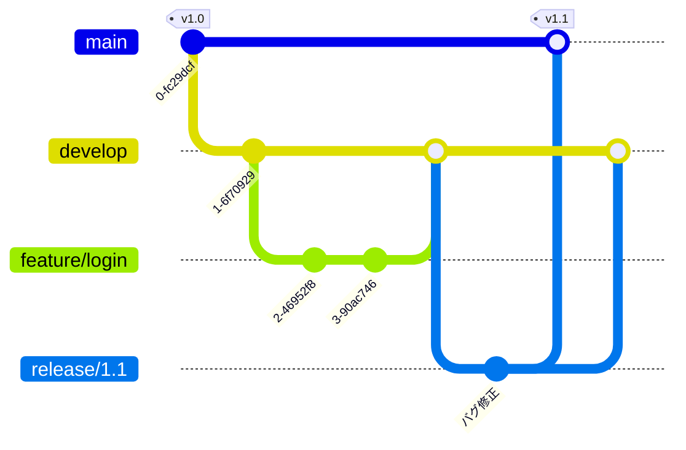
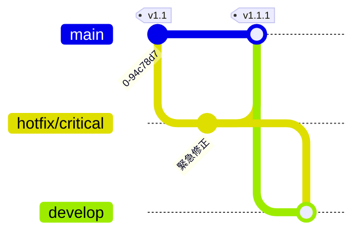

# Git Flow

Git Flow は、Vincent Driessen 氏が 2010 年に提唱した、**役割の異なる複数のブランチ**を使い分けるブランチ運用モデルです。リリースを計画的に区切る開発（パッケージ製品・モバイルアプリ・バージョン番号を明示するソフトウェア）に向いています。

## 5 種類のブランチ

Git Flow では、次の 2 本の「常設ブランチ」と 3 種類の「支援ブランチ」を使います。

| ブランチ | 寿命 | 役割 |
| --- | --- | --- |
| `main`（旧 `master`） | 常設 | **出荷済み**の安定版。タグでバージョンを刻む |
| `develop` | 常設 | 次回リリースに向けた**開発の統合先** |
| `feature/*` | 短命 | 個々の機能開発。`develop` から切り `develop` へ戻す |
| `release/*` | 短命 | リリース準備（バグ修正・バージョン調整）。`develop` から切り `main` と `develop` へ戻す |
| `hotfix/*` | 短命 | 出荷後の緊急修正。`main` から切り `main` と `develop` へ戻す |

## 全体の流れ

- **機能開発**は `feature/*` で行い、完成したら `develop` へマージする。
- リリースが近づいたら `develop` から `release/*` を切り、**そのブランチ上でのみ**バグ修正やバージョン番号の確定を行う（新機能は入れない）。
- リリース確定時に `release/*` を `main` へマージして**タグを打ち**、同じ内容を `develop` へも戻す。

## hotfix（緊急修正）

出荷済みの `main` に緊急の不具合が見つかったら、`develop` を待たずに `main` から `hotfix/*` を切って修正します。

修正は `main` へマージしてタグを打ち、**`develop` にも必ず取り込む**（同じ不具合が次期リリースで再発しないようにするため）。

## 長所と短所

### 長所

- リリースの区切りが明確で、**複数バージョンの並行開発・保守**に強い。
- 「開発中（`develop`）」と「出荷済み（`main`）」がブランチとして分離され、状態が把握しやすい。

### 短所

- ブランチ数が多く運用が複雑。**継続的デプロイ（CD）とは相性が悪い**。
- `develop` と `main` の二重マージなど手順が煩雑で、長命ブランチはコンフリクトを招きやすい。

::: tip このリポジトリの運用
本チュートリアルのリポジトリは、よりシンプルな [GitHub Flow](./github-flow) で運用しています。Git Flow はあくまで「選択肢の一つ」として解説しています。どの戦略を選ぶべきかは [ブランチ戦略の使い分け](./branching-strategies) を参照してください。
:::

## 関連ページ

- [GitHub Flow](./github-flow) — `main` 一本のシンプルな運用
- [GitLab Flow](./gitlab-flow) — 環境／リリースブランチを足した中間的な運用
- [ブランチ戦略の使い分け](./branching-strategies) — どれを選ぶかの判断
- [複数バージョンの保守（リリースブランチ）](./release-branches) — release ブランチ運用の実際
