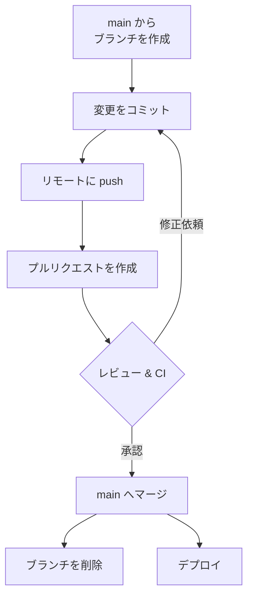
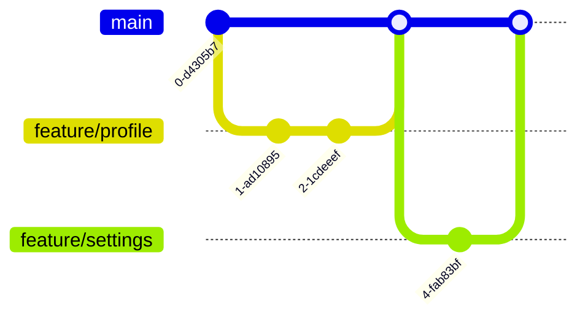

# GitHub Flow

GitHub Flow は、シンプルで実践的なブランチ運用モデルです。多くのチームの標準であり、このチュートリアルでも推奨します。

## 基本ルール

1. `main` は**常にデプロイ可能**な状態に保つ
2. 作業は `main` から切った**短命なブランチ**で行う
3. こまめにコミットし、リモートに push する
4. **プルリクエスト (PR)** を作ってレビューを受ける
5. レビュー承認後に `main` へマージし、デプロイする

## 全体の流れ



## 実際のコマンドの流れ

```bash
# 1. 最新の main から作業ブランチを作成
git switch main
git pull
git switch -c feature/user-profile

# 2. 作業してコミット
git add .
git commit -m "feat: ユーザープロフィール画面を追加"

# 3. リモートに push
git push -u origin feature/user-profile

# 4. PR を作成（GitHub の画面、または gh CLI）
gh pr create --fill

# 5. レビュー反映後、main にマージ（通常は GitHub 上のボタン）
# 6. ローカルを片付け
git switch main
git pull
git branch -d feature/user-profile
```

## なぜ短命ブランチが良いのか

ブランチが長生きするほど `main` との差が広がり、マージ時のコンフリクトが大きくなります。



**小さく作って、早くマージする**——これが GitHub Flow をうまく回すコツです。

::: tip 他のブランチ戦略もある
`develop` / `release` ブランチを使う [Git Flow](./git-flow) や、環境／リリースブランチを足す [GitLab Flow](./gitlab-flow) もあります。Web サービスのように継続的にデプロイする現場では、シンプルな **GitHub Flow** が扱いやすいですが、プロダクトによって向き不向きがあります。どれを選ぶかは [ブランチ戦略の使い分け](./branching-strategies) を参照してください。タグ付け・バージョニング・hotfix は [リリースとバージョン管理](./release) で扱います。
:::

次は、フローの中心である [プルリクエストとレビュー](./pull-request) を掘り下げます。
