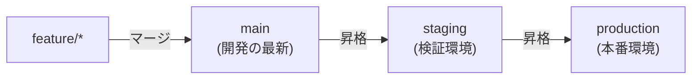
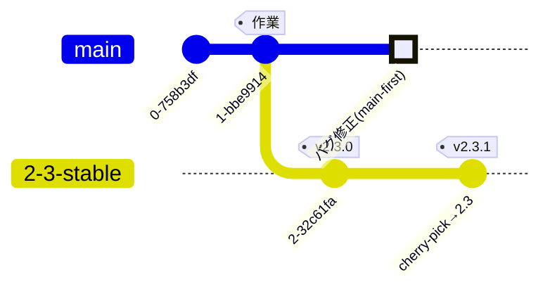

# GitLab Flow

GitLab Flow は、[GitHub Flow](./github-flow) のシンプルさを保ちつつ、**「本番へどう反映するか」という現実**を補うブランチ運用モデルです。GitHub Flow（`main` 一本）と [Git Flow](./git-flow)（多数のブランチ）の中間に位置づけられます。3 モデルの向き不向きは [ブランチ戦略の使い分け](./branching-strategies) で比較しています。

中心にあるのは 2 つの原則です。

1. **環境ブランチ**または**リリースブランチ**で、デプロイ先やリリース版を表現する。
2. **Upstream first**（上流優先）——修正は必ず一番上流（`main`）へ先に入れ、そこから下流へ流す。

## パターン A: 環境ブランチ

ステージング・本番など、**デプロイ先の環境をブランチで表す**やり方です。コードは上流から下流へ一方向に流れます。

- `main` へマージされた変更は、まず `staging` へ、検証を経て `production` へと**昇格（promote）**していく。
- 本番で不具合が出たら、まず `main` を直してから各環境ブランチへ反映する（**upstream first**）。特定環境だけを直接パッチしない。
- 「いま本番に何が出ているか」が `production` ブランチを見れば分かる。継続的デプロイと相性が良い。

## パターン B: リリースブランチ

バージョンを明示して出荷するソフトウェア向けに、**リリースごとにブランチを固定**するやり方です。

- リリース時点の状態を `2-3-stable` のような**安定ブランチ**として切り出す。
- バグ修正は**まず `main` に入れて**から、必要な安定ブランチへ `cherry-pick` で反映する（ここでも upstream first）。これにより「古いバージョンだけ直って `main` で直っていない」という退行を防ぐ。

## GitHub Flow / Git Flow との違い

- **[GitHub Flow](./github-flow) との違い**: GitHub Flow は `main` にマージ＝即デプロイを前提とする。GitLab Flow は、デプロイのタイミングと `main` へのマージを**環境／リリースブランチで分離**できる。
- **[Git Flow](./git-flow) との違い**: Git Flow のような常設 `develop` を持たず、`main` を開発の中心に据える。ブランチの種類が少なく運用が軽い。

## 長所と短所

### 長所

- `main` を中心にしつつ、**デプロイ／リリースの現実**を無理なく表現できる。
- upstream first のルールで、修正漏れによる退行を防ぎやすい。

### 短所

- 環境ブランチとリリースブランチのどちらを採るか、**チームで運用を設計する必要**がある。
- GitHub Flow よりは登場するブランチが増える。

## 関連ページ

- [GitHub Flow](./github-flow) — `main` 一本の最小構成
- [Git Flow](./git-flow) — develop/release/hotfix を使う構成
- [ブランチ戦略の使い分け](./branching-strategies) — どれを選ぶかの判断
- [複数バージョンの保守（リリースブランチ）](./release-branches) — 安定ブランチ運用の実際
- [デュアル配布（SaaS + セルフホスト）でのリリース運用](./dual-distribution) — SaaS と自ホスト版を単一 main で両立
