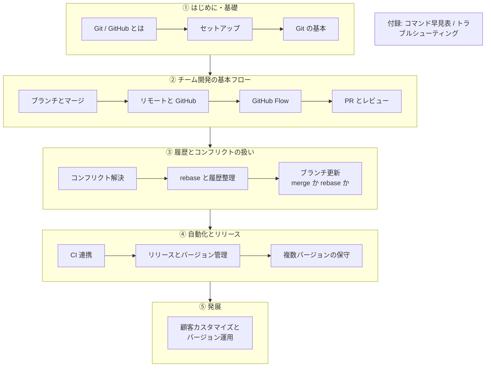

# ガイドの歩き方

このガイドは、**チーム開発で Git / GitHub を実践的に使いこなす**ことをゴールに、基礎から運用までを 6 つの段階に分けて解説します。上から順に読めば一本道で力がつくように並べていますが、必要な段階だけ拾い読みしても構いません。

読み終えたら、[実習（ハンズオン）](/hands-on/) で実際に手を動かして定着させましょう。

## 学習ロードマップ

## 各セクションの狙い

### ① はじめに・基礎

Git / GitHub の全体像をつかみ、手元で最小の操作ができるようになる段階です。

- [Git / GitHub とは](./introduction) — 何がどう違い、なぜ使うのか
- [セットアップ](./setup) — インストールと初期設定、認証
- [Git の基本](./basics) — add / commit / log など日常操作の土台

### ② チーム開発の基本フロー

複数人で `main` を壊さずに開発を回す、GitHub Flow の中核です。

- [ブランチとマージ](./branching) — 作業を分岐して統合する
- [リモートと GitHub](./remote) — ローカルとリモートを同期する
- [GitHub Flow](./github-flow) — ブランチ → PR → マージの基本サイクル
- [プルリクエストとレビュー](./pull-request) — 変更を提案しレビューで磨く

### ③ 履歴とコンフリクトの扱い

並行作業でぶつかる衝突を解消し、履歴をきれいに保つための段階です。

- [コンフリクト解決](./conflicts) — 衝突を読み解いて直す
- [rebase と履歴整理](./rebase) — 履歴を一直線に整える
- [ブランチ更新: merge か rebase か](./update-branch) — PR 更新時の選び方

### ④ 自動化とリリース

変更の検証を自動化し、出荷（リリース）につなげる段階です。

- [CI 連携 (GitHub Actions)](./ci) — PR ごとに自動でチェックする
- [リリースとバージョン管理](./release) — タグ・SemVer・GitHub Release
- [複数バージョンの保守（リリースブランチ運用）](./release-branches) — 旧バージョンへの hotfix

### ⑤ 発展

現場特有の要件に応える、一歩進んだ運用です。

- [顧客カスタマイズとバージョン運用](./customization) — 顧客ごとの差分をどう扱うか

### 付録

必要になったときに引く、リファレンス集です。

- [コマンド早見表](./commands) — よく使う Git コマンドの逆引き
- [トラブルシューティング](./troubleshooting) — 「困った」の対処法

---

まずは [Git / GitHub とは](./introduction) から始めましょう。
