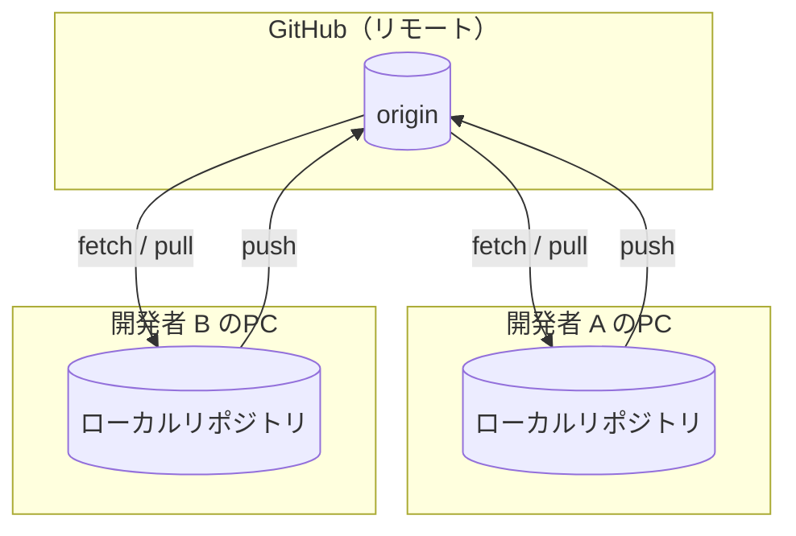

# Git / GitHub とは

**チーム開発で Git と GitHub を実践的に使いこなす**ことを目標に、基礎は手早く押さえ、ブランチ戦略・プルリクエスト・コンフリクト解決・CI 連携といった「現場で毎日使う」部分に重点を置いて解説します。

## バージョン管理システム (VCS) とは

バージョン管理システムは、ファイルの変更履歴を記録し、「いつ・誰が・何を・なぜ」変更したかを追跡する仕組みです。これにより次のことが可能になります。

- 過去の任意の時点に**巻き戻す**
- 複数人が**並行して**作業し、変更を**統合**する
- 変更の**理由（コミットメッセージ）**を後から追える

## Git と GitHub は別物

混同しやすいですが、役割がはっきり分かれています。

| | Git | GitHub |
| --- | --- | --- |
| 正体 | バージョン管理**ツール**（手元で動く） | Git リポジトリの**ホスティングサービス** |
| 動作場所 | ローカル（あなたの PC） | クラウド（リモート） |
| 主な役割 | 履歴の記録・ブランチ・マージ | 共有・レビュー・課題管理・CI/CD |

つまり **Git で履歴を管理し、GitHub でチームと共有・協業する**という関係です。

## 分散型バージョン管理

Git は **分散型 (DVCS)** です。各開発者が完全な履歴のコピーを手元に持ち、リモート（GitHub）を介して同期します。

各開発者はオフラインでもコミットでき、ネットワークに接続したときに `push` / `pull` で同期します。中央サーバーが落ちても各自の手元に完全な履歴が残るのが分散型の強みです。
