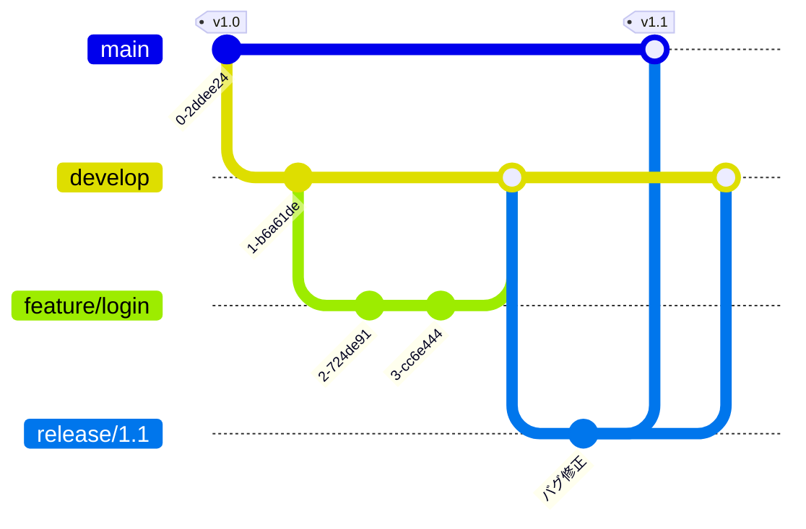
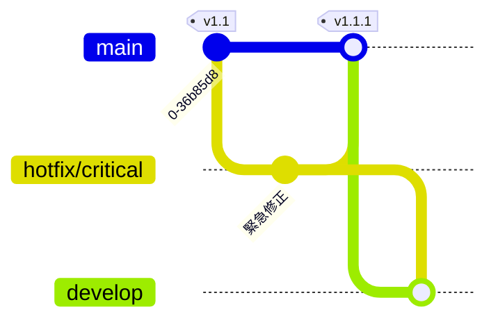
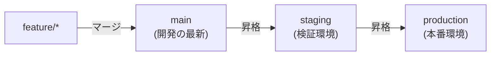
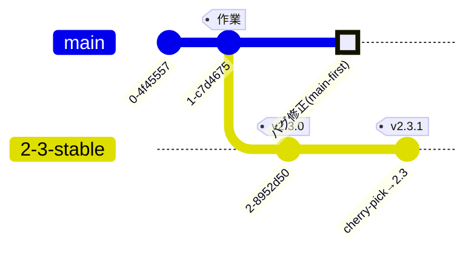

# 他のブランチ戦略（Git Flow / GitLab Flow）

[GitHub Flow](./github-flow) が扱いやすい場面は多いですが、**複数バージョンの並行保守**や**環境ごとのデプロイ表現**が必要になると、別のブランチ運用モデルが選択肢に入ります。ここでは代表的な 2 つ——**Git Flow** / **GitLab Flow**——を、比較の材料として紹介します。どれを選ぶかの判断は [ブランチ戦略の使い分け](./branching-strategies) を参照してください。

## Git Flow

Git Flow は、Vincent Driessen 氏が 2010 年に提唱した、**役割の異なる複数のブランチ**を使い分けるブランチ運用モデルです。リリースを計画的に区切る開発（パッケージ製品・モバイルアプリ・バージョン番号を明示するソフトウェア）に向いています。

### 5 種類のブランチ

Git Flow では、次の 2 本の「常設ブランチ」と 3 種類の「支援ブランチ」を使います。

| ブランチ | 寿命 | 役割 |
| --- | --- | --- |
| `main`（旧 `master`） | 常設 | **出荷済み**の安定版。タグでバージョンを刻む |
| `develop` | 常設 | 次回リリースに向けた**開発の統合先** |
| `feature/*` | 短命 | 個々の機能開発。`develop` から切り `develop` へ戻す |
| `release/*` | 短命 | リリース準備（バグ修正・バージョン調整）。`develop` から切り `main` と `develop` へ戻す |
| `hotfix/*` | 短命 | 出荷後の緊急修正。`main` から切り `main` と `develop` へ戻す |

### 全体の流れ

- **機能開発**は `feature/*` で行い、完成したら `develop` へマージする。
- リリースが近づいたら `develop` から `release/*` を切り、**そのブランチ上でのみ**バグを修正し、バージョン番号を確定する（新機能は入れない）。
- リリース確定時に `release/*` を `main` へマージして**タグを打ち**、同じ内容を `develop` へも戻す。

### hotfix（緊急修正）

出荷済みの `main` に緊急の不具合が見つかったら、`develop` を待たずに `main` から `hotfix/*` を切って修正します。

修正は `main` へマージしてタグを打ち、**`develop` にも必ず取り込む**（同じ不具合が次期リリースで再発しないようにするため）。

> [!NOTE]
> **図の補足**
>
> 上の gitGraph では作図の都合で `develop` を新規ブランチとして描いていますが、実際の `develop` は常設の既存ブランチです。hotfix は「新しく `develop` を作る」のではなく、**既存の `develop` へ取り込む**操作を表しています。

### 長所と短所

- **長所**:
  - リリースの区切りが明確で、**複数バージョンの並行開発・保守**に強い。
  - 「開発中（`develop`）」と「出荷済み（`main`）」がブランチとして分離され、状態が把握しやすい。
- **短所**:
  - ブランチ数が多く運用が複雑。**継続的デプロイ（CD）とは相性が悪い**。
  - `develop` と `main` の二重マージなど手順が煩雑で、長命ブランチはコンフリクトを招きやすい。

> [!TIP]
> **Git Flow は選択肢の 1 つ**
>
> Git Flow が持ち込む `develop` / `release` の常設ブランチは、計画的なリリースと安定化期間のために要るものです。継続的にデプロイしていて出荷済みの版を保守しないなら、その構造は使われないまま手順だけが残ります。どの戦略を選ぶべきかは [ブランチ戦略の使い分け](./branching-strategies) を参照してください。

## GitLab Flow

GitLab Flow は、[GitHub Flow](./github-flow) のシンプルさを保ちつつ、**「本番へどう反映するか」という現実**を補うブランチ運用モデルです。GitHub Flow（`main` 一本）と [Git Flow](#git-flow)（多数のブランチ）の中間に位置づけられます。

中心にあるのは 2 つの原則です。

1. **環境ブランチ**または**リリースブランチ**で、デプロイ先やリリース版を表現する。
2. **Upstream first**（上流優先）——修正は必ず一番上流（`main`）へ先に入れ、そこから下流へ流す。

### パターン A: 環境ブランチ

ステージング・本番など、**デプロイ先の環境をブランチで表す**やり方です。コードは上流から下流へ一方向に流れます。

- `main` へマージされた変更は、まず `staging` へ、検証を経て `production` へと**昇格（promote）** していく。
- 本番で不具合が出たら、まず `main` を直してから各環境ブランチへ反映する（**upstream first**）。特定環境だけを直接パッチしない。
- 「いま本番に何が出ているか」が `production` ブランチを見れば分かる。継続的デプロイと相性が良い。

### パターン B: リリースブランチ

バージョンを明示して出荷するソフトウェア向けに、**リリースごとにブランチを固定**するやり方です。

- リリース時点の状態を `2-3-stable` のような**安定ブランチ**として切り出す。
- バグ修正は**まず `main` に入れて**から、必要な安定ブランチへ `cherry-pick` で反映する（ここでも upstream first）。これにより「古いバージョンだけ直って `main` で直っていない」という退行を防ぐ。

### リリースブランチ主軸とタグ主軸の使い分け

リリースブランチ版は「**リリースをブランチで表す**」立場を取ります。一方、継続デプロイ（`main` → GitHub Pages）を前提とする場合は、[リリースとバージョン管理](./release) で説明したとおり**タグ（＋ GitHub Release）を主軸**にする選び方もあります。

どちらが正しいということはありません。**「サポート中の版を長期間 back-patch し続ける」** なら release ブランチが要になり、**「常に最新の 1 版を出し続ける」** ならタグで十分、という使い分けです。

### GitHub Flow / Git Flow との違い

- **[GitHub Flow](./github-flow) との違い**: GitHub Flow は `main` にマージ＝即デプロイを前提とする。GitLab Flow は、デプロイのタイミングと `main` へのマージを**環境／リリースブランチで分離**できる。
- **[Git Flow](#git-flow) との違い**: Git Flow のような常設 `develop` を持たず、`main` を開発の中心に据える。ブランチの種類が少なく運用が軽い。

### 長所と短所

- **長所**:
  - `main` を中心にしつつ、**デプロイ／リリースの現実**を無理なく表現できる。
  - upstream first のルールで、修正漏れによる退行を防ぎやすい。
- **短所**:
  - 環境ブランチとリリースブランチのどちらを採るか、**チームで運用を設計する必要**がある。
  - GitHub Flow よりは登場するブランチが増える。

## 関連ページ

- [GitHub Flow](./github-flow) — `main` 一本のシンプルな運用
- [ブランチ戦略の使い分け](./branching-strategies) — どれを選ぶかの判断
- [複数バージョンの保守（リリースブランチ運用）](./release-branches) — release ブランチ運用の実際
- [リリースとバージョン管理](./release) — タグ主軸のリリース
- [デュアル配布（SaaS + セルフホスト）でのリリース運用](./dual-distribution) — SaaS と自ホスト版を単一 main で両立
