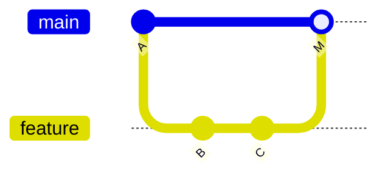
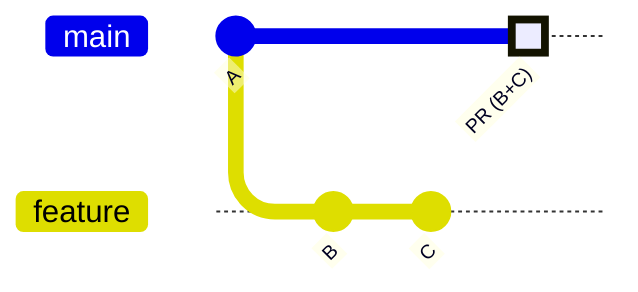
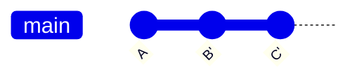
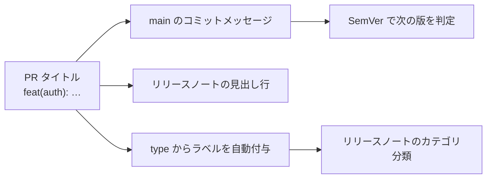

# プルリクエストとレビュー

プルリクエスト (PR) は「この変更を取り込んでほしい」という提案であり、チームでの**コードレビューの場**です。GitHub Flow でも中心的な役割を担います。

## PR を作る

GitHub の Web 画面、または `gh` CLI で作成できます。

```bash
# 対話的に作成
gh pr create

# タイトル・本文をコミットから自動入力
gh pr create --fill

# ドラフト（作業中）として作成
gh pr create --draft
```

## 良い PR の条件

レビューしやすい PR は、マージも速くなります。

- **小さく保つ** — 数百行を超えると質の高いレビューが難しくなる
- **目的を 1 つに** — 「機能追加」と「リファクタ」を混ぜない
- **説明を書く** — 何を・なぜ変えたか、確認方法、関連 Issue をリンク
- **セルフレビュー** — 出す前に自分で diff を読み返す

```markdown
## 概要
ユーザープロフィール画面を追加します。

## 変更点
- プロフィール表示コンポーネントを追加
- API クライアントに getProfile を追加

## 確認方法
1. `npm run dev` で起動
2. /profile にアクセスして表示を確認

Closes #123
```

> [!TIP]
> **Issue の自動クローズ**
>
> PR 本文に `Closes #123` / `Fixes #123` と書くと、マージ時に対応する Issue が自動でクローズされます。

## レビューの観点

レビュアーは「粗探し」ではなく「品質を一緒に上げる」姿勢で見ます。

| 観点 | 確認すること |
| --- | --- |
| 正しさ | 仕様を満たすか、エッジケースの考慮はあるか |
| 可読性 | 命名・構造が理解しやすいか |
| 設計 | 既存の方針・パターンと整合するか |
| テスト | テストが追加され、CI が通っているか |
| 安全性 | 機密情報の混入・脆弱性はないか |

GitHub では「コメント」「承認 (Approve)」「変更要求 (Request changes)」を使い分けます。

## マージ方式の比較

GitHub には 3 つのマージ方式があります。同じ PR（`feature` の `B`・`C` の 2 コミット）を `main` に取り込んだとき、**取り込み後の `main` の履歴の形**がどう変わるかで選びます。各図の `A` は取り込み前の `main`、`B`・`C` は feature 側のコミットです（Rebase and merge の図では、載せ直したあとを `B'`・`C'` と表記します）。

### Merge commit

`feature` の全コミット（`B`・`C`）に加え、統合を示す**マージコミット `M`** が残ります。作業履歴がそのまま残る形です。



### Squash and merge

`feature` の `B`・`C` を **1 つにまとめた単一コミット**として `main` に載せます。個々のコミットは `main` には残りません。



### Rebase and merge

`feature` の各コミットを、`main` の先端へ**一直線に載せ直し**ます（`B'`・`C'`）。マージコミットは作られず、コミットは 1 つずつ残ります。



| 方式 | 結果 | 向いているケース |
| --- | --- | --- |
| **Merge commit** | ブランチの全コミット + マージコミット | 作業履歴を忠実に残したい |
| **Squash and merge** | PR を 1 コミットに圧縮 | `main` の履歴を機能単位で揃えたい |
| **Rebase and merge** | コミットを一直線に追加（マージコミットなし） | 直線的な履歴を保ちつつ各コミットを残したい |

> [!TIP]
> **何を基準に選ぶか**
>
> 判断軸は 3 つあります。**`main` の履歴に何を残したいか**（ブランチの作業コミットまで残すなら Merge commit、機能単位の 1 コミットに揃えるなら Squash）、**あとで履歴を追う単位**（PR 単位で `git log` を読むなら Squash、コミット単位で辿りたいなら Merge commit か Rebase）、そして **linear history を要求するか**（要求するなら Merge commit は使えません）です。ブランチ保護で linear history を必須にしている場合、選べるのは Squash か Rebase に絞られます。

## PR タイトルは Conventional Commits に従う

**Squash and merge** を選ぶと、PR タイトルの重みが変わります。ブランチ側のコミットは 1 つに潰されるため、**PR タイトルがそのまま `main` のコミットメッセージ**になるからです。ブランチの中で `wip` や `レビュー反映` と書いていても、`main` に残るのは PR タイトルだけです。

そこで PR タイトルは、コミットメッセージと同じ [Conventional Commits](./commits#conventional-commits) の形式で書きます。

```text
feat(auth): パスワードリセット機能を追加
fix(api): 空配列を渡すと 500 が返る不具合を修正
```



### リリースノートにそのまま載る

GitHub の[自動リリースノート生成](https://docs.github.com/ja/repositories/releasing-projects-on-github/automatically-generated-release-notes)は、前回のリリース以降に**マージされた PR のタイトルを見出しとして一覧に並べます**。リポジトリに `.github/release.yml` を置けば、PR ラベルごとのカテゴリ分けもできます。

```yaml
# .github/release.yml
changelog:
  categories:
    - title: 新機能
      labels: ['type: feat']
    - title: 不具合修正
      labels: ['type: fix']
```

つまり PR タイトルは、レビュー時の見出しであると同時に、**`main` の履歴の 1 行であり、リリースノートの 1 行**でもあります。3 か所で読まれる文章なので、書式を揃える価値があります。

- `type` を揃えると、リリースノートのカテゴリ分類と次に上げる版の判定（[SemVer との対応](./release#conventional-commits-と対応している)）が機械的に決まる
- 要約を具体的に書くと、リリースノートを読んだ利用者が「何が変わったか」を理解できる

> [!TIP]
> **このリポジトリでの運用**
>
> `pr-title.yml` ワークフローが PR タイトルの書式を検証し、`pr-label.yml` がタイトルの `type` に応じて `type: feat` などのラベルを自動付与します。書式が崩れた PR は CI で落ちます。

## PR を最新の main に追従させる（Update branch）

PR を出したあとに `main` が先へ進むと、GitHub の PR 画面に **「Update branch」** ボタンが出ます。遅れた自分のブランチへ `main` の最新を取り込むための操作で、2 つの選択肢があります。

- **Update with merge commit** … `main` の最新を**マージコミット**で取り込む（自分のコミット ID は変わらない）
- **Update with rebase** … 自分のコミットを `main` の最新の**上に乗せ直す**（コミット ID が振り直される）

> [!WARNING]
> **これは「マージ方式」の選択ではありません**
>
> 上の [マージ方式の比較](#マージ方式の比較)（`Merge commit` / `Squash and merge` / `Rebase and merge`）は、**PR を `main` に取り込むとき**の方式です。ここで選ぶのは「**遅れた自分のブランチに `main` の最新を取り込む方法**」で、別物です。

### どう選べばいいか

**同じ PR ブランチを他の人も触っているなら、`Update with merge commit` を選びます。** コミット ID が変わらないので、相手の手元の履歴と食い違いません。

| | Update with merge commit | Update with rebase |
| --- | --- | --- |
| コミット ID | **変わらない** | **振り直される** |
| 元に戻しやすさ | 高い | コミット ID が変わるぶん手間がかかる |
| 向いているケース | 複数人で同じブランチを触っている | 自分しか触っていない PR で履歴を一直線に保ちたい |

**Squash and merge** 方針なら、取り込みのマージコミットは最終的に 1 コミットへ潰れるため、`Update with merge commit` で十分です。`Update with rebase` はコミット ID を振り直すので、**同じ PR ブランチを他の人も触っている場合は使いません**（次の pull で履歴が食い違います）。

### 手元（ローカル）で同じことをする

GitHub のボタンを使わず、ローカルで取り込んでから push しても同じです。コンフリクト対応はローカルの方が楽なことが多いです。下は `Update with merge commit` に相当する手順です。

```bash
# 自分のブランチにいる状態で

# 「Update with merge commit」に相当
git fetch origin
git merge origin/main
git push
```

複雑なコンフリクトが出たら、ボタンではなくローカルで解決します。手順は [コンフリクト解決](./conflicts) を参照してください。
