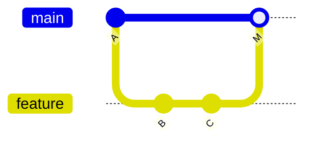
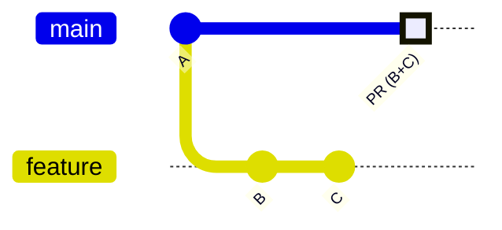
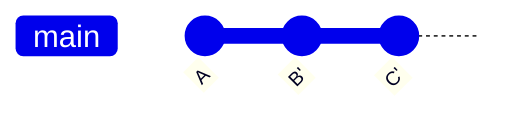

# プルリクエストとレビュー

プルリクエスト (PR) は「この変更を取り込んでほしい」という提案であり、チームでの**コードレビューの場**です。GitHub Flow の心臓部です。

## PR を作る

GitHub の Web 画面、または `gh` CLI で作成できます。

```bash
# 対話的に作成
gh pr create

# タイトル・本文をコミットから自動入力
gh pr create --fill

# ドラフト（作業中）として作成
gh pr create --draft
```

## 良い PR の条件

レビューしやすい PR は、マージも速くなります。

- **小さく保つ** — 数百行を超えると質の高いレビューが難しくなる
- **目的を 1 つに** — 「機能追加」と「リファクタ」を混ぜない
- **説明を書く** — 何を・なぜ変えたか、確認方法、関連 Issue をリンク
- **セルフレビュー** — 出す前に自分で diff を読み返す

```markdown
## 概要
ユーザープロフィール画面を追加します。

## 変更点
- プロフィール表示コンポーネントを追加
- API クライアントに getProfile を追加

## 確認方法
1. `npm run dev` で起動
2. /profile にアクセスして表示を確認

Closes #123
```

::: tip Issue の自動クローズ
PR 本文に `Closes #123` / `Fixes #123` と書くと、マージ時に対応する Issue が自動でクローズされます。
:::

## レビューの観点

レビュアーは「粗探し」ではなく「品質を一緒に上げる」姿勢で見ます。

| 観点 | 確認すること |
| --- | --- |
| 正しさ | 仕様を満たすか、エッジケースの考慮はあるか |
| 可読性 | 命名・構造が理解しやすいか |
| 設計 | 既存の方針・パターンと整合するか |
| テスト | テストが追加され、CI が通っているか |
| 安全性 | 機密情報の混入・脆弱性はないか |

GitHub では「コメント」「承認 (Approve)」「変更要求 (Request changes)」を使い分けます。

## マージ方式の比較

GitHub には 3 つのマージ方式があります。同じ PR（`feature` の `B`・`C` の 2 コミット）を `main` に取り込んだとき、**取り込み後の `main` の履歴の形**がどう変わるかで選びます。各図の `A` は取り込み前の `main`、`B`・`C` は feature 側のコミットです（Rebase and merge の図では、載せ直したあとを `B'`・`C'` と表記します）。

### Merge commit

`feature` の全コミット（`B`・`C`）に加え、統合を示す**マージコミット `M`** が残ります。作業履歴がそのまま残る形です。



### Squash and merge

`feature` の `B`・`C` を **1 つにまとめた単一コミット**として `main` に載せます。個々のコミットは `main` には残りません。



### Rebase and merge

`feature` の各コミットを、`main` の先端へ**一直線に載せ直し**ます（`B'`・`C'`）。マージコミットは作られず、コミットは 1 つずつ残ります。



| 方式 | 結果 | 向いているケース |
| --- | --- | --- |
| **Merge commit** | ブランチの全コミット + マージコミット | 作業履歴を忠実に残したい |
| **Squash and merge** | PR を 1 コミットに圧縮 | `main` の履歴を機能単位で綺麗に保ちたい（**おすすめ**） |
| **Rebase and merge** | コミットを一直線に追加（マージコミットなし） | 直線的な履歴を保ちつつ各コミットを残したい |

::: tip 迷ったら Squash
多くのチームでは **Squash and merge** が扱いやすく人気です。PR 単位で履歴が 1 コミットにまとまり、`main` のログが読みやすくなります。
:::

## PR を最新の main に追従させる（Update branch）

PR を出したあとに `main` が先へ進むと、GitHub の PR 画面に **「Update branch」** ボタンが出ます。遅れた自分のブランチへ `main` の最新を取り込むための操作で、2 つの選択肢があります。

- **Update with merge commit** … `main` の最新を**マージコミット**で取り込む（自分のコミット ID は変わらない）
- **Update with rebase** … 自分のコミットを `main` の最新の**上に乗せ直す**（コミット ID が振り直される）

::: warning これは「マージ方式」の選択ではありません
上の [マージ方式の比較](#マージ方式の比較)（`Merge commit` / `Squash and merge` / `Rebase and merge`）は、**PR を `main` に取り込むとき**の方式です。ここで選ぶのは「**遅れた自分のブランチに `main` の最新を取り込む方法**」で、別物です。
:::

### どう選べばいいか

**迷ったら `Update with merge commit` を選べば安全です。**

| | Update with merge commit | Update with rebase |
| --- | --- | --- |
| コミット ID | **変わらない** | **振り直される** |
| 安全度 | 高い（元に戻しやすい） | 注意が必要 |
| 向いているケース | 通常はこちら / 複数人で同じブランチを触っている | 自分しか触っていない PR で履歴を一直線に保ちたい |

**Squash and merge** 方針なら、取り込みのマージコミットは最終的に 1 コミットへ潰れるため、`Update with merge commit` で十分です。`Update with rebase` はコミット ID を振り直すので、**同じ PR ブランチを他の人も触っている場合は使いません**（次の pull で履歴が食い違います）。

### 手元（ローカル）で同じことをする

GitHub のボタンを使わず、ローカルで取り込んでから push しても同じです。コンフリクト対応はローカルの方が楽なことが多いです。

```bash
# 自分のブランチにいる状態で

# 「Update with merge commit」に相当
git fetch origin
git merge origin/main
git push

# 「Update with rebase」に相当
git fetch origin
git rebase origin/main
git push --force-with-lease   # 履歴が変わるので force push が必要
```

::: tip rebase 後の push は `--force-with-lease`
`rebase` するとコミット ID が変わるため、通常の `git push` は弾かれます。`--force-with-lease` は「自分が知らないうちにリモートが更新されていたら中断する」安全な force push です。単なる `--force` は他人の push を上書きしかねないので避けましょう。
:::

複雑なコンフリクトが出たら、ボタンではなくローカルで解決します。手順は [コンフリクト解決](./conflicts) を参照してください。
