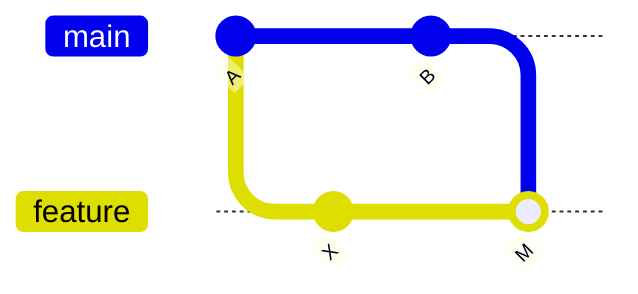
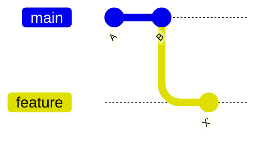

# rebase と履歴整理

`rebase` は、コミットの土台（base）を別の場所に付け替える操作です。**履歴を一直線に保つ**ために使われ、使いこなすとレビューしやすい綺麗な履歴を作れます。

## merge と rebase の違い

同じ「main の最新を取り込む」でも、結果の履歴の形が違います。

### merge の場合（マージコミットが残る）



### rebase の場合（一直線になる）



rebase は feature のコミット `X` を、最新の `B` の上に「乗せ直し」ます。結果として履歴が枝分かれせず一直線になります。

```bash
# feature ブランチで、main の最新の上に乗せ直す
git switch feature/login
git rebase main

# コンフリクトが出たら解決して続行
git add <解決したファイル>
git rebase --continue
```

## 使い分けの指針

| | merge | rebase |
| --- | --- | --- |
| 履歴 | 分岐が残る（事実に忠実） | 一直線（読みやすい） |
| マージコミット | 作られる | 作られない |
| 向いている対象 | 共有ブランチ | **手元の未共有ブランチ** |

::: danger 黄金律: 共有済みの履歴を rebase しない
すでに push してチームが参照しているブランチを rebase すると、コミットの ID が変わり、他のメンバーの履歴と食い違って大混乱します。**rebase は「自分しか触っていないコミット」にだけ**使いましょう。
:::

## interactive rebase で履歴を整える

`-i`（インタラクティブ）を使うと、コミットの**まとめ・並べ替え・メッセージ修正**ができます。PR を出す前に履歴を整えるのに便利です。

```bash
# 直近 3 コミットを編集対象にする
git rebase -i HEAD~3
```

エディタが開き、各コミットに操作を指定します。

```text
pick   a1b2c3d feat: ログインフォーム
squash e4f5g6h fix: typo                 # 直前にまとめる
reword i7j8k9l feat: バリデーション追加   # メッセージを書き直す
```

| コマンド | 動作 |
| --- | --- |
| `pick` | そのまま使う |
| `squash` / `s` | 直前のコミットに統合（メッセージは残す） |
| `fixup` / `f` | 直前に統合（メッセージは捨てる） |
| `reword` / `r` | メッセージを書き直す |
| `drop` / `d` | コミットを削除 |

## pull を rebase で行う

`git pull` のたびにマージコミットが増えるのを避けたい場合、rebase 方式の pull が使えます。

```bash
git pull --rebase

# 常にこの挙動にする設定
git config --global pull.rebase true
```

履歴管理ができたら、最後の仕上げは自動化です。次は [CI 連携 (GitHub Actions)](./ci) に進みます。
