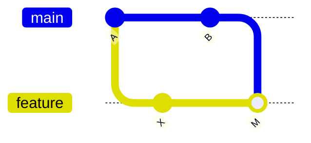
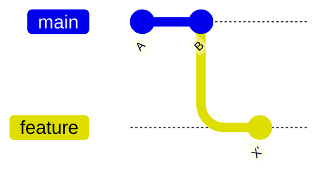

# rebase と履歴整理

`rebase` は、コミットの土台（base）を別の場所に付け替える操作です。**履歴を一直線に保つ**ために使われ、使いこなすとレビューしやすい綺麗な履歴を作れます。

## merge と rebase の違い

同じ「main の最新を取り込む」でも、結果の履歴の形が違います。

### merge の場合（マージコミットが残る）



### rebase の場合（一直線になる）



rebase は feature のコミット `X` を、最新の `B` の上に「乗せ直し」ます。結果として履歴が枝分かれせず一直線になります。

```bash
# feature ブランチで、main の最新の上に乗せ直す
git switch feature/login
git rebase main

# コンフリクトが出たら解決して続行
git add <解決したファイル>
git rebase --continue
```

## 使い分けの指針

| | merge | rebase |
| --- | --- | --- |
| 履歴 | 分岐が残る（事実に忠実） | 一直線（読みやすい） |
| マージコミット | 作られる | 作られない |
| 向いている対象 | 共有ブランチ | **手元の未共有ブランチ** |

::: danger 黄金律: 共有済みの履歴を rebase しない
すでに push してチームが参照しているブランチを rebase すると、コミットの ID が変わり、他のメンバーの履歴と食い違って大混乱します。**rebase は「自分しか触っていないコミット」にだけ**使いましょう。
:::

## interactive rebase で履歴を整える

`-i`（インタラクティブ）を使うと、コミットの**まとめ・並べ替え・メッセージ修正**ができます。PR を出す前に履歴を整えるのに便利です。

```bash
# 直近 3 コミットを編集対象にする
git rebase -i HEAD~3
```

エディタが開き、各コミットに操作を指定します。

```text
pick   a1b2c3d feat: ログインフォーム
squash e4f5g6h fix: typo                 # 直前にまとめる
reword i7j8k9l feat: バリデーション追加   # メッセージを書き直す
```

| コマンド | 動作 |
| --- | --- |
| `pick` | そのまま使う |
| `squash` / `s` | 直前のコミットに統合（メッセージは残す） |
| `fixup` / `f` | 直前に統合（メッセージは捨てる） |
| `reword` / `r` | メッセージを書き直す |
| `drop` / `d` | コミットを削除 |

## pull を rebase で行う

`git pull` のたびにマージコミットが増えるのを避けたい場合、rebase 方式の pull が使えます。

```bash
git pull --rebase

# 常にこの挙動にする設定
git config --global pull.rebase true
```

## GitHub 上でブランチを更新する（merge か rebase か）

ここまではローカルの `rebase` の話でした。同じ選択は **GitHub の PR 画面**にも現れます。PR を出したあと `main` が先に進むと、**「Update branch」** ボタンが出て、遅れた自分のブランチに `main` の最新を取り込めます。ボタンには 2 つの選択肢があります。

- **Update with merge commit** … `main` の最新を**マージコミット**で取り込む（自分のコミット ID は変わらない）
- **Update with rebase** … 自分のコミットを `main` の最新の**上に乗せ直す**（コミット ID が振り直される）

結果の履歴の形は、上の「[merge と rebase の違い](#merge-と-rebase-の違い)」で見た 2 つの図とまったく同じです。

::: warning これは「マージ方式」の選択ではありません
PR を**マージするとき**の `Merge commit` / `Squash and merge` / `Rebase and merge` とは別物です。ここで選ぶのは「**遅れた自分のブランチに `main` の最新を取り込む方法**」です。マージ方式の選び方は [プルリクエストとレビュー](./pull-request) を参照してください。
:::

### どう選べばいいか

まず結論から。**迷ったら `Update with merge commit` を選べば安全です。**

| | Update with merge commit | Update with rebase |
| --- | --- | --- |
| 履歴 | マージコミットが増える | 一直線で読みやすい |
| コミット ID | **変わらない** | **振り直される** |
| 安全度 | 高い（元に戻しやすい） | 注意が必要 |
| 向いているケース | 通常はこちら / 複数人で同じブランチを触っている | 履歴を綺麗に保ちたい / 自分しか触っていない PR |

- **`Update with merge commit` を選ぶとき**: どちらでもよく安全に済ませたいとき／他の人も同じ PR ブランチを触っているとき／**Squash and merge** 方針で更新のマージコミットが最終的に潰れるとき。
- **`Update with rebase` を選ぶとき**: 自分しか触っていないブランチで履歴を一直線に保ちたいとき／`Rebase and merge` 方針で最終履歴を綺麗にしたいとき。

`Update with rebase` はコミット ID を振り直すため、**共有ブランチでは使わない**——上の [使い分けの指針](#使い分けの指針)で触れた黄金律と同じ理由です。同じ PR ブランチを他の人も pull していると、次の pull で履歴が食い違います。

### 手元（ローカル）で同じことをする

GitHub のボタンを使わず、ローカルで取り込んでから push しても同じです。むしろコンフリクト対応はローカルの方が楽なことが多いです。

```bash
# 自分のブランチにいる状態で

# 「Update with merge commit」に相当
git fetch origin
git merge origin/main
git push                      # 取り込んだ結果をリモートの PR ブランチへ反映

# 「Update with rebase」に相当
git fetch origin
git rebase origin/main
git push --force-with-lease   # rebase 後は履歴が変わるので force push が必要
```

::: tip rebase 後の push は `--force-with-lease`
rebase するとコミット ID が変わるため、通常の `git push` は弾かれます。`--force-with-lease` を使うと「自分が知らないうちにリモートが更新されていたら中断する」安全な force push になります。単なる `--force` は他人の push を上書きしかねないので避けましょう。
:::

複雑なコンフリクトが出たら、GitHub のボタンではなくローカルで解決します。手順は [コンフリクト解決](./conflicts) を参照してください。
