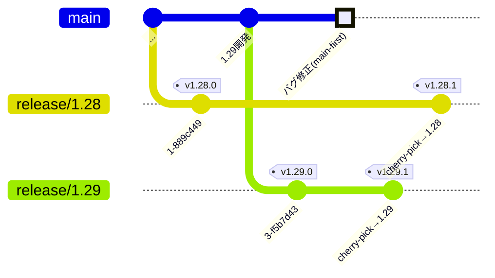

# 複数バージョンの保守（リリースブランチ運用）

[リリースとバージョン管理](./release) では、`main` 一本を土台に、緊急修正を **release ブランチ + hotfix** で安全に出す流れを学びました。ここではその発展として、**複数の出荷済みバージョンを同時に保守し続ける**ための運用——有名 OSS が実際に採っている**長命なリリースブランチ**の使い方——を扱います。

::: tip このページの位置づけ
これは「継続デプロイの単一サービス」には**基本的に不要**な、やや進んだトピックです。まず [リリースとバージョン管理](./release) を読んでから、「複数バージョンを並行してサポートする必要が出てきたら」戻ってくれば十分です。
:::

## なぜ長命なリリースブランチが要るのか

`main` から最新をリリースし続ける運用では、「出荷済みのバージョン」は基本 1 つだけです。しかし世の中には、**利用者が常に最新へ上げられない**プロダクトがあります。

- **ライブラリ・言語・DB・OS** — 利用者は自分の都合でバージョンを固定している。`v1` を使い続ける人がいる間、`v2` を出しても `v1` のセキュリティ修正は続けなければならない
- **エンタープライズ製品** — 顧客が特定バージョンで検証・運用しており、勝手に上げられない
- **長期サポート (LTS)** — 「この版は 3 年間サポートします」と約束している

こうした状況では、**複数のバージョン系列を同時に保守する**必要があります。そのために、リリースした系列ごとに**ずっと生き続けるブランチ**（`release/1.28`, `release/1.29` など）を用意し、それぞれにパッチを積んでいきます。これが**パターンA＝長命なリリースブランチ運用**です。

## 単一 hotfix 線との違い

[リリースとバージョン管理](./release) で扱った `release/1.2` は、**1 本の保守線**を切って hotfix を当てる入口でした。パターンAは、これを**複数系列に一般化**したものです。

| | 単一 hotfix 線（release.md） | 複数保守ブランチ（本ページ） |
| --- | --- | --- |
| 目的 | 出荷直後の緊急修正を安全に出す | 複数バージョンを長期に並行保守 |
| ブランチ | 必要なときに 1 本 | 系列ごとに常設（`release/1.28` / `release/1.29` …） |
| 寿命 | 短命（役目を終えたら畳む） | 長命（サポート期間中ずっと維持） |
| 代表例 | 小〜中規模のプロダクト | Kubernetes / Node.js / PostgreSQL など |

## 仕組み：main-first と cherry-pick

パターンAの心臓部は、**修正をどこに入れて、どう各系列へ配るか**です。鉄則は **main-first（まず main に入れる）** です。

1. バグ修正は、まず **`main` にマージ**する（＝将来のすべてのリリースに含まれる）
2. その修正を、サポート中の各リリースブランチへ **cherry-pick（back-patch）** する
3. 各リリースブランチ上で**パッチ版のタグ**（`v1.28.4` など）を打ってリリースする

```bash
# 1. まず main に修正を入れる（通常の PR フロー）
#    → 修正コミット abc1234 が main に入ったとする

# 2. サポート中の系列へ cherry-pick する
git switch release/1.29
git cherry-pick abc1234
git push origin release/1.29

git switch release/1.28
git cherry-pick abc1234
git push origin release/1.28

# 3. 各系列でパッチ版を切る（注釈付きタグ → Release）
git switch release/1.29
git tag -a v1.29.3 -m "リリース v1.29.3"
git push origin v1.29.3
gh release create v1.29.3 --generate-notes --target release/1.29
```



::: warning なぜ「main-first」なのか
逆順（先にリリースブランチだけ直す）だと、**`main` への取り込みを忘れて次のリリースで同じバグが復活**します。これは [リリースとバージョン管理](./release#release-ブランチと-hotfix) でも触れた最頻出の事故です。**「main に入れてから各系列へ配る」**を徹底すれば、取りこぼしが構造的に起きません。修正が main に無い状態を作らないのが要点です。
:::

## 実際の OSS ではどうしているか

長命なリリースブランチは、大規模 OSS でごく一般的な運用です。ブランチ名の付け方に各プロジェクトの個性が出ます。

::: tip 本ガイドでの命名
実プロジェクトのブランチ名は `release-1.29`・`v20.x`・`REL_16_STABLE` などさまざまですが、**本ガイドでは他ページと揃えて `release/x.y`（スラッシュ形）に統一**しています。上の自前例（`release/1.28` など）と、下の表に出てくる各 OSS の実名との違いは、この方針によるものです。
:::

| プロジェクト | ブランチ名の例 | 運用の特徴 |
| --- | --- | --- |
| **Kubernetes** | `release-1.29` | minor ごとに枝を切り、`v1.29.x` を枝上で tag。修正は main→枝へ cherry-pick |
| **Node.js** | `v20.x`（+ `v20.x-staging`） | メジャー系列ごと。偶数メジャーを **LTS** として長期保守 |
| **PostgreSQL** | `REL_16_STABLE` | メジャーごとの安定枝に back-patch。5 年サポート |
| **Linux（stable）** | `linux-6.6.y` | 安定版メンテナが修正だけを取り込む。mainline とは別管理 |
| **Chromium / Firefox** | マイルストーン枝（`M120` 等） | 時期でブランチを切る「リリーストレイン」型 |
| **GitLab** | `16-7-stable` | 月次リリース。セキュリティ修正を各 stable 枝へ back-patch |

共通点は明確です——**タグは枝の上で打たれ、枝はサポート期間中ずっと生き続ける**。「リリースを作るための使い捨てブランチ」ではなく、**バージョン系列そのものを表す住所**として機能します。

## リリーストレインと LTS

長命ブランチ運用とセットで語られる 2 つの概念があります。

- **リリーストレイン** — 「毎月 / 6 週間ごと」のように**時期を決めて**リリースブランチを切る方式（Chromium・Firefox・GitLab など）。機能が間に合わなければ「次の電車」に乗せる、という発想。個々の機能の完成を待たず、リリース間隔を安定させられる
- **LTS（Long-Term Support）** — 特定の系列を「長期サポート版」と定め、**通常より長い期間**バグ・セキュリティ修正を提供する（Node.js の偶数メジャー、Ubuntu の `YY.04 LTS` など）。利用者は「頻繁に上げたくないが安全は保ちたい」ニーズを LTS 系列で満たせる

どちらも「**複数系列を並行保守する**」というパターンAの土台があって初めて成立します。

## ブランチ戦略との対応

より形式化したブランチ戦略の中にも、この考え方は組み込まれています。

- **Git Flow** — `main` / `develop` に加えて `release/*` ブランチを持つ。リリース準備と保守の場を明示的に分ける
- **GitLab Flow** — `main` の下流に環境別・バージョン別の `release` ブランチ（`production` や `X-Y-stable`）を置き、上流から下流へ変更を流す

いずれも本質は同じで、**「出荷した線を、次の開発とは切り離して維持する」**ための仕組みです。詳しくは [GitHub Flow](./github-flow) との比較として押さえておくとよいでしょう。

## いつ導入し、いつ導入しないか

強力な運用ですが、**維持コストも大きい**（複数枝への cherry-pick、各系列の CI、サポート期限の管理）。導入判断の目安は次のとおりです。

### 導入する価値があるとき

- ライブラリ・SDK・言語処理系など、**利用者がバージョンを固定**して使う
- 複数バージョンを**同時にサポートする約束**（LTS・SLA）がある
- 出荷後に**安定化期間**を設け、新機能とは別に修正だけ流したい

### 導入しなくてよいとき

- **継続デプロイ中心の Web サービス**——常に最新の 1 バージョンだけが動く。修正は「`main` を直して再デプロイ」で済む
- リリース頻度が低く、旧バージョンを保守する約束もない

::: tip 継続デプロイ型サイトの場合
`main` への push で継続デプロイする**単一線**の構成なら、長命なリリースブランチは**不要**で、タグ・Release は [リリースとバージョン管理](./release) で学んだとおり「出荷点の印」として使えば十分です。パターンAは「そういう運用が必要なプロダクトに出会ったとき」の引き出しとして知っておく、という位置づけです。
:::

## まとめ

- **長命なリリースブランチ**は、**複数の出荷済みバージョンを並行保守する**ための仕組み（＝パターンA）
- 鉄則は **main-first**——修正はまず `main`、そこから各系列へ **cherry-pick**。取りこぼしを構造的に防ぐ
- Kubernetes・Node.js・PostgreSQL など大規模 OSS の標準運用。タグは**枝の上**で打ち、枝は**サポート期間中ずっと**生きる
- **リリーストレイン**（時期で切る）・**LTS**（長期サポート）はこの土台の上に成り立つ
- **継続デプロイの単一サービスには基本不要**。「複数バージョンを支える必要が出たら」導入する

## 関連ページ

- [リリースとバージョン管理](./release) — タグ・SemVer・GitHub Release・単一 hotfix 線
- [GitHub Flow](./github-flow) — `main` 一本のシンプルな運用（本ページの対極）
- [ブランチとマージ](./branching) — ブランチ操作と cherry-pick の基礎
- [デュアル配布（SaaS + セルフホスト）でのリリース運用](./dual-distribution) — 版付き配布と継続デプロイの併走
