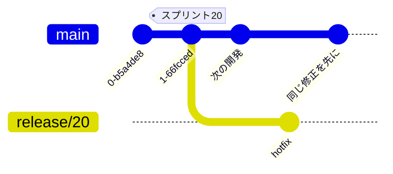

# Microsoft Release Flow

**Release Flow** は、Microsoft（Azure DevOps チーム）が公開しているブランチ運用のガイダンスです。[GitHub Flow](./github-flow) をベースにしつつ、**大規模チームで定期リリースと複数バージョンの保守を回す**ための工夫を加えた「型」で、GitHub Flow / [Git Flow](./git-flow) / [GitLab Flow](./gitlab-flow) と並ぶ選択肢として押さえておくと比較の幅が広がります。

出典: [Microsoft の Git 分岐ガイダンス（Release Flow）](https://learn.microsoft.com/ja-jp/azure/devops/repos/git/git-branching-guidance)

::: tip このページの位置づけ
ここでは Release Flow を**戦略の紹介・比較**として扱います。本リポジトリがどれを採用するか（規約）は別で扱い、ここでは「どういう考え方か」に徹します。
:::

## 3 つの原則

Release Flow の土台は GitHub Flow と同じく、次のシンプルな原則です。

- **すべての作業を feature ブランチで行う** — `main` で直接作業しない。
- **変更は必ず Pull Request で `main` にマージする** — レビューと CI を通す。
- **`main` を常に高品質・最新に保つ** — いつでもここからリリースを切り出せる状態にする。

## ブランチの命名規則

Release Flow は**用途が一目で分かる階層的なブランチ名**を推奨します（原文の例）。

```text
users/<username>/<description>
users/<username>/<workitem>
feature/<feature-name>
feature/<feature-area>/<feature-name>
bugfix/<description>
hotfix/<description>
```

Azure Repos では **「Require branch folders」ポリシー**で「`/` を含む（＝フォルダ階層を持つ）名前」を強制でき、命名を機械的に揃えられます。個人の下書きは `users/<名前>/…`、共有する機能開発は `feature/…` といった住み分けが分かりやすくなります。

## リリースは「長命な release ブランチ」で表す

Release Flow の最大の特徴は、**リリースを長命な `release` ブランチで表現する**ことです。

- リリースのたびに `main` から `release/<番号>`（例 `release/20`）を切る。
- **`release` ブランチから `main` へは PR で戻さない**（マージしない）。
- サポート中のバージョンごとに `release` ブランチが 1 本あり、**サポート終了（EOL）でロック**する。



この「バージョン系列 = 長命なブランチ」という考え方は、本教材の [複数バージョンの保守（リリースブランチ）](./release-branches) と同じ発想です。

## main-first + cherry-pick

`release` ブランチのバグを直すときは、**先に `main`（mainline）を直し、その修正を `release` ブランチへ `cherry-pick` で移植**します。`release` から `main` へマージして戻すことはしません。

```bash
# 1. まず main で修正して PR マージ（mainline を先に直す）
# 2. その修正コミットを release ブランチへ移植
git switch release/20
git cherry-pick <main で入れた修正のコミット>
git push origin release/20
```

「**修正が `main` に無い状態を作らない**」——これは本教材が [複数バージョンの保守](./release-branches) で強調している鉄則とまったく同じです。順序を逆にすると、次のリリースで同じバグが復活します。

## タグ主軸との違い

Release Flow は「**リリースはタグではなくブランチで表す**」という立場を取ります。一方、本教材は継続デプロイ（`main` → GitHub Pages）を前提に、[リリースとバージョン管理](./release) で説明したとおり**タグ（＋ GitHub Release）を主軸**にしています。

どちらが正しいということはありません。**「サポート中の版を長期間 back-patch し続ける」**なら release ブランチが要になり、**「常に最新の 1 版を出し続ける」**ならタグで十分、という使い分けです。

## 環境ブランチ `deploy/<環境>`

Release Flow では、特定環境へのデプロイを表す **`deploy/<環境>`**（例 `deploy/performance-test`）というブランチも、`release` ブランチと同じ要領（main-first + cherry-pick）で扱う手法が紹介されています。これは [GitLab Flow](./gitlab-flow) の**環境ブランチ**（`staging` / `production` など）と同じ狙いのものです。

## どんなチームに向くか

- 定期的な**スプリント／リリース**を回しつつ、`main` は常にデプロイ可能に保ちたい。
- 出荷済みの版に**緊急修正を back-patch** する必要がある（複数バージョンの並行保守）。
- 大人数で**命名やレビューを機械的に統一**したい（ブランチフォルダ強制など）。

継続デプロイの単一サービスなら [GitHub Flow](./github-flow) で十分です。まずはそこから始め、必要に応じて考え方を採り入れるのが安全です——戦略の選び方は [ブランチ戦略の使い分け](./branching-strategies) を参照してください。

## 関連ページ

- [GitHub Flow](./github-flow) — Release Flow の土台
- [複数バージョンの保守（リリースブランチ）](./release-branches) — 長命な release ブランチと main-first + cherry-pick
- [GitLab Flow](./gitlab-flow) — 環境ブランチの考え方
- [リリースとバージョン管理](./release) — タグ主軸のリリース
- [ブランチ戦略の使い分け](./branching-strategies) — 各戦略の選び方
