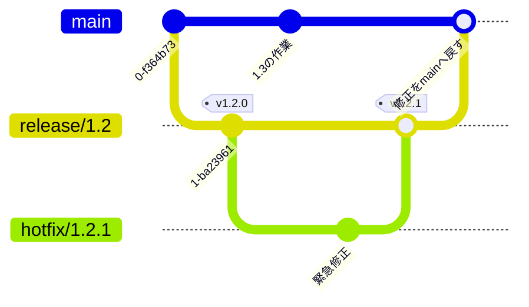

# リリースとバージョン管理

`main` にマージした変更を、いつ・どのバージョンとして世に出すか——それを管理するのが**リリース**です。ここでは、GitHub Flow を土台に、**タグ**・**セマンティックバージョニング**・**GitHub Release**、そして出荷済みバージョンを直す **hotfix** までを扱います。

## マージ・リリース・デプロイは別のこと

似た文脈で使われますが、3 つは別の操作です。

| 語 | 意味 | 主な操作 |
| --- | --- | --- |
| **マージ** | PR を `main` に取り込む | GitHub の「Merge pull request」 |
| **リリース** | `main` のある 1 点に「これが v1.2.0」と**印を付けて出荷単位を確定**する | `git tag` / GitHub Release |
| **デプロイ** | その成果物を本番環境で動かす | CI/CD・ホスティング |

::: tip 継続デプロイ型の例
たとえば `main` に push されるたびに GitHub Actions が自動で GitHub Pages へデプロイする**継続デプロイ型**の構成（[deploy.yml](https://github.com/ykgw-daiki-nakamura/nakamura-git-tutorial/blob/main/.github/workflows/deploy.yml) の例）では、タグや Release は**デプロイのトリガーではなく「出荷点の印」** として使います。プロダクトによっては、次章で触れるように**タグや Release をデプロイのトリガー**にする構成もあります。
:::

## セマンティックバージョニング (SemVer)

バージョン番号は `MAJOR.MINOR.PATCH`（例 `1.4.2`）の 3 つの数字で表します。**変更の性質に応じて、どの数字を上げるか**が決まっています。

| 上げる桁 | いつ上げるか | 例 |
| --- | --- | --- |
| **MAJOR** | 後方互換性を壊す変更 | `1.4.2` → `2.0.0` |
| **MINOR** | 後方互換のある機能追加 | `1.4.2` → `1.5.0` |
| **PATCH** | 後方互換のあるバグ修正 | `1.4.2` → `1.4.3` |

### Conventional Commits と対応している

[Conventional Commits](https://www.conventionalcommits.org/ja/)（`type(scope): 要約`）は、そのまま SemVer に対応します。**普段書いているコミット種別が、次に上げるべき桁を教えてくれます。**

| コミット | 上がる桁 |
| --- | --- |
| `fix:` | **PATCH** |
| `feat:` | **MINOR** |
| `feat!:` / 本文に `BREAKING CHANGE:` | **MAJOR** |
| `docs:` `chore:` `refactor:` など | 原則バージョンに影響しない |

::: tip 0.x.y のうちは
`1.0.0` に達する前（`0.x.y`）は「まだ安定していない開発版」の合図です。この期間は破壊的変更でも MINOR（`0.2.0` → `0.3.0`）で上げる運用が一般的です。実習でも `v0.1.0` から始めます。
:::

## タグを打つ

**タグ**は、コミットに付ける動かない名札です。「このコミットが v1.2.0」と印を付けます。リリースには**注釈付きタグ (`-a`)** を使います（作成者・日時・メッセージが記録されるため）。

```bash
# いまの HEAD に注釈付きタグを打つ
git tag -a v1.2.0 -m "リリース v1.2.0"

# タグはデフォルトでは push されない。明示的に送る
git push origin v1.2.0

# 確認
git tag              # タグ一覧
git show v1.2.0      # タグの中身とコミットを表示
```

::: warning タグは push を忘れやすい
`git push` は**タグを送りません**。タグを共有するには `git push origin <タグ名>`（またはまとめて `git push --tags`）が必要です。「ローカルには v1.2.0 があるのに GitHub に無い」の多くはこれが原因です。
:::

## GitHub Release

タグはただの名札ですが、**GitHub Release** はそのタグに**リリースノート**（変更点の一覧）や成果物を紐付けて、ページとして公開する機能です。

```bash
# タグから Release を作る。--generate-notes で変更履歴を自動生成
gh release create v1.2.0 --generate-notes
```

ブラウザの場合は、リポジトリの **Releases → Draft a new release** から、タグを選び **Generate release notes** を押すと、前回のリリース以降にマージされた PR からノートが自動生成されます。

::: tip CHANGELOG.md で変更履歴を残す
自動生成のリリースノートに加えて、リポジトリに `CHANGELOG.md` を置き、**人が読む変更履歴**を [Keep a Changelog](https://keepachangelog.com/ja/1.1.0/) 形式でまとめておくと親切です。PR をマージするたびに `[Unreleased]` へ 1 行足し、リリース時にバージョン見出しへ繰り上げます。**[CHANGELOG.md](https://github.com/ykgw-daiki-nakamura/nakamura-git-tutorial/blob/main/CHANGELOG.md) がその実例**です。
:::

## release ブランチと hotfix

GitHub Flow では基本的に `main` 一本で回せますが、**すでに出荷したバージョンを、`main` の未完成な変更を巻き込まずに直したい**場面が出てきます。たとえば、本番は `v1.2.0` で動いているのに、`main` はすでに次の `1.3` に向けて進んでいる——そんなときに緊急のバグ修正（**hotfix**）を安全に出すために **release ブランチ**を使います。



流れは次のとおりです。

1. **リリース時に `release/1.2` を切る**——出荷したバージョンを保守するための線を残す。ここで `v1.2.0` を打つ。
2. `main` は次の機能開発（`1.3`）へ進む。
3. **本番でバグが見つかったら** `release/1.2` から `hotfix/1.2.1` を切って直す。
4. 修正を `release/1.2` へマージし、**`v1.2.1` を打って Release**・デプロイする。
5. **`release/1.2` を `main` へマージし戻す**——`main` にも同じ修正を反映し、取りこぼしを防ぐ。

::: warning `main` への戻し忘れに注意
hotfix 方式で最も多い事故が、**修正を `main` へ戻し忘れる**ことです。すると次のリリースで同じバグが復活します。「hotfix は release で直し、必ず `main` へ戻す」までを 1 セットにしてください。
:::

::: tip いつ release ブランチが要る？
継続デプロイ中心の Web サービスなら、多くの場合 release ブランチは不要で、hotfix も「`main` を直して再デプロイ」で済みます。**複数バージョンを並行して保守する**、**出荷後に安定化期間を設ける**——そうした「出荷済みを直し続ける」必要が出てから導入すれば十分です。`develop` / `release` を常設する **Git Flow**、`main` + `release/*` の **GitLab Flow** など、より形式化した運用もあります。有名 OSS が実際に採る**長命なリリースブランチ**運用は [複数バージョンの保守（リリースブランチ運用）](./release-branches) で詳しく扱います。
:::

## CI と組み合わせる（例）

タグや Release を**デプロイのトリガー**にすると、「タグを打つ＝出荷」を自動化できます。GitHub Actions での例です（あくまで構成例です）。

```yaml
# タグ push を起点にする例
on:
  push:
    tags: ['v*']        # v1.2.0 のようなタグが push されたら
```

```yaml
# GitHub Release の公開を起点にする例
on:
  release:
    types: [published]  # Release が公開されたら
```

こうしておくと、`git push origin v1.2.0` や Release の公開をきっかけに、本番デプロイやリリース成果物のビルドを走らせられます。CI の基本は [CI 連携 (GitHub Actions)](./ci) を参照してください。

## まとめ

- **マージ・リリース・デプロイは別物**。リリースは「出荷点に印を付ける」こと
- バージョンは **SemVer**（`MAJOR.MINOR.PATCH`）。**Conventional Commits がどの桁を上げるかを教えてくれる**
- リリースには**注釈付きタグ**を打ち、**push を忘れない**。**GitHub Release** でノートを公開する
- 出荷済みバージョンを直すときは **release ブランチ + hotfix**。修正は**必ず `main` へ戻す**

実際にタグを打って Release を作り、hotfix まで一周する練習は [⑦ タグとリリース](../hands-on/release-lab) で行えます。

出荷済みの複数バージョンを並行して長期保守する運用は [複数バージョンの保守（リリースブランチ運用）](./release-branches) で詳しく扱います。顧客ごとのカスタマイズや、特定バージョンを土台にした案件の進め方は、開発規約の [顧客別カスタマイズ](/standards/customization)・[バージョン運用](/standards/versioning) を参照してください。
