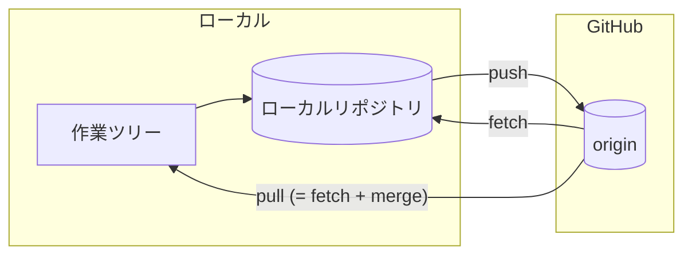
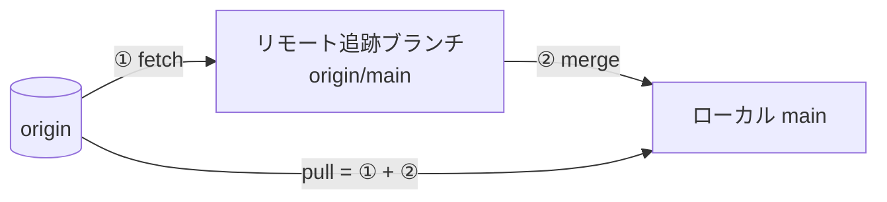

# リモートと GitHub

ローカルで作った履歴を GitHub と同期する方法を見ていきます。チーム開発では、この「同期」が日々の中心になります。

## リモートとは

リモートは「別の場所にあるリポジトリ」への参照です。GitHub 上のリポジトリには慣習的に `origin` という名前が付きます。



## 接続設定（認証）

GitHub へ push するには、自分が誰かを証明する必要があります。方式は **SSH 鍵**と **HTTPS** の 2 つで、どちらを選んでも以降の `git` の使い方は変わりません。最初のセットアップでつまずきやすいので、先に済ませておきます。

| | SSH | HTTPS |
| --- | --- | --- |
| リモート URL | `git@github.com:user/repo.git` | `https://github.com/user/repo.git` |
| 認証情報 | 手元の秘密鍵 | アクセストークン（資格情報ヘルパーが保存） |
| 初期設定 | 鍵を作って GitHub に公開鍵を登録 | ヘルパーの導入、または `gh auth login` |
| ファイアウォール | 22 番ポートが塞がれる環境がある | 443 番なのでほぼ通る |
| 向いている場面 | 自分の端末で長く使う | 社内プロキシ環境、共用端末 |

### SSH 鍵を使う

```bash
# 1. 鍵を作る（既に ~/.ssh/id_ed25519 があれば不要）
ssh-keygen -t ed25519 -C "you@example.com"

# 2. 公開鍵を GitHub に登録する（表示された内容を GitHub の Settings > SSH keys に貼る）
cat ~/.ssh/id_ed25519.pub

# 3. 疎通を確認する
ssh -T git@github.com
```

### HTTPS を使う

パスワードでは push できません。**アクセストークン**を使い、毎回入力しなくて済むよう資格情報ヘルパー（Git Credential Manager など）に保存させます。

```bash
# 資格情報ヘルパーの設定を確認する
git config --get credential.helper
```

[GitHub CLI](https://cli.github.com/) を入れているなら、対話に答えるだけで HTTPS の認証設定まで済みます。

```bash
gh auth login
```

::: tip どちらを選ぶか
チームの方針があればそれに従ってください。特に決まっていなければ、**手元の端末では SSH、プロキシで 22 番が塞がれている環境では HTTPS** が無難です。あとから `git remote set-url origin <新しい URL>` で切り替えられます。
:::

## リモートの確認・追加

```bash
# 設定されているリモートを確認
git remote -v

# リモートを追加（git init から始めた場合）
git remote add origin git@github.com:user/repo.git
```

## clone — リモートを複製する

既存のリポジトリで作業を始めるときは `clone` します。リモート設定も自動で行われます。

```bash
# SSH
git clone git@github.com:user/repo.git

# HTTPS
git clone https://github.com/user/repo.git
```

## push — ローカルの変更をリモートへ

```bash
# 初回（上流ブランチを設定）
git push -u origin feature/login

# 2 回目以降は引数なしでOK
git push
```

`-u`（`--set-upstream`）を付けると、以降そのブランチは `git push` / `git pull` だけで `origin` と同期できるようになります。

## fetch と pull の違い

ここはよく混乱するポイントです。

| コマンド | 動作 |
| --- | --- |
| `git fetch` | リモートの変更を**取得するだけ**（作業ツリーは変わらない） |
| `git pull` | `fetch` + `merge` を一度に行う |



::: warning `git pull` の ② は設定で変わる
`pull.rebase` を有効にしていると、② は `merge` ではなく履歴を書き換える取り込み方になります。本ガイドは **merge 基調**で説明するため、`git pull --no-rebase` のように明示するか、`git config --global pull.rebase false` を一度設定しておくと手順どおりに再現できます。
:::

```bash
# 安全に確認してから取り込みたい場合
git fetch
git log --oneline main..origin/main   # 差分を確認
git merge origin/main

# まとめて取り込む
git pull
```

::: tip 安全な習慣
チーム開発では、作業前に `git pull`（または `fetch`）で最新を取り込む習慣をつけましょう。古い状態で作業を進めると、後で大きなコンフリクトの原因になります。
:::

## リモートブランチの削除

```bash
git push origin --delete feature/login
```
