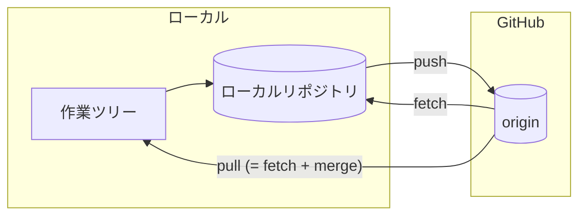
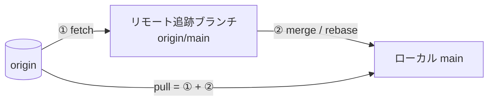

# リモートと GitHub

ローカルで作った履歴を GitHub と同期する方法を見ていきます。チーム開発では、この「同期」が日々の中心になります。

## リモートとは

リモートは「別の場所にあるリポジトリ」への参照です。GitHub 上のリポジトリには慣習的に `origin` という名前が付きます。



## リモートの確認・追加

```bash
# 設定されているリモートを確認
git remote -v

# リモートを追加（git init から始めた場合）
git remote add origin git@github.com:user/repo.git
```

## clone — リモートを複製する

既存のリポジトリで作業を始めるときは `clone` します。リモート設定も自動で行われます。

```bash
git clone git@github.com:user/repo.git
```

## push — ローカルの変更をリモートへ

```bash
# 初回（上流ブランチを設定）
git push -u origin feature/login

# 2 回目以降は引数なしでOK
git push
```

`-u`（`--set-upstream`）を付けると、以降そのブランチは `git push` / `git pull` だけで `origin` と同期できるようになります。

## fetch と pull の違い

ここはよく混乱するポイントです。

| コマンド | 動作 |
| --- | --- |
| `git fetch` | リモートの変更を**取得するだけ**（作業ツリーは変わらない） |
| `git pull` | `fetch` + `merge`（または `rebase`）を一度に行う |



```bash
# 安全に確認してから取り込みたい場合
git fetch
git log --oneline main..origin/main   # 差分を確認
git merge origin/main

# まとめて取り込む
git pull
```

::: tip 安全な習慣
チーム開発では、作業前に `git pull`（または `fetch`）で最新を取り込む習慣をつけましょう。古い状態で作業を進めると、後で大きなコンフリクトの原因になります。
:::

## リモートブランチの削除

```bash
git push origin --delete feature/login
```
