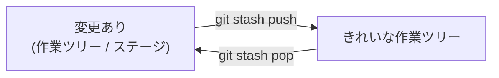

# git stash で作業を一時退避する

作業の途中で「今すぐ別のブランチに切り替えたい。でも中途半端な変更をコミットはしたくない」——チーム開発では日常的に起きます。急なレビュー依頼、緊急の hotfix、間違ったブランチで編集していたことに気づいた、など。こんなときに使うのが `git stash` です。**まだコミットしていない変更を一時的に棚上げ**し、作業ツリーをきれいな状態に戻します。

## 何が退避されるのか

`git stash` は、**作業ツリーの変更**と**ステージした変更**を退避し、最後のコミット直後の状態に戻します。退避した内容は「スタッシュ」として積み上げられ、あとで好きなタイミングで戻せます。



::: warning 追跡されていないファイルは既定で退避されない
新規作成してまだ `git add` していないファイルは、既定では stash されず作業ツリーに残ります。これも含めたいときは `-u`（`--include-untracked`）を付けます。
:::

## 基本操作

```bash
# 変更を退避（メッセージを付けると後で分かりやすい）
git stash push -m "ログイン画面の途中まで"

# 退避した一覧を見る
git stash list
# stash@{0}: On feature/login: ログイン画面の途中まで

# 直近の退避を戻して、スタッシュからも消す
git stash pop

# 戻すがスタッシュには残す（複数ブランチに当てたいとき）
git stash apply

# 不要になった退避を削除
git stash drop stash@{0}
git stash clear            # すべて削除
```

| コマンド | 意味 |
| --- | --- |
| `git stash push -m "..."` | 変更を退避（`-u` で未追跡も含む） |
| `git stash list` | 退避の一覧 |
| `git stash pop` | 直近を戻して削除 |
| `git stash apply` | 戻すが残す |
| `git stash drop` / `clear` | 退避を削除 / 全削除 |
| `git stash show -p stash@{0}` | 退避の中身を diff で確認 |

## 典型シナリオ：ブランチを間違えて編集していた

`main` で作業を始めてしまったことに気づいた場合、退避 → ブランチ作成 → 復元、で安全に移せます。

```bash
git stash push -m "作りかけの変更"
git switch -c feature/new-form   # 正しいブランチを作成
git stash pop                    # ここで変更を復元
```

## pop 時のコンフリクト

`pop` / `apply` は、退避後に変わった作業ツリーへ変更を当て直します。当てる先が変わっていると**コンフリクトすることがあります**。その場合は通常のコンフリクトと同じように解消します（[コンフリクト解決](./conflicts) を参照）。なお `pop` はコンフリクトが起きるとスタッシュを**削除せずに残す**ため、解消後に手動で `git stash drop` します。

## stash に頼りすぎない

stash は手軽ですが、**名前のない一時退避**なので、積み上がると「どれが何だったか」を見失いがちです。数時間以上の作業や、他の人と共有したい変更は、**作業用ブランチを切って WIP コミットする**ほうが安全です（`git commit -m "wip: ..."` して後で `git commit --amend` や `git rebase -i` で整える）。stash は「数分〜十数分、ちょっと退避したい」ときの道具と考えると使い分けやすくなります。

---

一時退避を覚えておくと、割り込み作業に慌てず対応できます。ここまでで日々の操作は一通りです。次章からは発展的なトピックとして、まず [ブランチ戦略の使い分け](./branching-strategies) を見ていきます。よく使うコマンドは[コマンド早見表](./commands)にまとまっています。
