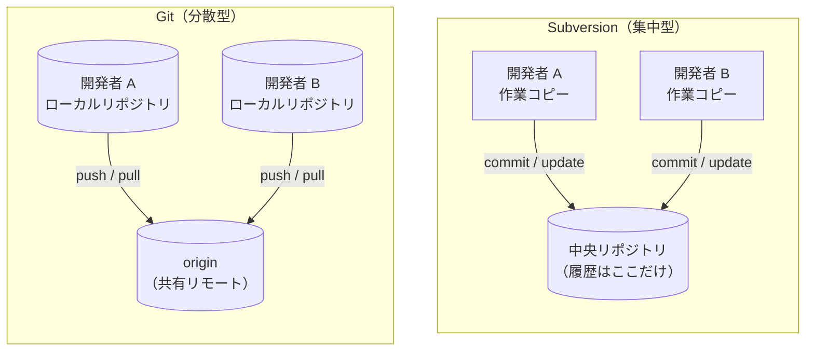

# SVN との比較 — 集中型から Git へ

**Subversion (SVN) を使ってきたチームが Git へ移る**ときに、何が同じで何が違うのかを橋渡しする章です。基本操作は似ていますが、リポジトリの持ち方と「コミット」の意味が根本的に異なります。ここを押さえると、後続の [Git の基本](./basics) や [ブランチとマージ](./branching) が一気に腹落ちします。

## 前提

Git の基礎用語（リポジトリ・コミット・ブランチ・リモート）に一度は触れていることを前提にします。まだの場合は [Git / GitHub とは](./introduction) と [Git の基本](./basics) を先に読んでください。

## 集中型と分散型（モデルの違い）

最大の違いは **リポジトリ（履歴）をどこが持つか**です。SVN は中央サーバに履歴が 1 つだけあり、各開発者の手元には最新の作業コピーしかありません。Git は各開発者が **完全な履歴のコピー**を手元に持ち、リモート（GitHub など）と同期します。

SVN では commit がそのまま中央サーバへ届くため、ネットワークが無いと履歴を刻めません。Git では commit は手元のローカルリポジトリに記録され、共有したいときに `push` でリモートへ送ります。次の表に主な違いをまとめます。

| 観点 | Subversion（集中型） | Git（分散型） |
| --- | --- | --- |
| 履歴の所在 | 中央サーバに 1 つだけ | 手元とリモートがそれぞれ完全な履歴を持つ（`push` / `pull` で同期し、ふだんは進み具合がずれる） |
| commit の到達先 | ただちに中央サーバ | まず手元のローカルリポジトリ |
| オフライン作業 | commit や履歴の参照（log）にサーバ接続が必要（作業コピー内の差分 `svn diff` は手元で可） | commit・log・diff・ブランチ操作まで手元で完結 |
| ブランチ | サーバ上のディレクトリのコピー（重い） | コミットを指すポインタ（軽い・一瞬） |
| 障害耐性 | 中央が落ちると全員が履歴を失いうる | 各自の手元に完全な履歴が残る |
| 変更の識別子 | リビジョン番号（`r1`, `r2`… の連番） | コミット SHA（内容から決まるハッシュ） |
| 作業コピーの目印 | 各ディレクトリに `.svn` | リポジトリのルートに `.git` が 1 つ |

## 考え方の転換

コマンド名以上に、**頭の切り替え**が要る点がいくつかあります。

- **commit はローカルで完結する。** SVN の `svn commit` は「中央へ確定して全員に共有する」操作でした。Git の `git commit` は手元に記録するだけで、共有するには別途 `git push` が要ります。つまり **SVN の commit ≒ Git の commit + push** の 2 段階に分かれた、と捉えると混乱しません。
- **ブランチとマージが日常の道具になる。** SVN ではブランチがディレクトリのコピーで作成もマージも重く、避けられがちでした。Git のブランチはコミットを指すポインタにすぎず、作成も切り替えも一瞬です。機能ごとに気軽にブランチを切る運用が前提になります（[GitHub Flow](./github-flow)）。
- **履歴は分散して存在する。** 「中央だけが唯一の正」ではなく、各自の手元にも同じ履歴があります。だからこそオフラインで作業でき、リモートが落ちても復旧できます。
- **番号ではなくハッシュで指す。** SVN のリビジョン番号は増えていく連番でしたが、Git のコミットは内容から決まる SHA（`a1b2c3d…`）で識別します。連番の「大小＝新旧」の直感は通じないので、時系列は `git log` で確認します。

> [!TIP]
> **「commit したら共有された」ではない**
>
> SVN 出身者が最初に踏む段差がこれです。`git commit` はあくまで手元の記録で、チームに見えるのは `git push` の後です。作業を共有したつもりで push を忘れる、という取りこぼしに注意してください。

## コマンド対応表

日々の操作を SVN と Git で対応づけると、手を動かしながら移りやすくなります。

| よくある操作 | Subversion | Git |
| --- | --- | --- |
| リポジトリを取得する | `svn checkout <url>` | `git clone <url>` |
| 最新を取り込む | `svn update` | `git pull` |
| 変更を確定する | `svn commit -m "..."` | `git commit -m "..."` してから `git push` |
| 変更を記録対象に加える | `svn add <file>` | `git add <file>` |
| 状態を見る | `svn status` | `git status` |
| 差分を見る | `svn diff` | `git diff` |
| 履歴を見る | `svn log` | `git log` |
| 手元の変更を捨てる | `svn revert <file>` | `git restore <file>` |
| 作業先を切り替える | `svn switch <branch>` | `git switch <branch>` |
| ブランチを取り込む | `svn merge <branch>` | `git merge <branch>` |

一番の違いは「変更を確定する」の行です。SVN の 1 コマンドが Git では **commit（手元に記録）と push（リモートへ共有）の 2 コマンド**に分かれます。

## つまずきやすい点

移行時に誤解しやすい点を軽く挙げます。

- **`.svn` はもう無い。** SVN は作業コピーの各ディレクトリに `.svn` を置きましたが、Git はリポジトリのルートに `.git` が 1 つあるだけです。サブディレクトリを別リポジトリとして扱いたいときは [submodule など別の仕組み](https://git-scm.com/book/ja/v2/Git-のさまざまなツール-サブモジュール)を使います（本チュートリアルの範囲外）。
- **`svn revert` と `git revert` は別物。** SVN の `svn revert` は「手元の未コミット変更を捨てる」操作で、Git では `git restore`（あるいは `git checkout -- <file>`）に当たります。一方 Git の `git revert` は「公開済みのコミットを打ち消す新しいコミットを積む」操作で、意味がまったく違います（[トラブルシューティング](./troubleshooting) を参照）。
- **`svn:externals` は submodule / subtree へ。** 外部リポジトリの参照は SVN の `svn:externals` に相当する `git submodule` や `git subtree` で扱いますが、挙動が異なるため個別に確認してください。

## まとめ

- SVN は **中央に履歴が 1 つ**の集中型、Git は **各自が完全な履歴を持つ**分散型です。
- SVN の commit は Git では **commit（手元に記録）+ push（共有）** の 2 段階に分かれます。
- Git のブランチは軽いので、機能ごとに気軽に切って [GitHub Flow](./github-flow) で回すのが前提です。
- 変更は連番のリビジョン番号ではなく、内容から決まる **コミット SHA** で識別します。

## 次のステップ

- [Git / GitHub とは](./introduction) — 分散型の全体像を図で確認する
- [Git の基本](./basics) — 3 つの領域と commit の流れを手を動かして掴む
- [ブランチとマージ](./branching) — 軽いブランチの作成とマージを体験する
