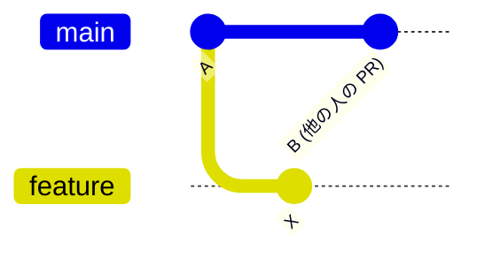
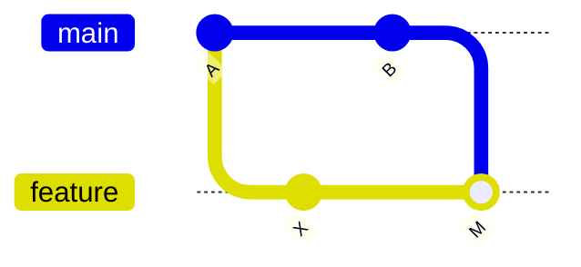
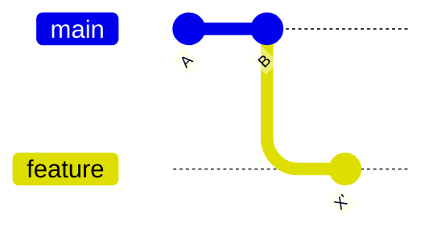

# ブランチ更新: merge か rebase か

PR を出したあと、`main` が先に進んでしまい GitHub の PR 画面に **「Update branch」** ボタンが出ることがあります。このボタンには 2 つの選択肢があります。

- **Update with merge commit** … `main` の最新を **マージコミット** で取り込む
- **Update with rebase** … 自分のコミットを `main` の最新の **上に乗せ直す**

::: warning これは「マージ方式」の選択ではありません
PR を**マージするとき**の `Merge commit` / `Squash and merge` / `Rebase and merge` とは別物です。ここで選ぶのは「**遅れた自分のブランチに `main` の最新を取り込む方法**」です。マージ方式の選び方は [プルリクエストとレビュー](./pull-request) を参照してください。
:::

## なぜこのボタンが出るのか

PR を作ったあとに他の人の PR が先に `main` にマージされると、自分のブランチは `main` より「遅れた」状態になります。この差分を埋める（＝最新の `main` を取り込む）のがこのボタンです。



`feature` は `B` を知らないまま。ここで「Update branch」を押すと、`B` を自分のブランチに取り込みます。

## 2 つの結果の違い

### Update with merge commit

`main` の最新をマージコミットで取り込みます。**自分のコミットの ID は変わりません**。



### Update with rebase

自分のコミット `X` を、最新の `B` の上に乗せ直します。履歴は一直線になりますが、**コミットの ID が新しく振り直されます**。



## どう選べばいいか

まず結論から。**迷ったら `Update with merge commit` を選べば安全です。**

| | Update with merge commit | Update with rebase |
| --- | --- | --- |
| 履歴 | マージコミットが増える | 一直線で読みやすい |
| コミット ID | **変わらない** | **振り直される** |
| 安全度 | 高い（元に戻しやすい） | 注意が必要 |
| 向いているケース | 通常はこちら / 複数人で同じブランチを触っている | 履歴を綺麗に保ちたい / 自分しか触っていない PR |

### `Update with merge commit` を選ぶとき

- どちらでもよく、**とにかく安全に済ませたい**とき
- **他の人も同じ PR ブランチを触っている**とき（後述の理由で rebase は危険）
- チームで **Squash and merge** を使っている場合、更新のマージコミットは最終的に潰れるので、そもそも履歴の汚れを気にしなくてよい

### `Update with rebase` を選ぶとき

- **自分しか触っていない**ブランチで、履歴を一直線に保ちたいとき
- `Rebase and merge` でマージする方針で、最終履歴を綺麗にしたいとき

::: danger 共有ブランチを rebase しない（黄金律）
`Update with rebase` はコミット ID を振り直します。**同じ PR ブランチを他の人も pull している場合**、その人の手元の履歴と食い違い、次の pull で大混乱します。共有しているブランチでは必ず `Update with merge commit` を選んでください。この原則は [rebase と履歴整理](./rebase) の「黄金律」と同じです。
:::

## 手元（ローカル）で同じことをする

GitHub のボタンを使わず、ローカルで取り込んでから push しても同じです。むしろコンフリクト対応はローカルの方が楽なことが多いです。

```bash
# 自分のブランチにいる状態で

# 「Update with merge commit」に相当
git fetch origin
git merge origin/main
git push                      # 取り込んだ結果をリモートの PR ブランチへ反映

# 「Update with rebase」に相当
git fetch origin
git rebase origin/main
git push --force-with-lease   # rebase 後は履歴が変わるので force push が必要
```

::: tip rebase 後の push は `--force-with-lease`
rebase するとコミット ID が変わるため、通常の `git push` は弾かれます。`--force-with-lease` を使うと「自分が知らないうちにリモートが更新されていたら中断する」安全な force push になります。単なる `--force` は他人の push を上書きしかねないので避けましょう。
:::

## コンフリクトが出たら

どちらの方式でもコンフリクトは起こり得ます。GitHub のボタンで解決できない複雑なコンフリクトはローカルで対応します。解決手順は [コンフリクト解決](./conflicts) を参照してください。

---

更新方法を選べるようになったら、次は自動化です。[CI 連携 (GitHub Actions)](./ci) に進みましょう。
