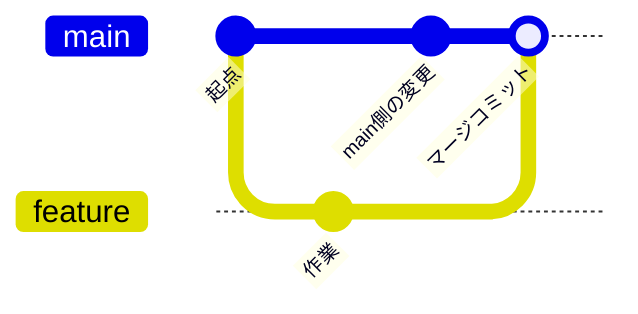

# ② ブランチとマージ

ブランチは並行作業の要です。この実習では、練習ページを編集しながら **fast-forward マージ** と **3-way マージ** の 2 種類を作って見比べます。対応する解説は [ブランチとマージ](../guide/branching) です。

## 🎯 この実習のゴール

- `git switch -c` でブランチを作成・移動できる
- 練習ページを編集してコミットし、`main` にマージできる
- fast-forward と 3-way マージの違いを履歴で理解する
- `git log --graph` で分岐を読める

| 前提 | 所要時間 |
| --- | --- |
| 共有リポジトリを clone 済み（以降ローカルのみ） | 約 20 分 |

::: tip スタート地点をそろえる
各実習は `main` から始めます。まず `git switch main` で main に戻ってから進めてください（前の実習のブランチが残っていても問題ありません）。
:::

## ステップ 1：ブランチを作って作業する

`main` から作業ブランチを切り、[練習場](../practice/)（`docs/practice/index.md`）の「練習ログ」に 1 行追記してコミットします。

```bash
git switch main
git switch -c practice/branch-ff
# docs/practice/index.md の「練習ログ」に1行追記してから:
git commit -am "docs: ブランチ実習の記録を追加"
```

✅ **チェックポイント**

```bash
git log --oneline -2
```

```text
1111aaa (HEAD -> practice/branch-ff) docs: ブランチ実習の記録を追加
5ac3fde (main) build(vitepress): chunk size 警告を解消するため...
```

`practice/branch-ff` が `main` より 1 つ先に進みました。`main` 自体はまだ動いていません。

::: details 🔍 `git commit -am` とは
`-a` は「追跡済みファイルの変更を自動でステージ」、`-m` は「メッセージ指定」です。`git add` を省略できますが、**新規ファイル（Untracked）は対象外**なので、既存ファイルの編集にだけ使えます。
:::

## ステップ 2：fast-forward マージ

`main` に戻ってブランチを取り込みます。この間 `main` は変わっていないため、**先端を進めるだけ（fast-forward）** で済みます。

```bash
git switch main
git merge practice/branch-ff
```

✅ **チェックポイント**

```text
Updating 5ac3fde..1111aaa
Fast-forward
 docs/practice/index.md | 1 +
 1 file changed, 1 insertion(+)
```

`Fast-forward` と表示されればOK。`main` が `practice/branch-ff` と同じ位置まで進みました。使い終わったブランチは削除します。

```bash
git branch -d practice/branch-ff
```

## ステップ 3：分岐した状態を作る

今度は **両方のブランチが進んだ状態** を作ります。まず `main` 側で「自己紹介」セクションを編集してコミットします。

```bash
# docs/practice/index.md の「自己紹介」に1行追記してから:
git commit -am "docs: 自己紹介を追記(main側)"
```

次に、**ひとつ前のコミット**から新しいブランチを切り、今度は「練習ログ」を編集します（別のセクションを触るのがポイント）。

```bash
git switch -c practice/branch-3way HEAD~1
# docs/practice/index.md の「練習ログ」に1行追記してから:
git commit -am "docs: 練習ログを追記(feature側)"
```

✅ **チェックポイント**

```bash
git log --oneline --all --graph -4
```

```text
* 4444ddd (HEAD -> practice/branch-3way) docs: 練習ログを追記(feature側)
| * 3333ccc (main) docs: 自己紹介を追記(main側)
|/
* 1111aaa docs: ブランチ実習の記録を追加
* 5ac3fde build(vitepress): chunk size 警告を解消するため...
```

`main` と `practice/branch-3way` が**枝分かれ**しました。共通の親から両方が進んでいます。

## ステップ 4：3-way マージ

`main` に戻ってマージします。両ブランチは**別々のセクション**を編集しているので、コンフリクトせずに合流できます。

```bash
git switch main
git merge practice/branch-3way
```

マージコミットのメッセージを尋ねるエディタが開いたら、そのまま保存して閉じます。

✅ **チェックポイント**

```bash
git log --oneline --graph -5
```

```text
*   5555eee (HEAD -> main) Merge branch 'practice/branch-3way'
|\
| * 4444ddd docs: 練習ログを追記(feature側)
* | 3333ccc docs: 自己紹介を追記(main側)
|/
* 1111aaa docs: ブランチ実習の記録を追加
```

fast-forward と違い、**両方の枝を束ねる「マージコミット」**（`Merge branch ...`）が作られました。これが 3-way マージです。

## fast-forward と 3-way の違い



- **fast-forward**：分岐後に main が動いていない → 履歴は一直線
- **3-way マージ**：両方が動いた → 合流点にマージコミットができる

## ⚠️ つまずきポイント

::: warning 同じ場所を触るとコンフリクトする
この実習では main 側と feature 側で**別のセクション**を編集したので、すんなりマージできました。もし**同じ行**を両方で変更していたら、ここでコンフリクトが発生します。その対処は次の [③ コンフリクトを解決する](./conflicts-lab) で練習します。
:::

## まとめ

- ブランチは `git switch -c <名前>` で作成＆移動
- 取り込みは `main` に戻ってから `git merge <ブランチ>`
- main が動いていなければ fast-forward、動いていれば 3-way マージ
- `git log --graph --all` で分岐と合流を可視化できる

枝分かれが同じ場所に及ぶと衝突が起きます。その対処を [③ コンフリクトを解決する](./conflicts-lab) で練習しましょう。
