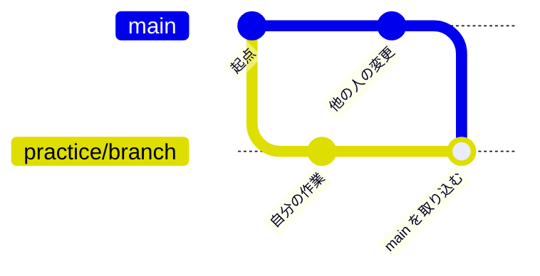

# ② ブランチとマージ

ブランチは並行作業の要です。この実習では、作業ブランチを作り、**PR を出す前に最新の `main` を自分のブランチへ取り込む**——実務で日常的に行う操作を体験します。対応する解説は [ブランチとマージ](../guide/branching) です。

## 🎯 この実習のゴール

- `git switch -c` でブランチを作成・移動できる
- **最新の `main` を自分の作業ブランチに取り込める**（`git merge main`）
- `git log --graph` で分岐と合流を読める
- fast-forward と 3-way マージの違いを理解する

| 前提 | 所要時間 |
| --- | --- |
| 共有リポジトリを clone 済み（以降ローカルのみ） | 約 20 分 |

::: tip なぜ「main を取り込む」のか
作業ブランチが長く生きるほど、その間に `main` は他の人の PR で進んでいきます。差が開いたまま放置すると、最後の PR で大きなコンフリクトになりがちです。**こまめに最新の `main` を自分のブランチへ取り込む**ことで、衝突を小さいうちに片付けられます。これは GitHub Flow で頻繁に行う操作です。
:::

::: tip スタート地点をそろえる
各実習は `main` から始めます。まず `git switch main` で main に戻ってから進めてください（前の実習のブランチが残っていても問題ありません）。
:::

## ステップ 1：ブランチを作って作業する

`main` から作業ブランチを切り、[練習場](../practice/)（`docs/practice/index.md`）の「練習ログ」に 1 行追記してコミットします。

```bash
git switch main
git switch -c practice/branch
# docs/practice/index.md の「練習ログ」に1行追記してから:
git commit -am "docs: ブランチ実習の記録を追加"
```

✅ **チェックポイント**

```bash
git log --oneline -2
```

```text
1111aaa (HEAD -> practice/branch) docs: ブランチ実習の記録を追加
5ac3fde (main) build(vitepress): chunk size 警告を解消するため...
```

`practice/branch` が `main` より 1 つ先に進みました。

::: details 🔍 `git commit -am` とは
`-a` は「追跡済みファイルの変更を自動でステージ」、`-m` は「メッセージ指定」です。`git add` を省略できますが、**新規ファイル（Untracked）は対象外**なので、既存ファイルの編集にだけ使えます。
:::

## ステップ 2：その間に main が進んだ状況を作る

あなたが作業している間に、**別の人の PR がマージされて `main` が進んだ**——という状況を再現します。`main` に切り替えて、別のセクション（自己紹介）を変更してコミットします。

```bash
git switch main
# docs/practice/index.md の「自己紹介」に1行追記してから:
git commit -am "docs: 自己紹介を追記(main側)"
git switch practice/branch
```

::: tip 実際のチームでは
本物のチーム開発では、`main` は自分ではなく**他のメンバーの PR がマージされて**進みます。その場合は `git switch main && git pull` で最新を取得してから、作業ブランチに戻ります。ここではローカルだけで再現するため、自分で `main` にコミットしています。
:::

✅ **チェックポイント**

作業ブランチに戻った状態で、分岐を確認します。

```bash
git log --oneline --all --graph -4
```

```text
* 3333ccc (main) docs: 自己紹介を追記(main側)
| * 1111aaa (HEAD -> practice/branch) docs: ブランチ実習の記録を追加
|/
* 5ac3fde build(vitepress): chunk size 警告を解消するため...
```

`main` と `practice/branch` が**枝分かれ**しました。共通の親から、それぞれ別の方向へ進んでいます。

## ステップ 3：最新の main を自分のブランチに取り込む

作業ブランチにいる状態で、`main` を取り込みます。両方が別々のセクションを進めているので、Git は **3-way マージ**で合流させます。

```bash
# いま practice/branch にいることを確認
git merge main
```

マージコミットのメッセージを尋ねるエディタが開いたら、そのまま保存して閉じます。

✅ **チェックポイント**

```bash
git log --oneline --graph -5
```

```text
*   4444ddd (HEAD -> practice/branch) Merge branch 'main' into practice/branch
|\
| * 3333ccc (main) docs: 自己紹介を追記(main側)
* | 1111aaa docs: ブランチ実習の記録を追加
|/
* 5ac3fde build(vitepress): chunk size 警告を解消するため...
```

**両方の枝を束ねる「マージコミット」**（`Merge branch 'main' ...`）ができ、あなたのブランチに `main` の最新が取り込まれました。この状態で PR を出せば、最新の `main` を踏まえた差分になります。



## fast-forward と 3-way の違い

いま作られた「マージコミット」が **3-way マージ**です。一方、**fast-forward** は次のような場合に起こります。

- もし**あなたがまだ何もコミットしていない**うちに `main` だけが進んでいたら、`git merge main` は新しいコミットを作らず、ブランチの先端を `main` に**滑らせるだけ**で済みます。これが fast-forward です。

| | 起きる条件 | 結果 |
| --- | --- | --- |
| **fast-forward** | 片方しか進んでいない | 履歴は一直線。マージコミットなし |
| **3-way マージ** | 両方が進んでいる | 合流点にマージコミットができる |

::: tip この知識が効く場面

- **GitHub の「Merge pull request」ボタン** … `main` へのマージは、ふだん**この緑のボタン**が行います（手で `git merge` する必要はありません）。ボタンが作るのが、まさにこのマージコミットです。
- **`git pull`** … `pull` は `fetch` + `merge`。だから `git pull` でもマージコミットができることがあります。
- **一直線に保ちたいなら** … マージの代わりに `rebase` を使う手もあります（**発展・任意**）。興味があれば [④ rebase で履歴を整える](./rebase-lab) で扱います（マージ基調の標準フローでは必須ではありません）。
:::

## ⚠️ つまずきポイント

::: warning 同じ場所を触るとコンフリクトする
この実習では `main` 側と作業ブランチ側で**別のセクション**を編集したので、すんなりマージできました。もし**同じ行**を両方で変更していたら、`git merge main` でコンフリクトが発生します。その対処は次の [③ コンフリクトを解決する](./conflicts-lab) で練習します。
:::

## まとめ

- ブランチは `git switch -c <名前>` で作成＆移動
- **作業ブランチにいる状態で `git merge main`** すれば、最新の `main` を取り込める（PR 前の定番操作）
- `main` への最終的なマージは、ふだん **GitHub の PR ボタン**が行う
- 両方が進んでいれば 3-way（マージコミット）、片方だけなら fast-forward
- `git log --graph --all` で分岐と合流を可視化できる

取り込みのときに同じ行がぶつかると衝突します。その対処を [③ コンフリクトを解決する](./conflicts-lab) で練習しましょう。
