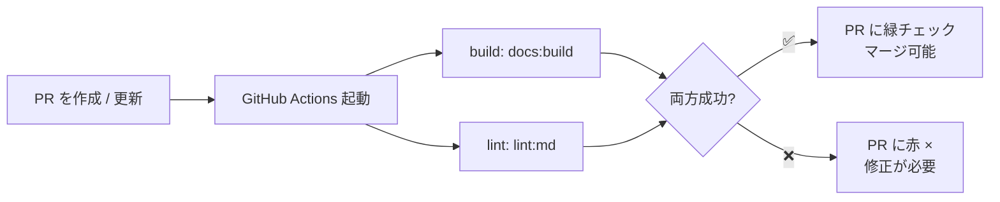

# ⑦ CI を動かす

この実習では、このリポジトリに**もとから用意されている CI（GitHub Actions）** を、共有リポジトリで実際に動かします。新しくワークフローを書く必要はありません——PR を出せば、[.github/workflows/ci.yml](https://github.com/ykgw-daiki-nakamura/nakamura-git-tutorial/blob/main/.github/workflows/ci.yml) が自動で走り、あの「緑のチェック」が付きます。対応する解説は [CI 連携 (GitHub Actions)](../guide/ci) です。

## 🎯 この実習のゴール

- PR を出すと CI が自動で走ることを体感する
- CI の成功（緑）・失敗（赤）を読み解ける
- 「CI が通ってからマージ」という流れを理解する

| 前提 | 所要時間 |
| --- | --- |
| 共有リポジトリを clone 済み・コラボレーター招待済み | 約 25 分 |

::: tip Actions の有効化・ブランチ保護はオーナーの担当
共有リポジトリでの **Actions の有効化** と、`main` の **Branch protection rule**（CI が緑でないとマージ不可、など）の設定は**オーナーが行います**（[実習の進め方](./) のオーナー向けセットアップ参照）。参加者は、用意された CI が PR で動く様子を確認します。
:::

## このリポジトリの CI が見ているもの

`ci.yml` には 2 つのジョブがあります。

| ジョブ | 内容 |
| --- | --- |
| **build** | `npm run docs:build`（内部リンク切れ・Mermaid 構文エラーなどを検知） |
| **lint** | `npm run lint:md`（Markdown の文体・整形の一貫性をチェック） |



## ステップ 1：正常な変更で PR を出し、CI を見る

まず「通る」PR を作ります。`<あなた>` を自分の名前、`<オーナー>` をオーナー名に置き換えてください。

```bash
git switch main
git pull
git switch -c practice/<あなた>-ci
# docs/practice/index.md の「練習ログ」に1行追記してから:
git commit -am "docs: CI実習の記録を追加 (<あなた>)"
git push -u origin practice/<あなた>-ci
```

[⑥](./github-flow-lab) と同じ要領で、**共有リポジトリの `main`** 宛てに PR を作成します。

```bash
gh pr create --repo <オーナー>/nakamura-git-tutorial --base main --head practice/<あなた>-ci --fill
```

✅ **チェックポイント**

PR ページの下部で **build / lint のチェックが走り始め**、しばらくすると ✅ **All checks have passed** になります。**Actions** タブを開くと各ステップのログも追えます。

```text
✓ CI / build (pull_request)  Successful
✓ CI / lint  (pull_request)  Successful
```

## ステップ 2：わざと壊して赤を見る

CI が「壊れた変更を止める」様子を体験します。練習ページに、**markdownlint 違反になる行**をわざと足します。ページの一番下に、もう 1 つの**トップレベル見出し**を追加してください（1 ページに H1 は 1 つ、というルール MD025 に違反します）。

```markdown
# これはわざとのエラー
```

コミットして push すると、同じ PR が自動で再チェックされます。

```bash
git commit -am "test: わざとlintを失敗させる"
git push
```

✅ **チェックポイント**

同じ PR の **lint ジョブが ❌（赤）** になります。Actions のログには、MD025（複数のトップレベル見出し）違反が表示されます。

```text
✓ CI / build (pull_request)  Successful
✗ CI / lint  (pull_request)  Failing
```

::: tip これがブランチ保護の効きどころ
オーナーが `main` に **Branch protection rules** の「Require status checks to pass」を設定していると、**この赤い状態ではマージできません**。CI を通すまでマージ不可＝壊れた変更が `main` に入らない、という安全網になります。
:::

## ステップ 3：直して緑に戻す

失敗させたコミットを取り消して、CI を緑に戻します。push 済みのコミットなので、`git revert` で安全に打ち消します。

```bash
git revert HEAD --no-edit
git push
```

✅ **チェックポイント**

CI が再び ✅ **All checks have passed** に戻ります。これで安心してマージできる状態です。マージ（オーナーが実施）とローカルの片付けは⑥と同じ流れです。

```bash
git switch main
git pull
git branch -d practice/<あなた>-ci
```

::: details 🔍 revert と reset の違い
今回 `git revert` を使ったのは、**push 済みのコミットを安全に打ち消す**ためです。`revert` は「取り消す変更」を新しいコミットとして積むので、共有履歴を壊しません。一方 `git reset` は履歴そのものを巻き戻すため、共有済みのブランチには使いません。詳しくは [トラブルシューティング](../guide/troubleshooting) を参照してください。
:::

## まとめ

- リポジトリに置かれた `.github/workflows/*.yml` により、**PR ごとに CI が自動で走る**
- このリポジトリの CI は **build（ビルド検証）** と **lint（Markdown 整形）** をチェックする
- CI は成功＝緑、失敗＝赤。ブランチ保護と組み合わせると「CI が通った変更だけマージ」を強制できる
- push 済みの変更を打ち消すときは `git revert` が安全

CI が緑になり、マージまでの安全網を体験できました。

::: tip ここまでの流れ
共有リポジトリの clone から始めて、基本操作・ブランチ・コンフリクト・rebase・リモート・GitHub Flow・CI まで、本物のリポジトリで一通り手を動かせました。ここで身につけた GitHub Flow は、そのまま実際の OSS 貢献にも使えます。[CONTRIBUTING](https://github.com/ykgw-daiki-nakamura/nakamura-git-tutorial/blob/main/CONTRIBUTING.md) を読んで、本家への改善 PR に挑戦してみるのも良い練習になります。
:::
