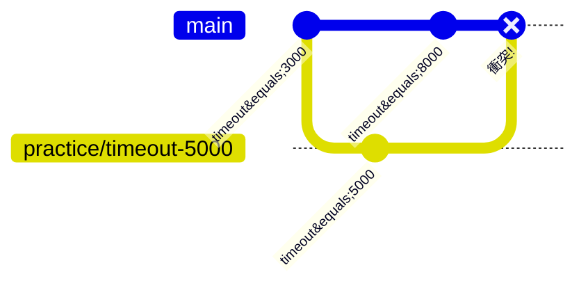

# ③ コンフリクトを解決する

コンフリクト（競合）は避けられないものですが、**仕組みが分かれば怖くありません**。この実習では、練習ページの**同じ行**を 2 つのブランチで別々に変えて、わざとコンフリクトを起こして解決します。対応する解説は [コンフリクト解決](../guide/conflicts) です。

## 🎯 この実習のゴール

- コンフリクトがなぜ起きるかを体験する
- コンフリクトマーカー（`<<<<<<<` `=======` `>>>>>>>`）を読める
- 編集 → `add` → `commit` で解決を完了できる
- 中断（`merge --abort`）の使い方を知る

| 前提 | 所要時間 |
| --- | --- |
| 共有リポジトリを clone 済み（以降ローカルのみ） | 約 20 分 |

## 仕込み：使う行

[練習場](../practice/)（`docs/practice/index.md`）の「練習用の設定値」にある、次の **1 行だけ** を編集対象にします。

```markdown
- ビルドのタイムアウト: 3000ms
```

## ステップ 1：作業ブランチ側で値を変える

`main` から作業ブランチを切り、`3000ms` を **`5000ms`** に書き換えてコミットします。

```bash
git switch main
git switch -c practice/timeout-5000
# docs/practice/index.md の該当行を 3000ms → 5000ms に変更してから:
git commit -am "docs: タイムアウトを5000msに変更"
```

## ステップ 2：main 側で同じ行を別の値に変える

`main` に戻り、**同じ 1 行** を今度は **`8000ms`** に書き換えてコミットします。

```bash
git switch main
# docs/practice/index.md の該当行を 3000ms → 8000ms に変更してから:
git commit -am "docs: タイムアウトを8000msに変更"
```

これで `main`（8000）と `practice/timeout-5000`（5000）が、同じ行を別々に変えた状態になりました。



## ステップ 3：マージしてコンフリクトを起こす

```bash
git merge practice/timeout-5000
```

✅ **チェックポイント**

```text
Auto-merging docs/practice/index.md
CONFLICT (content): Merge conflict in docs/practice/index.md
Automatic merge failed; fix conflicts and then commit the result.
```

`CONFLICT` が出ました。狙いどおりです。慌てずに状況を確認します。

```bash
git status
```

```text
Unmerged paths:
  (use "git add <file>..." to mark resolution)
        both modified:   docs/practice/index.md
```

## ステップ 4：マーカーを読み解く

`docs/practice/index.md` を開くと、該当箇所に Git が両者の主張を書き込んでいます。

```text
<<<<<<< HEAD
- ビルドのタイムアウト: 8000ms
=======
- ビルドのタイムアウト: 5000ms
>>>>>>> practice/timeout-5000
```

- `<<<<<<< HEAD` 〜 `=======` … **現在のブランチ（main）** の内容 = `8000ms`
- `=======` 〜 `>>>>>>> practice/timeout-5000` … **取り込もうとしている側** の内容 = `5000ms`

## ステップ 5：解決する

エディタで **マーカー 3 行をすべて削除** し、採用したい内容だけを残します。ここでは `5000ms` を採用することにします。最終的に、その行をこの状態にしてください。

```markdown
- ビルドのタイムアウト: 5000ms
```

::: tip 「どちらを残す」だけが正解ではない
コンフリクト解決は、片方を選ぶだけでなく **両方を活かす編集** も含みます。大事なのは「マーカーを消し、意図どおりの最終形にする」こと。値の取捨選択はチームで相談して決めます。
:::

解決したら、ステージしてコミットします。

```bash
git add docs/practice/index.md
git commit
```

`Merge branch ...` というメッセージのエディタが開いたら、そのまま保存して閉じれば完了です。

✅ **チェックポイント**

```bash
git diff --check
git log --oneline --graph -4
```

`git diff --check` が**何も出力しない**（＝マーカーの消し忘れがない）こと、履歴にマージコミットができていることを確認します。

::: details 🔍 マーカーを消し忘れたまま add すると
`<<<<<<<` などを残したまま add/commit すると、その記号がそのままファイルに残り、サイトのビルドや表示が壊れます。`git diff --check` はこの**残ったマーカーを検出**してくれるので、コミット前のクセにすると安全です。
:::

## ステップ 6：やり直したいときは abort

「解決を始めたけど、いったん最初の状態に戻したい」というときは中断できます。**コミット前**なら、次のコマンドでマージ前に戻せます。

```bash
git merge --abort
```

もう一度ステップ 1〜3 でコンフリクトを起こしてから `git merge --abort` を実行し、`git status` がきれいな状態に戻ることを試してみましょう。

## ⚠️ つまずきポイント

::: warning パニックにならないコツ
コンフリクトは**エラーではなく、Git からの質問**です。「どちらを採用しますか？」と聞かれているだけ。手順は毎回同じです。

1. `git status` で競合ファイルを確認
2. ファイルを開いてマーカーを消し、正しい形に編集
3. `git add` で「解決済み」とマーク
4. `git commit`（rebase 中なら `git rebase --continue`）

迷ったら `git merge --abort` でいつでも振り出しに戻せます。
:::

## まとめ

- コンフリクトは「同じ箇所を別々に変えた」ときに起きる
- マーカーは **HEAD（現在）側** と **取り込む側** を区切る目印
- 解決は **編集 → `add` → `commit`** の流れ
- `git merge --abort` で安全にやり直せる
