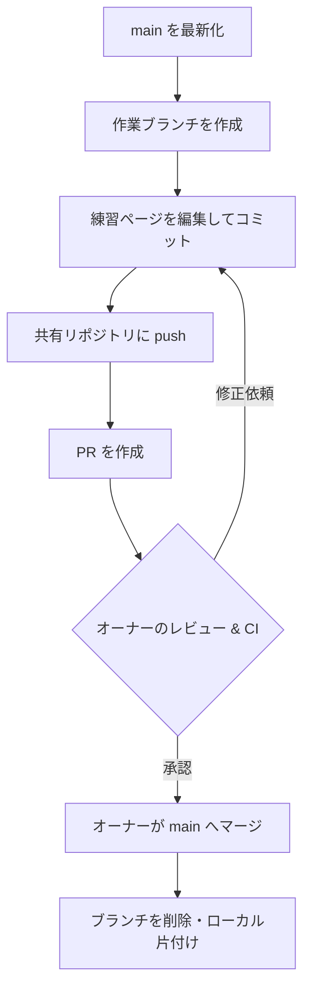

# ⑤ GitHub Flow を一周する

この実習では、チーム開発の標準である **GitHub Flow を最初から最後まで 1 周** します。練習ページを編集し、ブランチ作成 → コミット → push → プルリクエスト (PR) → レビュー → マージ → 後片付け、の一連の流れを通します。対応する解説は [GitHub Flow](../guide/github-flow) と [プルリクエストとレビュー](../guide/pull-request) です。

## 🎯 この実習のゴール

- `main` から作業ブランチを切って共有リポジトリへ push できる
- 共有リポジトリに対して PR を作成し、変更内容を説明できる
- レビュー → マージ → ブランチ削除の流れを理解する

| 前提 | 所要時間 |
| --- | --- |
| 共有リポジトリを clone 済み・コラボレーター招待済み | 約 25 分 |

::: tip 役割分担
**参加者は「PR を作成する」ところまで** が担当です。PR の**レビューとマージはオーナー**が行います（共有リポジトリの `main` はオーナーが守ります）。一人で練習している場合は、自分でレビューしてマージしてください。
:::

## GitHub Flow の全体像



## ステップ 1：最新の main から作業ブランチを切る

作業を始める前に、必ず `main` を最新にします。`<あなた>` は自分の名前に置き換えてください。

```bash
git switch main
git pull
git switch -c practice/<あなた>-flow
```

✅ **チェックポイント**

```bash
git branch --show-current
```

```text
practice/<あなた>-flow
```

## ステップ 2：練習ページを編集してコミットする

[練習場](../practice/)（`docs/practice/index.md`）の「自己紹介」セクションに、自分の情報を 1 行追記します（**名前を入れる**と、誰の変更か分かりやすくなります）。

```markdown
## 自己紹介（任意）

実習⑤（GitHub Flow）で、ここに自分の情報を 1 行追記して PR を出す練習に使えます。

- （例）名前 / 好きな言語 / 学びたいこと
- 佐藤 / TypeScript / チーム開発の作法   ← この行を追加
```

意味のある単位でコミットします。

```bash
git commit -am "docs: 自己紹介を追加 (<あなた>)"
```

::: tip コミットメッセージの作法
このリポジトリでは `type(scope): 要約` 形式（Conventional Commits）を推奨しています。`docs:` `feat:` `fix:` `chore:` などの種別を先頭に付けると、履歴が読みやすくなります。
:::

## ステップ 3：共有リポジトリに push する

```bash
git push -u origin practice/<あなた>-flow
```

✅ **チェックポイント**

```text
 * [new branch]      practice/<あなた>-flow -> practice/<あなた>-flow
branch 'practice/<あなた>-flow' set up to track 'origin/practice/<あなた>-flow'.
```

## ステップ 4：プルリクエストを作成する

以下では、`<オーナー>` を共有リポジトリのオーナー名に置き換えてください。

### A. `gh` CLI で作る場合

`--repo` で base を**共有リポジトリ**に固定します。これを省くと、本家チュートリアル宛ての PR になってしまうことがあります。

```bash
gh pr create \
  --repo <オーナー>/nakamura-git-tutorial \
  --base main \
  --head practice/<あなた>-flow \
  --fill
```

`--fill` はコミット内容からタイトルと本文を自動で埋めます。自分で書くなら `--title` / `--body` を使います。

### B. ブラウザで作る場合

1. **共有リポジトリ**のページで **Pull requests → New pull request**
2. 上部の **base repository** が**共有リポジトリ**（`<オーナー>/nakamura-git-tutorial`）であることを確認（本家になっていないか必ずチェック）
3. base が `main`、compare が `practice/<あなた>-flow` であることを確認
4. タイトルと説明を記入して **Create pull request**

✅ **チェックポイント**

PR ページが開き、「Files changed」タブで `docs/practice/index.md` の差分（自己紹介の 1 行追加）が確認できます。base が共有リポジトリの `main` になっていることも確認しましょう。

::: details 🔍 良い PR にするコツ

- **小さく保つ** — レビューしやすい差分にする
- **目的を書く** — 「何を・なぜ」変えたかを説明に含める
- **自分でも一読する** — 提出前に「Files changed」を見て、消し忘れがないか確認
- **関連 Issue を紐付ける** — 本文に `Closes #123` と書くと、マージ時に Issue が自動クローズされる

:::

## ステップ 5：レビューとマージ

PR を作ったら、**オーナーがレビューしてマージ**します。参加者はレビューコメントに対応（修正をコミットして push すれば、同じ PR に反映されます）し、承認・マージを待ちます。

オーナー（または一人で練習している人）は、次のいずれかでマージします。

### A. `gh` CLI の場合

```bash
gh pr merge --repo <オーナー>/nakamura-git-tutorial practice/<あなた>-flow \
  --squash --delete-branch
```

### B. ブラウザの場合

PR ページの **Squash and merge → Confirm squash and merge** を押し、続いて表示される **Delete branch** でリモートのブランチを削除します。

::: tip このリポジトリは Squash Merge
このリポジトリは **Squash Merge**（PR のコミットを 1 つにまとめて `main` に入れる）を採用しています。そのため **PR タイトルがそのまま `main` のコミットメッセージ**になります（PR タイトルを Conventional Commits 形式にするのはこのため）。マージ方式の使い分けは [プルリクエストとレビュー](../guide/pull-request) を参照してください。
:::

✅ **チェックポイント**

PR が **Merged**（紫のバッジ）になり、共有リポジトリの `main` の `docs/practice/index.md` に「自己紹介」の行が反映されています。

## ステップ 6：ローカルを片付ける

マージが終わったら、ローカルも最新化して作業ブランチを掃除します。

```bash
git switch main
git pull
git branch -d practice/<あなた>-flow
```

✅ **チェックポイント**

```bash
git log --oneline -3
git branch
```

`main` に変更が取り込まれ（先頭付近に「docs: 自己紹介を追加」）、作業ブランチが消えていれば 1 周完了です。

## ⚠️ つまずきポイント

::: warning うまくいかないとき

- **PR の base が本家になっている** … 共有リポジトリは本家の fork なので、PR の base が本家に向きがちです。base リポジトリを**共有リポジトリ**に直してください。
- **`Updates were rejected`** … リモートの `main` が進んでいます。`git switch main && git pull` で最新化してから、作業ブランチに戻り `git merge main`（または rebase）で取り込み直します。
- **マージできない** … `main` の保護により、CI が緑でないとマージできない設定の場合があります。次の [⑥ CI を動かす](./ci-lab) で扱います。

:::

## まとめ

GitHub Flow の 1 周は、いつも同じリズムです。

1. `main` を最新化して**作業ブランチを切る**
2. **コミット**して **push**（共有リポジトリへ）
3. **PR** を作る（base は共有リポジトリの `main`）
4. **オーナーのレビュー・CI** を経て **マージ**
5. ローカルとリモートのブランチを**片付ける**

**小さく作って、早くマージする**——これを繰り返すのがチーム開発の基本です。
