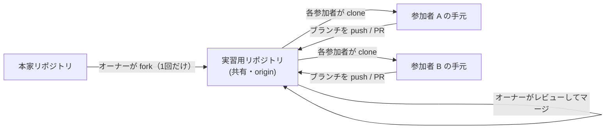

# 実習の進め方

ここからは、**実際に手を動かして覚える実習（ハンズオン）** です。このチュートリアルサイトの元になっている **GitHub リポジトリそのものを練習台** にして、Git/GitHub の操作を一通り体験します。「読んで分かったつもり」を「やってできる」に変えるのが目的です。

## このスタイルのいいところ

使い捨ての練習用リポジトリではなく、**本物のドキュメントサイトのリポジトリ**を使います。

- 本物の Markdown を編集するので、変更がサイトに反映される手応えがある
- リポジトリに用意された**本物の CI（GitHub Actions）** が、PR で実際に動く
- 実務とまったく同じ「ブランチ → PR → レビュー → マージ」の流れを練習できる

このリポジトリ自体が GitHub Flow の教材です（[CONTRIBUTING](https://github.com/ykgw-daiki-nakamura/nakamura-git-tutorial/blob/main/CONTRIBUTING.md) 参照）。

## 登場人物と全体像

この実習は、**1 つの「実習用リポジトリ」を全員で共有**して進めます。

| 役割 | やること |
| --- | --- |
| **オーナー（主催者）** | 実習用リポジトリを 1 回だけ用意し、参加者を招待。PR のレビューとマージを担当 |
| **参加者** | 共有リポジトリを clone し、ブランチを切って push、PR を作成 |



①〜④ は clone した後は**ローカルだけ**で進みます。⑤〜⑦ で、共有リポジトリへ push したり PR を出したりします。

::: tip 一人で練習する場合
オーナーと参加者を兼ねて、自分一人でも実習できます。その場合は下の「オーナー向け」のセットアップを自分で行い、レビュー・マージも自分で行ってください。
:::

## 前提

| 項目 | 内容 |
| --- | --- |
| Git | インストール済み（[セットアップ](../guide/setup) 参照） |
| GitHub アカウント | **必須** |
| 共有リポジトリへのアクセス | 参加者はオーナーから**コラボレーター招待**を受ける（push 権限が必要） |
| gh CLI | あると便利。Web 操作でも代替可 |
| Node.js | 18 以上（`npm run docs:dev` でプレビューする場合） |

まだ認証していない場合は、`gh auth login`、または SSH 鍵の設定（[セットアップ](../guide/setup)）を先に済ませてください。

## オーナー向け：実習用リポジトリを用意する（1 回だけ）

主催者は、実習の前に次を済ませておきます。**参加者はこの節を飛ばして**、次の「参加者向け」へ進んでください。

1. 本家を fork して、実習用の共有リポジトリを作る

   ```bash
   gh repo fork ykgw-daiki-nakamura/nakamura-git-tutorial --clone=false
   ```

   ブラウザの場合は [本家リポジトリ](https://github.com/ykgw-daiki-nakamura/nakamura-git-tutorial) の **Fork** から作成します。

2. 参加者を**コラボレーターとして招待**する（参加者がブランチを push できるようにするため）
   - リポジトリの **Settings → Collaborators → Add people** で各参加者を追加

3. fork した直後は **Actions が無効**なことがあるため、**Actions** タブで有効化する（⑦ の CI 実習で使います）

4. （推奨）`main` に **Branch protection rule** を設定し、「Require a pull request before merging」「Require status checks to pass」を有効にする
   - これで「PR・CI を通った変更だけが `main` に入る」状態になり、マージはオーナーの承認で行われます

セットアップが終わったら、参加者に**共有リポジトリの URL**（`https://github.com/<オーナー>/nakamura-git-tutorial`）を共有してください。

## 参加者向け：clone して始める

オーナーから共有リポジトリの URL をもらったら、それを clone します。**fork は不要**です（オーナーがすでに用意しています）。

```bash
# <オーナー> はオーナーの GitHub ユーザー名に置き換える
git clone https://github.com/<オーナー>/nakamura-git-tutorial.git
cd nakamura-git-tutorial
```

✅ origin が共有リポジトリを指していることを確認します。

```bash
git remote -v
```

```text
origin  https://github.com/<オーナー>/nakamura-git-tutorial.git (fetch/push)
```

::: warning ブランチ名に自分の名前を入れる
共有リポジトリなので、参加者全員がブランチを push します。名前が重ならないよう、push するブランチは **`practice/<あなたの名前>-<トピック>`**（例: `practice/sato-flow`）のように名前を入れてください。
:::

::: tip プレビューもできる
clone したら `npm install` → `npm run docs:dev` で、編集結果をローカルのブラウザ（既定では `http://localhost:5173/`）で確認できます。必須ではありませんが、変更がサイトに反映される様子を見ると理解が深まります。
:::

## 編集するのは「練習場」ページ

実習では、安全に編集できる **[練習場（サンドボックス）](../practice/)** ページ（ファイルは `docs/practice/index.md`）を書き換えます。サイト本体のドキュメントは触らないので、何をしても安心です。追記する行には**自分の名前を入れておく**と、共有リポジトリでも誰の変更か分かりやすくなります。

::: tip 失敗しても大丈夫
おかしくなったら、作業ブランチを捨てて `main` から作り直せば元通りです。`main` は保護されているので、壊れた変更がそのまま入ることはありません。
:::

## ページ内の記号

| 記号 | 意味 |
| --- | --- |
| 🎯 | この実習のゴール |
| ✅ チェックポイント | 期待どおりに進んでいるか確認する区切り |
| 🔍 答え合わせ・解説 | 折りたたみ。何が起きたのかの補足 |
| ⚠️ つまずきポイント | よくある失敗とその回避策 |

✅ チェックポイントの想定出力は、環境や既存の履歴によってハッシュやコミット数が変わります。**自分の操作の結果（追加した行・作ったコミット・ブランチ名）が想定どおりか**に注目してください。

準備ができたら [① ローカルで基本操作](./basics-lab) から始めましょう。
