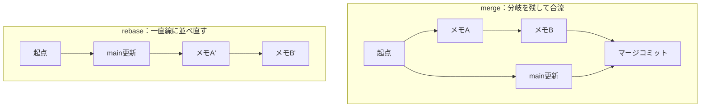

# ④ rebase で履歴を整える

::: tip 発展・任意の実習
この実習は**発展・任意**です。本教材が標準とする**マージ基調のフロー**では `rebase` は必須ではありません。興味があれば取り組んでください。飛ばして [⑤ GitHub にリモート連携](./remote-lab) へ進んでも問題ありません（①〜③でローカルの `main` に練習コミットが残るため、スキップする場合も ⑤ 冒頭の「ローカルの `main` を戻す」手順だけは済ませてください）。
:::

`rebase` は、コミットの土台を付け替えて **履歴を一直線に整える** ための道具です。この実習では、練習ページを編集しながら、ブランチの付け替えと複数コミットの squash（まとめ）を体験します。対応する解説は [rebase と履歴整理](../guide/rebase) です。

## 🎯 この実習のゴール

- `git rebase main` でブランチの土台を付け替えられる
- merge と rebase の履歴の違いを理解する
- `git rebase -i` で複数コミットを 1 つに squash できる

| 前提 | 所要時間 |
| --- | --- |
| 共有リポジトリを clone 済み（以降ローカルのみ） | 約 20 分 |

::: warning 共有済みの履歴は rebase しない
rebase はコミットを**作り直す**操作です。すでに push して他人と共有したコミットを書き換えると、全員の履歴がずれて混乱します。**rebase は「まだ自分しか持っていないローカルのコミット」に対してだけ** 使いましょう。この実習はすべてローカルなので安全です。
:::

## ステップ 1：分岐した状態を作る

`main` から feature ブランチを切り、[練習場](../practice/)（`docs/practice/index.md`）の「練習ログ」に **2 回に分けて** 追記・コミットします。

```bash
git switch main
git switch -c practice/notes
# 「練習ログ」に1行目を追記してから:
git commit -am "docs: rebaseメモAを追加"
# 「練習ログ」に2行目を追記してから:
git commit -am "docs: rebaseメモBを追加"
```

次に `main` 側も進めます。「自己紹介」セクションを編集してコミットします。

```bash
git switch main
# 「自己紹介」を編集してから:
git commit -am "docs: 自己紹介を更新(main側)"
```

✅ **チェックポイント**

```bash
git log --oneline --all --graph -4
```

```text
* aaa (HEAD -> main) docs: 自己紹介を更新(main側)
| * ccc (practice/notes) docs: rebaseメモBを追加
| * bbb docs: rebaseメモAを追加
|/
* 000 (一つ前の共通コミット)
```

`main` と `practice/notes` が共通の親から枝分かれしています。

## ステップ 2：feature を main の上に付け替える

feature ブランチに移動し、土台を最新の `main` に付け替えます。

```bash
git switch practice/notes
git rebase main
```

✅ **チェックポイント**

```text
Successfully rebased and updated refs/heads/practice/notes.
```

```bash
git log --oneline --all --graph -4
```

```text
* ccc' (HEAD -> practice/notes) docs: rebaseメモBを追加
* bbb' docs: rebaseメモAを追加
* aaa (main) docs: 自己紹介を更新(main側)
* 000 (一つ前の共通コミット)
```

枝分かれが消え、**一直線** になりました。feature の 2 コミットが、`main` の最新の上に乗せ直された状態です。

::: details 🔍 ハッシュが変わるのはなぜ？
rebase は元のコミットをコピーして、新しい土台の上に**作り直します**。中身（変更内容）は同じでも、親が変わるためコミットのハッシュは別物になります（図の `bbb` → `bbb'`）。これが「履歴を書き換える」と言われる理由です。
:::

## merge と rebase の違い

同じ「main の変更を取り込む」でも、結果の形が違います。



- **merge**：分岐の事実が履歴に残る（マージコミットができる）
- **rebase**：分岐がなかったかのように一直線になる（履歴が読みやすい）

## ステップ 3：複数コミットを squash でまとめる

「メモA」「メモB」は本来 1 つの作業です。`rebase -i`（インタラクティブ rebase）で 1 コミットにまとめます。直近 2 コミットを対象にします。

```bash
git rebase -i HEAD~2
```

エディタが開き、次のような行が表示されます。

```text
pick bbb docs: rebaseメモAを追加
pick ccc docs: rebaseメモBを追加
```

**2 行目の `pick` を `squash`（または `s`）に書き換えます。**

```text
pick bbb docs: rebaseメモAを追加
squash ccc docs: rebaseメモBを追加
```

保存して閉じると、次に**コミットメッセージの編集画面**が開きます。1 つのメッセージに整え（例：`docs: rebase実習のメモを追加`）、保存して閉じます。

✅ **チェックポイント**

```bash
git log --oneline -3
```

```text
ddd (HEAD -> practice/notes) docs: rebase実習のメモを追加
aaa docs: 自己紹介を更新(main側)
000 (一つ前の共通コミット)
```

2 つあったメモのコミットが、**1 つにまとまりました**。

::: details 🔍 rebase -i でよく使うコマンド

| コマンド | 意味 |
| --- | --- |
| `pick` | そのまま採用 |
| `squash` (`s`) | 直前のコミットに統合し、メッセージは両方を編集 |
| `fixup` (`f`) | 直前に統合するが、このコミットのメッセージは捨てる |
| `reword` (`r`) | 内容はそのまま、メッセージだけ書き換える |
| `drop` (`d`) | そのコミットを削除する |

:::

## ⚠️ つまずきポイント

::: warning rebase 中にコンフリクトしたら
rebase でもコンフリクトは起きます。手順は merge とほぼ同じですが、**最後のコマンドが違います**。

1. 競合ファイルを編集して解決
2. `git add <ファイル>`
3. `git rebase --continue`（`git commit` ではない！）

やめたくなったら `git rebase --abort` で開始前に戻せます。
:::

## ⑤ に進む前に：ローカルの main を戻す

::: warning ローカル編の後片付け（重要）
①〜④ では、練習のために**ローカルの `main` に直接コミット**しました。このまま⑤以降で `main` からブランチを切って push すると、**練習用のコミットが PR に混ざったり**、`git pull` が複雑になってしまいます。⑤に進む前に、ローカルの `main` を共有リポジトリの最新状態に戻しておきましょう。

```bash
git switch main
git fetch origin
git reset --hard origin/main   # ローカル main の練習コミットを破棄し、origin/main に合わせる
```

練習用ブランチ（`practice/...`）が残っていれば削除しておきます（任意）。

```bash
git branch -D practice/notes practice/branch practice/timeout-5000   # 作ったものだけでOK
```

うまくいかないときは、**作業フォルダを消して clone し直す**のが最も確実です。
:::

## まとめ

- `git rebase main` で feature の土台を最新 main に付け替え、履歴を一直線にできる
- rebase はコミットを作り直すため、**共有済みの履歴には使わない**
- `git rebase -i` で squash すると、細かいコミットを意味のある単位にまとめられる

ここまででローカル編は完了です。上の後片付けを必ず済ませておきましょう。
