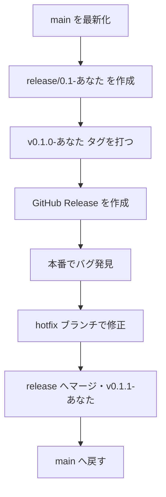

# ⑦ タグとリリース

この実習では、`main` のある 1 点を**リリース**として確定し、**タグ → GitHub Release → release ブランチ → hotfix** の一周を体験します。出荷したバージョンを、`main` を巻き込まずに直す流れまで通します。対応する解説は [リリースとバージョン管理](../guide/release) です。

## 🎯 この実習のゴール

- 注釈付きタグを打って push できる（`git tag -a` / `git push origin <タグ>`）
- タグから **GitHub Release** を作れる（`gh release create --generate-notes`）
- **release ブランチ**を切り、**hotfix** を当てて `v0.1.1` を出せる
- hotfix を **`main` へ戻す**ところまで理解する

| 前提 | 所要時間 |
| --- | --- |
| ⑤（GitHub Flow）を終えている・共有リポジトリを clone 済み | 約 25 分 |

::: warning 共有リポジトリなので名前を付ける
参加者全員が同じ共有リポジトリにタグやブランチを作ります。衝突しないよう、この実習では**タグ・ブランチ名に自分の名前を入れます**（例 `v0.1.0-sato`、`release/0.1-sato`）。以降 `<あなた>` は自分の名前に置き換えてください。
:::

::: tip 役割分担
一人で練習している場合は、以下をすべて自分で行います。チームで行う場合、`main` へのマージ（ステップ 6）は**オーナー**が担当します。
:::

## 全体像



## ステップ 1：最新の main から release ブランチを切る

リリースは「`main` のこの時点を出荷する」という確定です。まず `main` を最新化し、そこから release ブランチを切ります。

```bash
git switch main
git pull
git switch -c release/0.1-<あなた>
```

✅ **チェックポイント**

```bash
git branch --show-current
```

```text
release/0.1-<あなた>
```

::: details 🔍 なぜ release ブランチを切るのか
`main` はこの後も新機能で進んでいきます。**出荷した `0.1` を後から直せる線**を残しておくのが release ブランチです。継続デプロイのサービスでは省くこともありますが、この実習では hotfix まで体験するために切ります。
:::

## ステップ 2：注釈付きタグを打って push する

いまの release ブランチの先端に、注釈付きタグを打ちます。

```bash
git tag -a v0.1.0-<あなた> -m "リリース v0.1.0 (<あなた>)"
git push -u origin release/0.1-<あなた>
git push origin v0.1.0-<あなた>
```

✅ **チェックポイント**

```bash
git show v0.1.0-<あなた>
```

```text
tag v0.1.0-<あなた>
Tagger: あなたの名前 <...>
...
    リリース v0.1.0 (<あなた>)

commit 1111aaa...
```

タガー・メッセージ・指しているコミットが表示されれば成功です。

::: warning タグは push を忘れやすい
`git push` はタグを送りません。**`git push origin <タグ名>` を別に実行**する必要があります。GitHub の Releases 画面にタグが出てこないときは、まずこれを確認してください。
:::

## ステップ 3：GitHub Release を作る

タグに変更内容（リリースノート）を紐付けて公開します。

### A. gh CLI の場合

```bash
gh release create v0.1.0-<あなた> \
  --repo <オーナー>/nakamura-git-tutorial \
  --title "v0.1.0 (<あなた>)" \
  --generate-notes
```

`--generate-notes` は、直近のマージ済み PR から変更点を自動でまとめてくれます。

### B. ブラウザの場合

1. **共有リポジトリ**の **Releases → Draft a new release**
2. **Choose a tag** で `v0.1.0-<あなた>` を選ぶ
3. **Generate release notes** を押してノートを自動生成
4. **Publish release**

✅ **チェックポイント**

Releases 一覧に `v0.1.0 (<あなた>)` が表示され、変更点のノートが付いていれば成功です。

## ステップ 4：本番バグを想定して hotfix ブランチを切る

出荷後にバグが見つかった状況を再現します。**`main` ではなく `release/0.1-<あなた>` から** hotfix ブランチを切るのがポイントです（`main` はもう次の開発で進んでいるかもしれないため）。

```bash
git switch release/0.1-<あなた>
git switch -c hotfix/0.1.1-<あなた>
```

[練習場](../practice/)（`docs/practice/index.md`）の「練習ログ」に、修正を表す 1 行を追記してコミットします。

```bash
# 「練習ログ」に1行追記してから:
git commit -am "fix: リリース後の不具合を修正 (<あなた>)"
```

::: details 🔍 なぜ `fix:` なのか
バグ修正は Conventional Commits の `fix:`＝SemVer の **PATCH** に対応します。だから次のタグは `v0.1.0` → `v0.1.**1**` です。もし機能追加（`feat:`）なら MINOR（`0.**2**.0`）になります。
:::

## ステップ 5：release へマージして v0.1.1 を出す

hotfix を release ブランチへ取り込み、新しいパッチバージョンを打ちます。

```bash
git switch release/0.1-<あなた>
git merge hotfix/0.1.1-<あなた>
git tag -a v0.1.1-<あなた> -m "hotfix v0.1.1 (<あなた>)"
git push origin release/0.1-<あなた>
git push origin v0.1.1-<あなた>
```

続けて Release も作ります（任意）。

```bash
gh release create v0.1.1-<あなた> \
  --repo <オーナー>/nakamura-git-tutorial \
  --title "v0.1.1 (<あなた>)" --generate-notes
```

✅ **チェックポイント**

```bash
git tag | grep <あなた>
```

```text
v0.1.0-<あなた>
v0.1.1-<あなた>
```

出荷済みの `0.1` 系に、修正版 `v0.1.1` が並びました。

## ステップ 6：修正を main へ戻す

hotfix で最も忘れやすいのが、この**戻し**です。`release/0.1-<あなた>` の修正を `main` にも反映しないと、次のリリースで同じバグが復活します。

チームでは PR を作ってオーナーがマージします。

```bash
gh pr create \
  --repo <オーナー>/nakamura-git-tutorial \
  --base main \
  --head release/0.1-<あなた> \
  --title "fix: hotfix v0.1.1 を main へ反映 (<あなた>)" \
  --fill
```

一人で練習している場合は、直接マージしても構いません。

```bash
git switch main
git pull
git merge release/0.1-<あなた>
git push
```

✅ **チェックポイント**

```bash
git switch main
git log --oneline -3
```

`main` の履歴に「fix: リリース後の不具合を修正」が含まれていれば、修正が本流へ戻せています。

## ⚠️ つまずきポイント

::: warning うまくいかないとき

- **タグが GitHub に出てこない** … タグは `git push` で送られません。`git push origin <タグ名>` を実行してください。
- **`v` を付け忘れた / 名前を付け忘れた** … 慣習として `v` を付けます（`v0.1.0`）。共有リポジトリでは名前も必須です。打ち直すときは `git tag -d <タグ>`（ローカル削除）→ `git push origin :refs/tags/<タグ>`（リモート削除）してから付け直します。
- **hotfix を main へ戻し忘れる** … `git branch --merged main` で `release/0.1-<あなた>` が出てこなければ、まだ戻せていません。ステップ 6 を実行してください。
- **Release 作成で `tag not found`** … タグをまだ push していません。先にステップ 2・5 の `git push origin <タグ>` を済ませます。

:::

## まとめ

- リリースは**注釈付きタグ**（`git tag -a`）で出荷点に印を付け、**`git push origin <タグ>`** で共有する
- **GitHub Release**（`--generate-notes`）で変更点を公開できる
- 出荷済みを直すときは **release ブランチ → hotfix → `v0.1.1` → main へ戻す**
- コミット種別（`fix:`/`feat:`）が、次に上げる SemVer の桁を教えてくれる

これで、ブランチ操作からチーム開発・CI・リリースまでの一連の流れを一周できました。困ったときは [トラブルシューティング](../guide/troubleshooting)、操作を忘れたら [コマンド早見表](../guide/commands) を参照してください。
