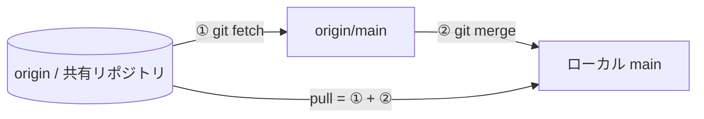

# ④ GitHub にリモート連携

ここから後半、**GitHub と連携する実習** です。これまでローカルで作った変更を、**共有リポジトリ（origin）** へ push し、リモートと同期する流れを体験します。対応する解説は [リモートと GitHub](../guide/remote) です。

## 🎯 この実習のゴール

- `origin`（共有リポジトリ）の役割を理解する
- `git push -u` で作業ブランチを共有リポジトリへアップロードできる
- `git fetch` / `git pull` でリモートやチームの変更と同期できる

| 前提 | 所要時間 |
| --- | --- |
| 共有リポジトリを clone 済み・コラボレーター招待済み・GitHub 認証済み | 約 20 分 |

::: warning 先にローカルの main を戻しておく（重要）
①〜③ では、練習のために**ローカルの `main` に直接コミット**した場合があります。そのまま `main` からブランチを切って push すると、**練習用のコミットが PR に混ざったり**、`git pull` が複雑になります。ここから共有リポジトリへ push する前に、ローカルの `main` を共有リポジトリの最新状態に戻しておきましょう。

```bash
git switch main
git fetch origin
git reset --hard origin/main   # ローカル main の練習コミットを破棄し、origin/main に合わせる
```

練習用ブランチ（`practice/...`）が残っていれば削除しておきます（任意）。

```bash
# 作ったブランチの分だけ実行すればOK（作っていないものは飛ばす）
git branch -D practice/basics        # 実習①で作成
git branch -D practice/branch        # 実習②で作成
git branch -D practice/timeout-5000  # 実習③で作成
```

うまくいかないときは、**作業フォルダを消して clone し直す**のが最も確実です。
:::

## ステップ 1：リモートを確認する

clone した時点で、`origin` が**共有リポジトリ**を指しているはずです。

```bash
git remote -v
```

✅ **チェックポイント**

```text
origin  https://github.com/<オーナー>/nakamura-git-tutorial.git (fetch/push)
```

push も PR も、この `origin`（共有リポジトリ）に対して行います。

::: details 🔍 origin と upstream
今回は**オーナーが用意した共有リポジトリを直接 clone**しているので、push 先の `origin` だけがあれば十分です。

なお、この共有リポジトリ自体は本家チュートリアルの fork です。本家の更新を共有リポジトリへ取り込む（`upstream` からの同期）作業は**オーナーの担当**で、参加者が行う必要はありません。
:::

## ステップ 2：作業ブランチを作って push する

`main` から作業ブランチを切ります。共有リポジトリなので、**ブランチ名に自分の名前**を入れて衝突を避けます（`<あなた>` は自分の名前に置き換え）。

```bash
git switch main
git pull
git switch -c practice/<あなた>-remote
# docs/practice/index.md の「練習ログ」に1行追記してから:
git commit -am "docs: リモート実習の記録を追加 (<あなた>)"
```

このブランチを共有リポジトリ（origin）へ push します。初回は `-u` で上流を設定します。

```bash
git push -u origin practice/<あなた>-remote
```

✅ **チェックポイント**

```text
 * [new branch]      practice/<あなた>-remote -> practice/<あなた>-remote
branch 'practice/<あなた>-remote' set up to track 'origin/practice/<あなた>-remote'.
```

ブラウザで共有リポジトリのページを開くと、あなたのブランチが現れ、「Compare & pull request」のバナーが出ます（PR は次の⑤で扱います）。

::: details 🔍 `-u` は何をしている？
`-u`（`--set-upstream`）は、ローカルのブランチと `origin` 側のブランチを**ひも付け**ます。一度設定すれば、以降は `git push` / `git pull` を引数なしで実行できます。初回だけ付ければOKです。
:::

## ステップ 3：チームの変更を取り込む（fetch / pull）

共有リポジトリでは、他の参加者の PR が次々にマージされ、`main` が進んでいきます。自分の `main` を最新に保つ流れを確認します。



まず `fetch`（取得するだけ）で、リモートの最新と手元の差を確認します。

```bash
git switch main
git fetch
git log --oneline main..origin/main
```

✅ **チェックポイント**

他の参加者のマージ済みコミットがあれば、`origin/main` 側にだけ見えます（手元の `main` はまだ古いまま）。`pull` で実際に取り込みます。

```bash
git pull
git log --oneline -3
```

取り込めたら、最新の `main` から次のブランチを切れる状態になります。差分が無ければ `Already up to date.` と出ますが、それで正常です。

::: details 🔍 fetch と pull の違い

| コマンド | 動作 |
| --- | --- |
| `git fetch` | リモートの変更を**取得するだけ**。手元の作業は変わらない |
| `git pull` | `fetch` してから `merge`（または rebase）まで行う |

「中身を確認してから取り込みたい」なら fetch、「最新に追いつくだけ」なら pull、と使い分けます。
:::

## ⚠️ つまずきポイント

::: warning push できないとき

- **`Permission denied` / `403`** … 共有リポジトリへの push 権限がありません。オーナーに**コラボレーター招待**を依頼してください。
- **`Updates were rejected`** … リモートのブランチが進んでいます。`git pull`（必要なら `--rebase`）で取り込んでから push し直します。
- **ブランチ名が他の人と衝突** … `practice/<あなたの名前>-<トピック>` のように、必ず自分の名前を入れて push しましょう。

:::

## まとめ

- **origin = 共有リポジトリ**（push 先 / PR 先）
- 作業ブランチの初回 push は `git push -u origin <ブランチ>`（名前入りブランチで衝突回避）
- チームの変更は `git fetch`（確認）→ `git pull`（取り込み）で同期する

リモートが使えるようになりました。
