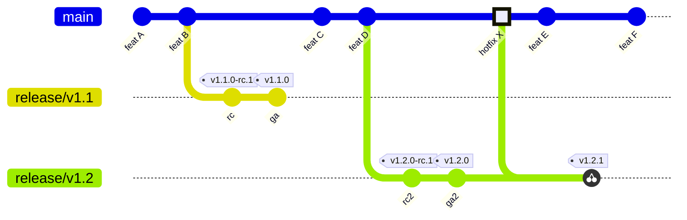

# ブランチ運用

本ページはブランチ体系（命名規則を含む）と、ブランチプロテクション・マージルールを扱う。全体像は[概要](./)を参照。

## ブランチ体系

### ブランチ一覧

| ブランチ | 役割 | 寿命 | 作成元 | マージ先 |
| --- | --- | --- | --- | --- |
| `main` | 唯一の統合ブランチ。次期バージョンの開発ライン | 永続 | — | — |
| `feature/*` | 機能開発・改善 | 短命 | `main` | `main`（PR 経由） |
| `fix/*` | バグ修正 | 短命 | `main` | `main`（PR 経由） |
| `release/vX.Y` | バージョン X.Y の安定化・出荷・保守ライン（SaaS / セルフホスト共通） | サポート期間中 | `main` | マージしない（cherry-pick のみ受け入れる） |

### ブランチモデル全体像

- `main` は常に「次期バージョン（N+1）」の開発ラインであり、直接デプロイ・出荷の起点にはしない。
- 出荷（SaaS 本番デプロイ / セルフホスト配布）は必ず `release/vX.Y` 上のタグから行う。
- 図の `hotfix X` → `v1.2.1` のように、修正は **main → release の一方向**にのみ流れる。

### 命名規則

| 種別 | 形式 | 例 |
| --- | --- | --- |
| feature ブランチ | `feature/<issue番号>-<短い説明>` | `feature/1234-tenant-flag-api` |
| fix ブランチ | `fix/<issue番号>-<短い説明>` | `fix/1250-forecast-nan-handling` |
| release ブランチ | `release/vX.Y` | `release/v1.2` |
| リリース候補タグ | `vX.Y.Z-rc.N` | `v1.2.0-rc.1` |
| GA タグ | `vX.Y.Z`（SemVer） | `v1.2.1` |

## ブランチプロテクションとマージルール

### ブランチ・タグ保護（Repository Rulesets）

保護設定は従来の branch protection ではなく **Repository Rulesets** で行う（ブランチとタグの保護、および bypass 権限の管理を一元化できるため）。

#### `main` に適用するルール

| ルール | 設定 | 意図 |
| --- | --- | --- |
| Restrict direct pushes（PR 必須） | 有効 | すべての変更を PR 経由に強制する |
| Required approvals | 1 名以上 | レビューの担保 |
| Dismiss stale approvals on push | 有効 | 承認後の追加 push で承認を無効化し、未レビューコードの混入を防ぐ |
| Required status checks | lint / 型チェック / テスト / ビルド | CI 成功をマージ条件とする。Require branches to be up to date を有効化（頻度が高くなった場合は merge queue の導入を検討） |
| Require conversation resolution | 有効 | 指摘の放置マージを防ぐ |
| Require linear history | 有効 | squash merge 運用と整合させ、履歴を 1 PR = 1 コミットに保つ |
| Block force pushes / deletions | 有効 | 履歴改変・ブランチ消失の防止 |
| CODEOWNERS review | 有効（対象: DB マイグレーション、IaC、`.github/workflows/`） | 影響の大きい変更にドメイン責任者のレビューを必須化する。特にリリースワークフロー自体の変更はリリース責任者のレビューを必須とする |

#### `release/*` に適用するルール

- `main` と同一のルールセットを適用する。
- 加えて、ブランチの**作成をリリース責任者（またはリリースワークフロー）に限定**する（creation restriction）。
- release ブランチへの PR は cherry-pick PR のみを想定し、PR テンプレートで元 PR（main 側）へのリンクを必須項目とする。

#### タグ `v*` に適用するルール

- 作成: リリースワークフロー（GitHub App / 専用ロール）のみに限定する。
- 更新・削除: 全員禁止（bypass 対象なし）。公開済みバージョンの改変を構造的に不可能にする。

#### Bypass 権限の方針

- 組織管理者を含め、bypass list への恒常的な登録は行わない。緊急時は bypass ではなく、規約で定めた緊急手順（[障害対応](./incident)の「ホットフィックス手順」: RC 省略の緊急パッチ）で対応する。
- bypass が発生した場合（監査ログで検知）は、事後レビューを必須とする。

### マージルール

1. `feature/*` → `main` のマージ方式は **squash merge** とする（merge commit / rebase merge はリポジトリ設定で無効化する）。
2. `main` → `release/*` への反映は **cherry-pick のみ**とする。merge / rebase による取り込みは禁止する。
3. `release/*` → `main` のマージは禁止する（upstream first の徹底）。
4. PR は小さく保つ。大きくなる場合は feature flag を活用して分割する。
