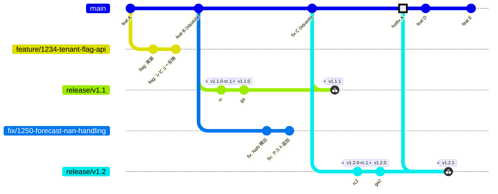

# ブランチ運用

ブランチ体系と命名規則を定める。保護設定は[ブランチ保護](./branch-protection)、マージ方式と PR タイトルの規約は[マージルールと PR タイトル規約](./merge-rules)を参照。全体像は[概要](./)を参照。

## このページの要点

- ブランチは `main` / `feature/*` / `fix/*` / `release/vX.Y` の 4 種類だけとする。
- `main` は次期バージョンの開発ラインであり、出荷の起点にはしない。出荷は `release/vX.Y` 上のタグから行う。
- 修正は **main → release の一方向**にだけ流れる（upstream first）。

## ブランチ一覧

| ブランチ | 役割 | 寿命 | 作成元 | マージ先 |
| --- | --- | --- | --- | --- |
| `main` | 唯一の統合ブランチ。次期バージョンの開発ライン | 永続 | — | — |
| `feature/*` | 機能開発・改善 | 短命 | `main` | `main`（PR 経由） |
| `fix/*` | バグ修正 | 短命 | `main` | `main`（PR 経由） |
| `release/vX.Y` | バージョン X.Y の安定化・出荷・保守ライン（SaaS / セルフホスト共通） | サポート期間中 | `main` | マージしない（cherry-pick のみ受け入れる） |

## ブランチモデル全体像

- `main` は常に「次期バージョン（N+1）」の開発ラインであり、直接デプロイ・出荷の起点にはしない。
- 機能追加・修正は `main` から `feature/*` / `fix/*` を切って進め、**squash merge** で `main` に取り込む。
- squash では、ブランチ側の複数コミット（`flag: 実装`・`flag: レビュー反映` など）が `main` 上の 1 コミット（`feat B (squash)`）にまとまる。ブランチ側のコミットは `main` に個別には現れない。
- マージコミットも作らないため、`main` は linear history を保つ（図でブランチ線が `main` へ戻らないのはこのため）。
- 出荷（SaaS 本番デプロイ / セルフホスト配布）は必ず `release/vX.Y` 上のタグから行う。
- 修正は **main → release の一方向**にのみ流れる（upstream first）。図の `fix C (squash)` → `v1.1.1` や `hotfix X` → `v1.2.1` がこれにあたる。
- backport 先は**選択的**に決める。対象は、そのバグが存在し、かつ保守期間内の release だけとする。
  - 図では、保守中の v1.1 へ `fix C` を戻して `v1.1.1` を出している。v1.2 は fix C を載せた後の `main` から切るため、最初から修正を含む。

## 命名規則

| 種別 | 形式 | 例 |
| --- | --- | --- |
| feature ブランチ | `feature/<issue番号>-<短い説明>` | `feature/1234-tenant-flag-api` |
| fix ブランチ | `fix/<issue番号>-<短い説明>` | `fix/1250-forecast-nan-handling` |
| release ブランチ | `release/vX.Y` | `release/v1.2` |
| リリース候補タグ | `vX.Y.Z-rc.N` | `v1.2.0-rc.1` |
| GA タグ | `vX.Y.Z`（SemVer） | `v1.2.1` |
