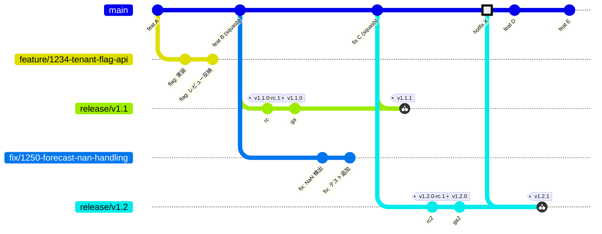
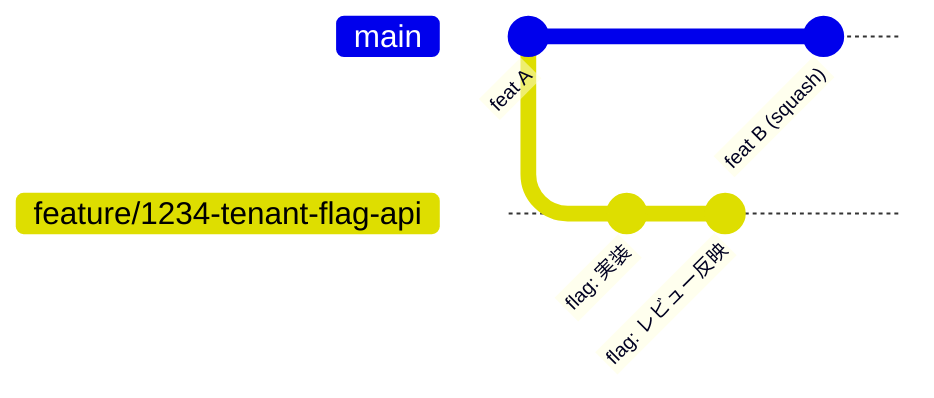
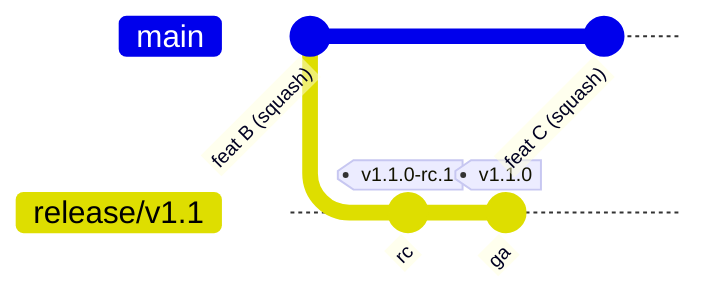
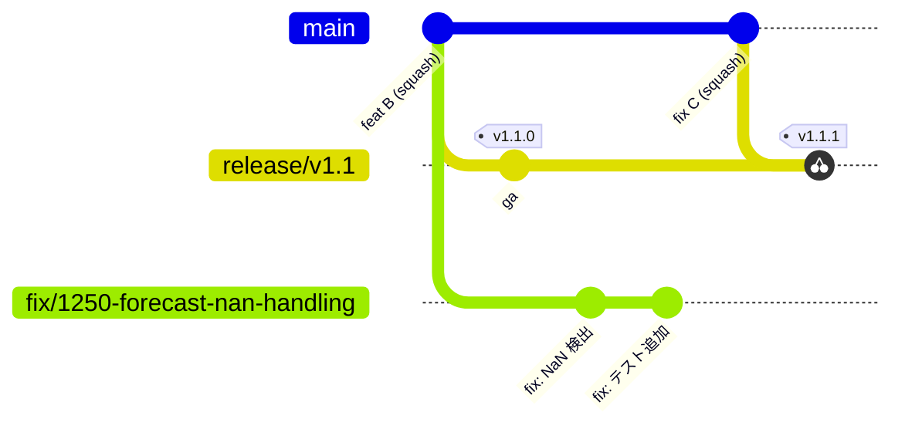
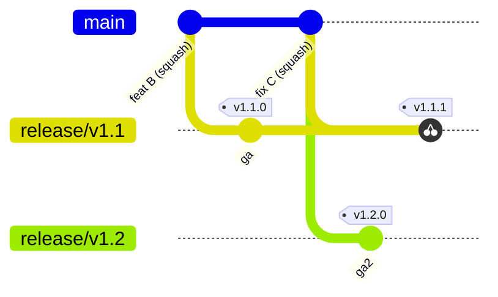

# ブランチ運用

ブランチ体系と命名規則を定める。

## このページの要点

- ブランチは **main** / **feature** / **fix** / **release** の 4 種類だけとする。種類を決めるのは名前ではなく役割である。
- feature / fix の名前は、**課題管理ツールが生成する既定のブランチ名に従ってよい**。
- `main` は次期バージョンの開発ラインであり、出荷の起点にはしない。出荷は `release/vX.Y` 上のタグから行う。
- 修正は **`main` → `release/*` の一方向**にだけ流れる（upstream first）。

## ブランチ一覧

| 種類 | 役割 | 名前 | 寿命 | 作成元 | マージ先 |
| --- | --- | --- | --- | --- | --- |
| main | 唯一の統合ブランチ。次期バージョンの開発ライン | `main` | 永続 | — | — |
| feature | 機能開発・改善 | 課題管理ツールの既定名（[命名規則](#命名規則)） | 短命 | `main` | `main`（PR 経由） |
| fix | バグ修正 | 課題管理ツールの既定名（[命名規則](#命名規則)） | 短命 | `main` | `main`（PR 経由） |
| release | バージョン X.Y の安定化・出荷・保守ライン（SaaS / セルフホスト共通） | `release/vX.Y` | サポート期間中 | `main` | — |

`release/*` のマージ先が `—` なのは、`release/*` から `main` へ戻すマージを禁じているため（upstream first）。逆向きの `main` → `release/*` も、マージではなく **cherry-pick で差分を写す**（後述の「局面 3」）。cherry-pick は履歴を合流させないので、この表の「マージ先」には現れない。

## 命名規則

`main` と `release/vX.Y` の名前は上表のとおり固定する。**feature / fix は、課題管理ツールが課題から生成する既定のブランチ名をそのまま使ってよい。**

| ツール | 既定のブランチ名 | 例 |
| --- | --- | --- |
| GitHub | `<課題番号>-<チケット名>` | `1234-tenant-flag-api` |
| Linear | `feature/<課題番号>-<チケット名>` | `feature/1234-tenant-flag-api` |

課題管理ツールを使わずに手で切る場合は、`feature/<課題番号>-<短い説明>` / `fix/<課題番号>-<短い説明>` を推奨する。いずれの形でも、**課題番号を名前に含める**ことは共通の要件とする。ブランチから課題へ辿れなくなるため。

### 補足: 既定名を正とする理由

既定のブランチ名は、接頭辞の有無まで含めてツールごとに異なる。規約側で 1 つの形に固定すると、課題から作成したブランチを毎回手で改名することになり、規約が形骸化するか、意味のない手間だけが残る。

そのうえで固定しなくても困らない。**ブランチの種類は名前ではなく役割で決まる**ため、名前が揃っていなくても運用上の判断は変わらない。取り込み方式も[ブランチ保護](./branch-protection)も、作業ブランチを名前のパターンで選り分けてはいない（squash merge はリポジトリ設定、保護ルールの適用対象は `main` と `release/*`）。

`release/vX.Y` だけは名前を固定する。こちらは出荷の起点であり、保守期間の判断・タグとの対応付け・ブランチ保護の適用対象の指定を、いずれもこの名前で行うため。

### タグの命名

タグはブランチではなく、`release/vX.Y` 上のコミットに打つ出荷の目印である。

| 種別 | 形式 | 例 |
| --- | --- | --- |
| リリース候補タグ | `vX.Y.Z-rc.N` | `v1.2.0-rc.1` |
| GA タグ | `vX.Y.Z`（SemVer） | `v1.2.1` |

## ブランチモデル全体像

この 1 枚には、次の 4 つの動きが同時に描かれている。以下、局面ごとに切り出して確認する。

1. `feature/*` / `fix/*` を `main` へ squash merge する（局面 1）
2. `main` から `release/vX.Y` を切り、タグを打って出荷する（局面 2）
3. `main` に入れた修正を `release/*` へ cherry-pick する（局面 3）
4. どの `release/*` へ戻すかを選ぶ（局面 4）

### 局面 1: feature / fix を squash merge で main に取り込む

- 機能追加・修正は `main` からブランチを切って進め、PR を **squash merge** で `main` に取り込む。
- ブランチ側の 2 コミット（`flag: 実装`・`flag: レビュー反映`）は `main` に個別には現れない。squash が 1 コミット `feat B (squash)` にまとめる。
- マージコミットも作らないため、`main` は linear history を保つ（図でブランチ線が `main` へ戻らないのはこのため）。
- 取り込んだブランチは削除する。長く残さないのが trunk-based development の前提である。

### 局面 2: main から release/vX.Y を切り、タグを打って出荷する

- `release/v1.1` は、切った時点の `main` のスナップショットである。以降 `main` に入った変更が自動で流れ込むことはない。
- release 上では安定化のコミットだけを積み、RC タグ（`v1.1.0-rc.1`）から GA タグ（`v1.1.0`）へ進める。出荷（SaaS 本番デプロイ / セルフホスト配布）は必ずこのタグから行う。
- `main` は同時に次期バージョン（v1.2）の開発ラインとして先へ進む。`feat C (squash)` は v1.1 には入らない。

### 局面 3: main の修正を release へ cherry-pick する

- 出荷済みの v1.1 で見つかったバグでも、修正はまず `main` に入れる（**upstream first**）。release で直して `main` へ戻し忘れると、次期バージョンで再発する。
- release へは cherry-pick で**差分だけを写す**。写した先には親の異なる別コミット（別の ID）ができるため、`main` と release の履歴は合流しない。`git branch --merged` にも現れず、取り込み済みかの判定には `git cherry` が要る。
- 取り込んだら release 上でパッチ版のタグ（`v1.1.1`）を打ち、そこから出荷する。

### 局面 4: backport 先は保守中の release だけに選ぶ

- 同じ修正をすべての release へ戻すわけではない。backport 先は**選択的**に決め、そのバグが存在し、かつ保守期間内の release にだけ cherry-pick する。
- `release/v1.2` は `fix C` を載せた後の `main` から切っているため、最初から修正を含む。cherry-pick は不要である。
- 保守中の `release/v1.1` にはバグが残っているので、`fix C` を戻して `v1.1.1` を出す。
- 保守期間の終わった release には戻さない。
