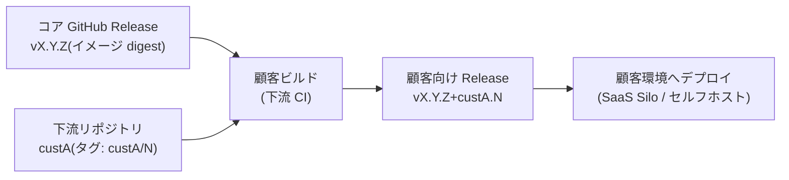
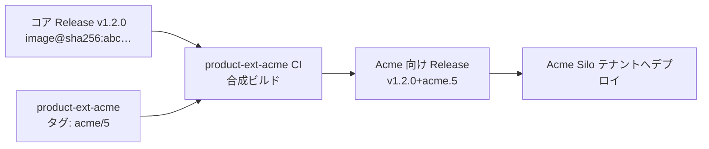

# 顧客別カスタマイズ運用

本ページは顧客別カスタマイズ運用を扱う。全体像は[概要](./)を参照。

## 顧客別カスタマイズ運用

### カスタマイズ階層（Tier）

顧客別カスタマイズは次の 3 階層で管理する。**下位の Tier で吸収できる要求を上位の Tier で実現してはならない。**

| Tier | 手段 | 対象 | 承認 |
| --- | --- | --- | --- |
| Tier 0 | 標準機能のみ | カスタマイズなし | 不要 |
| Tier 1（既定） | 設定値・feature flag・テンプレート差し替え | パラメータ化可能な差異（閾値、帳票レイアウト、画面項目、連携先設定 等） | 不要（構成変更の通常レビュー） |
| Tier 2（例外） | 拡張ポイント + 下流リポジトリ（downstream） | コードレベルの差異（顧客固有ロジック） | **アーキテクト + リリース責任者の承認必須** |

顧客ブランチ・顧客別フォークによるカスタマイズ（Tier 3 相当）は**禁止**する（[禁止事項](./anti-patterns)を参照）。

### Tier 1: 設定・フラグによるカスタマイズ

- 顧客別の設定値・フラグは、アプリケーションコードとは分離した**構成管理（構成リポジトリまたはコントロールプレーン）**で管理する。ビルド成果物は全顧客共通とする（build once の維持）。
- 設定スキーマは製品バージョンと同期してバージョン管理し、CI で設定値のバリデーションを行う（スキーマ外の設定・未定義フラグの混入を防ぐ）。
- **顧客識別子によるコード分岐（`if customer == A` 等）は禁止**する。コード上の分岐が必要になった時点で、それは Tier 1 の範囲外であり、フラグの抽象化（「顧客 A 向け」ではなく「機能 X の有効化」）または Tier 2 への昇格を検討する。
- 設定で表現できない要求が発生した場合の手順: まず**コアへの拡張（全顧客が使える形の機能追加・パラメータ追加）**として `main` への PR を検討し、それでも吸収できない顧客固有ロジックのみ Tier 2 とする。

### Tier 2: 拡張ポイントと下流リポジトリ（downstream）

#### 構成

- コア製品は差し替え可能な**拡張ポイント（プラグイン interface / フック）**を定義する。顧客固有ロジックは拡張ポイントの実装としてのみ記述できる。
- 顧客固有コードは**顧客ごとの独立したリポジトリ（下流リポジトリ / downstream）**に置く。コアリポジトリに顧客固有コードを含めない（顧客間のコード分離 = 契約境界）。
- 下流リポジトリにも本規約のブランチ運用（trunk-based、PR 必須、Rulesets）を適用する。

#### ビルドとバージョニング



- 顧客ビルドは「**公開済みコア GA 成果物（ダイジェスト参照）+ 下流の拡張実装**」の合成として、下流リポジトリ側の CI で組み立てる。**コアの再ビルドは行わない**（[リリースとデプロイ](./release)の「GA 昇格規約」の原則を維持）。
- 顧客向け成果物のバージョンは SemVer ビルドメタデータで `vX.Y.Z+custA.N` と表現し、下流リポジトリの GitHub Release として管理する。コアの `vX.Y.Z` との対応が常に機械的に特定できる。

#### 拡張 API の互換性ポリシー

- 拡張ポイントの interface は公開 API として扱い、**破壊的変更は MAJOR バージョンでのみ**行う。
- MINOR で拡張 API を非推奨化する場合、最低 1 MINOR バージョンの非推奨期間を置き、Release ノートの固定セクションで告知する。

### バージョン追従の運用（追従義務への対応）

カスタマイズ顧客にもバージョン追従義務があるため、コアのリリースごとに全下流リポジトリの追従を保証する仕組みを規約とする。

- **RC 段階での互換性検証**: コアの `vX.Y.Z-rc.N` Release 公開をトリガーに、全 Tier 2 下流リポジトリで互換性テスト（拡張 API のビルド + 契約テスト）を自動実行する。**GA 判定の条件に「全下流リポジトリの互換性テスト合格」を含める**。互換性破壊が GA 後に発覚する事態を構造的に防ぐ。
- **追従期限**: コア GA 公開後、各下流リポジトリは既定の期限内に `vX.Y.Z+custA.N` を発行し、顧客環境のバージョンアップを完了する。
- **セキュリティパッチ**: コアのパッチリリース（`Z` 更新）は拡張 API を変更しないため、下流リポジトリは原則として**依存バージョンの更新のみ（コード変更なし）**で追従できる。下流 CI の再実行と顧客向け Release の再発行を自動化する。
- Tier 2 顧客数と追従コストは比例するため、「Tier 2 カスタマイズの Tier 1 への引き下げ（コア機能化・パラメータ化）」を棚卸しする。

### 適用例（Acme Company の場合）

Tier 判定と Tier 2 の運用イメージを示すための例示である（呼称・要求内容は一般化したものであり、特定顧客・特定機能を指すものではない）。

**前提**: コア製品は `v1.2.0`（公開済み GitHub Release）。Acme は SaaS の Silo テナントとして契約。Acme から次の 3 要求が提示されたとする。

| 要求 | 内容 | Tier 判定 |
| --- | --- | --- |
| 要求 A | 出力帳票へのロゴ表示と、閾値超過時の通知先の追加 | **Tier 1**（ロゴ・閾値・通知先はいずれもパラメータ。構成管理側に Acme 設定として保持し、成果物は共通。コード変更なし） |
| 要求 B | 顧客固有の補正ロジックを予測処理へ組み込む | **要検討 → Tier 2**（設定では表現できない計算ロジック。まずコア汎用機能化を検討し、汎用化の見込みがない場合のみ Tier 2 とする） |
| 要求 C | 顧客の社内システムからの実績データ取り込み | **Tier 2**（既存のデータ取り込み拡張ポイントの Acme 実装として記述） |

大半の要求（A、および汎用化できれば B）は Tier 1 で吸収され、コード実装を要するのは残りのみとなる。

#### Tier 2 の実装手順（要求 B・C）

1. 必要な拡張ポイントがコアに存在するか確認する。データ取り込み用フック（要求 C）は既存とする。予測後処理用フック（要求 B）が未提供であれば、まず**コアへ汎用の拡張ポイントを追加する PR** を `main` に出す（全顧客が使える口であり、通常の開発フロー。承認は「カスタマイズ階層（Tier）」に従う）。
2. 拡張ポイントが揃ったら、Acme 専用の下流リポジトリ（`product-ext-acme`、コアの downstream）を作成し、各フックの Acme 実装と契約テストを配置する。このリポジトリにも本規約のブランチ運用（trunk + PR + Rulesets）を適用する。

```text
product-ext-acme/                  # Acme 下流リポジトリ（downstream）
  src/
    forecast_postprocess_ext.py    # 予測後処理フックの実装（要求B）
    external_ingest_connector.py   # データ取り込みフックの実装（要求C）
  tests/
    contract/                      # 拡張ポイントの契約テスト
  .github/workflows/build.yml
```

#### ビルド（合成）



- コアイメージ（`@sha256:abc…`）をベースに Acme 拡張を重ねるのみで、**コアは再ビルドしない**（[リリースとデプロイ](./release)の「GA 昇格規約」を維持）。
- 成果物バージョンは `v1.2.0+acme.5`（コア 1.2.0 + Acme 拡張 5 回目）として、コアとの対応が機械的に特定できる。

#### コアのバージョンアップ時（追従義務の担保）

コアが次期バージョンの RC（`v1.3.0-rc.1`）を公開すると、これをトリガーに Acme を含む全拡張リポジトリの互換性テストが自動実行される（前述「バージョン追従の運用」）。

| ケース | 挙動 |
| --- | --- |
| 拡張ポイントの interface に変更なし | Acme の契約テストは合格。依存を 1.3.0 に更新するのみで `v1.3.0+acme.6` を自動生成。**コード変更なしで追従** |
| 拡張ポイントに破壊的変更あり | Acme の契約テストが失敗 → **GA をブロック**（前述「バージョン追従の運用」）。コア側は破壊的変更を MAJOR へ回すか、downstream 修正を待つかを RC 段階で決着させる。「追従できないまま GA する」ことを構造的に防ぐ |
| セキュリティパッチ（`v1.2.1`） | 拡張 API 不変のため、Acme は依存更新のみで `v1.2.1+acme.6` を自動発行 → テナントへ再デプロイ。顧客数が増えても自動化経路でスケールする |

この例のように、顧客要求の多くは Tier 1 で完結し、コード実装を要する部分のみが顧客専用リポジトリに隔離される。これにより顧客間のコード分離を保ちつつ、コアのバージョンアップにも自動追従の仕組みで追従できる。
