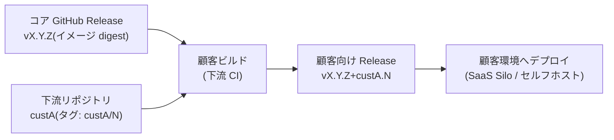
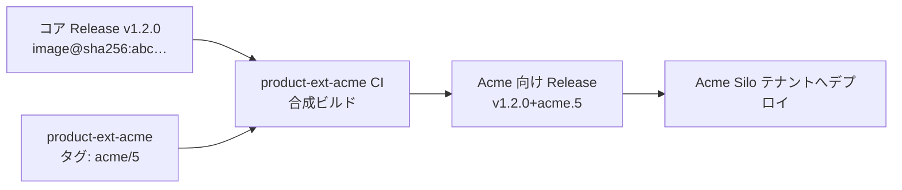

# 顧客別カスタマイズ 🚧

> [!WARNING]
> **本ページは検討中**
>
> 記載内容は検討段階の案であり、現時点の確定規約ではない。合意を経て確定するまでは、運用の根拠として参照しない。

顧客別カスタマイズの進め方を定める。

このページの規約が何によって守られるかは、[規約の担保状況](./enforcement)に一覧としてまとめる。

## このページの要点

- カスタマイズは Tier で管理する。既定は Tier 1（設定値・テンプレート差し替え）、例外が Tier 2（拡張ポイント + 下流リポジトリ）。
- 顧客固有コードはコアに入れない。顧客ごとの独立したリポジトリ（下流リポジトリ）に置く。
- コアの RC 公開をトリガーに全下流リポジトリの互換性テストを走らせ、その合格を GA 判定の条件に含める。

以降、「顧客別カスタマイズ運用」で規約を定め、最後の「適用例」で架空の顧客を題材にした当てはめを示す。

## 顧客別カスタマイズ運用

### カスタマイズ階層（Tier）

顧客別カスタマイズは次の階層で管理する。**下位の Tier で吸収できる要求を上位の Tier で実現してはならない。**

| Tier | 手段 | 対象 | 承認 |
| --- | --- | --- | --- |
| Tier 0 | 標準機能のみ | カスタマイズなし | 不要 |
| Tier 1（既定） | 設定値・feature flag・テンプレート差し替え | パラメータ化可能な差異（閾値、帳票レイアウト、画面項目、連携先設定 等） | 不要（構成変更の通常レビュー） |
| Tier 2（例外） | 拡張ポイント + 下流リポジトリ（downstream） | コードレベルの差異（顧客固有ロジック） | **アーキテクト + リリース責任者の承認必須** |

顧客ブランチ・顧客別フォークによるカスタマイズ（Tier 3 相当）は**禁止**する（[禁止事項](./anti-patterns)を参照）。

### Tier 1: 設定・フラグによるカスタマイズ

> feature flag は[現時点では利用を見送っている](./versioning#feature-flag-運用)。上の Tier 表に挙げたものを含め、フラグを前提とする記述は導入後に適用する。設定値・テンプレート差し替えによるカスタマイズは、この制約の対象外。

- 顧客別の設定値・フラグは、アプリケーションコードとは分離した**構成管理（構成リポジトリまたはコントロールプレーン）** で管理する。ビルド成果物は全顧客共通とする（build once の維持）。
- 設定スキーマは製品バージョンと同期してバージョン管理し、CI で設定値のバリデーションを行う（スキーマ外の設定・未定義フラグの混入を防ぐ）。
- **顧客識別子によるコード分岐（`if customer == A` 等）は禁止**する。コード上の分岐が必要になった時点で、それは Tier 1 の範囲外であり、フラグの抽象化（「顧客 A 向け」ではなく「機能 X の有効化」）または Tier 2 への昇格を検討する。
- 設定で表現できない要求が発生したら、まず**コアへの拡張**（全顧客が使える形の機能追加・パラメータ追加）として `main` への PR を検討する。それでも吸収できない顧客固有ロジックだけを Tier 2 とする。

### Tier 2: 拡張ポイントと下流リポジトリ（downstream）

#### 構成

- コア製品は差し替え可能な**拡張ポイント（プラグイン interface / フック）** を定義する。顧客固有ロジックは拡張ポイントの実装としてのみ記述できる。
- 顧客固有コードは**顧客ごとの独立したリポジトリ（下流リポジトリ / downstream）** に置く。コアリポジトリに顧客固有コードを含めない（顧客間のコード分離 = 契約境界）。
- 下流リポジトリにも本規約のブランチ運用（trunk-based、PR 必須、Rulesets）を適用する。

#### 拡張ポイントの例

結果後処理フック（`ResultPostProcessor`）を題材に、コードとしての形を示す。なお .NET のタブでは、命名規約に従って `IResultPostProcessor` とする。実装言語が変わっても、次の役割の対応は変わらない。

1. コアが公開する拡張ポイントの interface
2. 下流リポジトリに置く顧客実装
3. コアが実装を発見する登録（.NET は DI コンテナ、TypeScript は registry、Python は entry point）

各コード片の冒頭コメントは、そのファイルがコアと下流のどちらのリポジトリに属するかを示す。

::: code-group

```csharp [.NET]
// ── コアリポジトリ: Product.Core/Extensibility/IResultPostProcessor.cs
namespace Product.Core.Extensibility;

// 拡張ポイントの interface は公開 API。破壊的変更は MAJOR でのみ行う。
public interface IResultPostProcessor
{
    ProcessingResult Process(ProcessingResult result, ProcessingContext context);
}

// ── 下流リポジトリ product-ext-acme: src/AcmeResultPostProcessor.cs
public sealed class AcmeResultPostProcessor : IResultPostProcessor
{
    private const double CorrectionBias = 0.03;

    public ProcessingResult Process(ProcessingResult result, ProcessingContext context)
        => result with { Value = result.Value * context.ScaleFactor + CorrectionBias };
}

// ── 下流リポジトリ product-ext-acme: src/AcmeExtensionModule.cs
// コアは起動時に IExtensionModule 実装を読み込み、DI コンテナへ登録する。
public sealed class AcmeExtensionModule : IExtensionModule
{
    public void Register(IServiceCollection services)
        => services.AddSingleton<IResultPostProcessor, AcmeResultPostProcessor>();
}
```

```ts [TypeScript]
// ── コアリポジトリ: packages/core/src/extensibility/result-post-processor.ts
// 拡張ポイントの interface は公開 API。破壊的変更は MAJOR でのみ行う。
export interface ResultPostProcessor {
  process(result: ProcessingResult, context: ProcessingContext): ProcessingResult;
}

// ── 下流リポジトリ product-ext-acme: src/acme-result-post-processor.ts
import type { ProcessingContext, ProcessingResult, ResultPostProcessor } from "@product/core";

const CORRECTION_BIAS = 0.03;

export class AcmeResultPostProcessor implements ResultPostProcessor {
  process(result: ProcessingResult, context: ProcessingContext): ProcessingResult {
    return { ...result, value: result.value * context.scaleFactor + CORRECTION_BIAS };
  }
}

// ── 下流リポジトリ product-ext-acme: src/register.ts
// コアは起動時にこの register を呼び出し、registry 経由で実装を解決する。
import type { ExtensionRegistry } from "@product/core";

import { AcmeResultPostProcessor } from "./acme-result-post-processor";

export default function register(registry: ExtensionRegistry): void {
  registry.resultPostProcessors.register(new AcmeResultPostProcessor());
}
```

```python [Python]
# ── コアリポジトリ: product_core/extensibility.py
from typing import Protocol

# 拡張ポイントの interface は公開 API。破壊的変更は MAJOR でのみ行う。
class ResultPostProcessor(Protocol):
    def process(self, result: ProcessingResult, context: ProcessingContext) -> ProcessingResult: ...

# ── 下流リポジトリ product-ext-acme: src/result_postprocess_ext.py
from dataclasses import replace

CORRECTION_BIAS = 0.03

class AcmeResultPostProcessor:
    def process(self, result: ProcessingResult, context: ProcessingContext) -> ProcessingResult:
        return replace(result, value=result.value * context.scale_factor + CORRECTION_BIAS)

# ── 下流リポジトリ product-ext-acme: pyproject.toml
# コアは起動時にこの entry point group を走査し、実装を解決する。
#
#   [project.entry-points."product.result_post_processor"]
#   acme = "result_postprocess_ext:AcmeResultPostProcessor"
```

:::

- コアは interface だけを公開し、実装の存在を知らない。顧客名がコアのコードに現れないため、前述「Tier 1: 設定・フラグによるカスタマイズ」で禁じた顧客識別子によるコード分岐も生じない。
- 実装の解決は、コアが提供する発見機構（DI コンテナ / registry / entry point）に委ねる。下流リポジトリは既存の口へ実装を差し込むだけで、コアの再ビルドは要らない（後述「ビルドとバージョニング」）。
- 顧客固有の値（上記の補正値の定数）は実装の内側に閉じる。パラメータとして外から与えられる差異であれば、それは Tier 1 の設定で扱う。
- 契約テストは、この interface のシグネチャと入出力の約束が保たれることを検証する（後述の [バージョン追従の運用](#バージョン追従の運用-追従義務への対応)）。

#### ビルドとバージョニング



- 顧客ビルドは「**公開済みコア GA 成果物（ダイジェスト参照）+ 下流の拡張実装**」の合成として、下流リポジトリ側の CI で組み立てる。**コアの再ビルドは行わない**（リリースとデプロイの [GA 昇格規約（再ビルドの禁止）](./release#ga-昇格規約-再ビルドの禁止) の原則を維持）。
- 顧客向け成果物のバージョンは SemVer ビルドメタデータで `vX.Y.Z+custA.N` と表現し、下流リポジトリの GitHub Release として管理する。コアの `vX.Y.Z` との対応が常に機械的に特定できる。
- **`+custA.N` を下流リリースの新旧判定に使わない。** これはコアとの対応を人が読み取るための識別子である。順序が必要な場面では下流リポジトリのタグ（`custA/N`）を用いる。
  - SemVer 仕様では、ビルドメタデータ（`+` 以降）は**バージョンの優劣判定で無視される**。`1.2.0+custA.5` と `1.2.0+custA.6` は別々のバージョンではあるが優劣判定では同順位となり、SemVer の比較規則ではどちらが新しいかを決められない。

#### 拡張 API の互換性ポリシー

- 拡張ポイントの interface は公開 API として扱い、**破壊的変更は MAJOR バージョンでのみ**行う。
- MINOR で拡張 API を非推奨化する場合、最低 1 MINOR バージョンの非推奨期間を置き、Release ノートの固定セクションで告知する。

### バージョン追従の運用（追従義務への対応）

カスタマイズ顧客にもバージョン追従義務があるため、コアのリリースごとに全下流リポジトリの追従を保証する仕組みを規約とする。

- **RC 段階での互換性検証**: コアの `vX.Y.Z-rc.N` Release 公開をトリガーに、全 Tier 2 下流リポジトリで互換性テストを自動実行する（拡張 API のビルド + 契約テスト）。**GA 判定の条件に「全下流リポジトリの互換性テスト合格」を含める**。互換性破壊は GA 前に表面化する。
- **GA がブロックされ続ける場合のエスカレーション**: 上の条件は「1 顧客の下流リポジトリが直らないとコアの GA が全体で止まる」結合も生む。原因の所在で扱いを分ける。
  - コア側に原因がある互換性破壊は、RC 段階で決着させる（後述の表）。
  - 下流側の修正遅延（顧客都合・リソース不足）で GA が滞る場合は、**リリース責任者の判断で当該顧客を GA の対象から除外**できる。
  - 除外を決めたら、対象顧客・除外理由・除外時点のコアバージョンをインシデント記録に残す。
  - 除外顧客は追従が完了するまで旧バージョンに留まる。その**残留期限は顧客ごとに別途定める**（リリース責任者と顧客の合意事項とし、本規約では値を固定しない）。期限内に追従できない場合は、サポート対象外バージョンの取り扱いとして改めて協議する。
  - 除外は当該顧客の下流リリースを保留するだけであり、コアの GA・他顧客の追従・SaaS 本番デプロイは通常どおり進める。
- **追従期限**: コア GA 公開後、各下流リポジトリは遅滞なく `vX.Y.Z+custA.N` を発行し、顧客環境のバージョンアップを完了する。
- **セキュリティパッチ**: コアのパッチリリース（`Z` 更新）は拡張 API を変更しないため、下流リポジトリは原則として**依存バージョンの更新のみ（コード変更なし）** で追従できる。下流 CI の再実行と顧客向け Release の再発行を自動化する。
- Tier 2 顧客数と追従コストは比例するため、「Tier 2 カスタマイズの Tier 1 への引き下げ（コア機能化・パラメータ化）」を棚卸しする。

### 適用例（Acme Company の場合）

以下は Tier 判定と Tier 2 運用のイメージを示す架空の例である（呼称・要求内容は特定の顧客や機能を指さない）。

**前提**: コア製品は `v1.2.0`（公開済み GitHub Release）。Acme は SaaS の Silo テナントとして契約。Acme から次の要求が提示されたとする。

| 要求 | 内容 | Tier 判定 |
| --- | --- | --- |
| 要求 A | 出力帳票へのロゴ表示と、閾値超過時の通知先の追加 | **Tier 1**（ロゴ・閾値・通知先はいずれもパラメータ。構成管理側に Acme 設定として保持し、成果物は共通。コード変更なし） |
| 要求 B | 顧客固有の補正ロジックを処理結果へ組み込む | **要検討 → Tier 2**（設定では表現できない計算ロジック。まずコア汎用機能化を検討し、汎用化の見込みがない場合のみ Tier 2 とする） |
| 要求 C | 顧客の社内システムからの実績データ取り込み | **Tier 2**（既存のデータ取り込み拡張ポイントの Acme 実装として記述） |

コード実装が要るのは要求 B・C だけなので、その Tier 2 実装手順を示す。

#### Tier 2 の実装手順（要求 B・C）

1. 必要な拡張ポイントがコアに存在するか確認する。データ取り込み用フック（要求 C）は既存とする。結果後処理用フック（要求 B）が未提供であれば、まず**コアへ汎用の拡張ポイントを追加する PR** を `main` に出す（全顧客が使える口であり、通常の開発フロー。承認は「カスタマイズ階層（Tier）」に従う）。
2. 拡張ポイントが揃ったら、Acme 専用の下流リポジトリ（`product-ext-acme`、コアの downstream）を作成し、各フックの Acme 実装と契約テストを配置する。このリポジトリにも本規約のブランチ運用（trunk + PR + Rulesets）を適用する。

::: code-group

```text [.NET]
product-ext-acme/                       # Acme 下流リポジトリ（downstream）
  src/
    AcmeResultPostProcessor.cs          # 結果後処理フックの実装（要求 B）
    AcmeExternalIngestConnector.cs      # データ取り込みフックの実装（要求 C）
    AcmeExtensionModule.cs              # 拡張ポイントへの登録（DI コンテナ）
  tests/
    contract/                           # 拡張ポイントの契約テスト
  .github/workflows/build.yml
```

```text [TypeScript]
product-ext-acme/                       # Acme 下流リポジトリ（downstream）
  src/
    acme-result-post-processor.ts       # 結果後処理フックの実装（要求 B）
    acme-external-ingest-connector.ts   # データ取り込みフックの実装（要求 C）
    register.ts                         # 拡張ポイントへの登録（registry）
  tests/
    contract/                           # 拡張ポイントの契約テスト
  .github/workflows/build.yml
```

```text [Python]
product-ext-acme/                       # Acme 下流リポジトリ（downstream）
  src/
    result_postprocess_ext.py           # 結果後処理フックの実装（要求 B）
    external_ingest_connector.py        # データ取り込みフックの実装（要求 C）
  pyproject.toml                        # 拡張ポイントへの登録（entry point）
  tests/
    contract/                           # 拡張ポイントの契約テスト
  .github/workflows/build.yml
```

:::

#### ビルド（合成）



- コアイメージ（`@sha256:abc…`）をベースに Acme 拡張を重ねるだけで、**コアは再ビルドしない**。リリースとデプロイの [GA 昇格規約（再ビルドの禁止）](./release#ga-昇格規約-再ビルドの禁止) を維持するため。
- 成果物バージョンは `v1.2.0+acme.5`（コア 1.2.0 + Acme 拡張 5 回目）として、コアとの対応が機械的に特定できる。

#### コアのバージョンアップ時（追従義務の担保）

コアが次期バージョンの RC（`v1.3.0-rc.1`）を公開すると、これをトリガーに、Acme を含む全拡張リポジトリの互換性テストが自動実行される（前述の [バージョン追従の運用](#バージョン追従の運用-追従義務への対応)）。

| ケース | 挙動 |
| --- | --- |
| 拡張ポイントの interface に変更なし | Acme の契約テストは合格。依存を 1.3.0 に更新するのみで `v1.3.0+acme.6` を自動生成。**コード変更なしで追従** |
| 拡張ポイントに破壊的変更あり | Acme の契約テストが失敗 → **GA をブロック**。コア側は破壊的変更を MAJOR へ回すか、downstream 修正を待つかを RC 段階で決着させる |
| コアは互換だが Acme 側の修正が遅れている | GA を無期限に止めない。リリース責任者の判断で Acme を GA 対象から除外し、コアは GA する。Acme は追従完了まで `v1.2.0+acme.5` に留まり、残留期限は別途合意する |
| セキュリティパッチ（`v1.2.1`） | 拡張 API 不変のため、Acme は依存更新のみで `v1.2.1+acme.6` を自動発行 → テナントへ再デプロイ。顧客数が増えても自動化経路でスケールする |

この例のように、顧客要求の多くは Tier 1 で完結し、コード実装が要る部分だけが顧客専用リポジトリに隔離される。顧客間のコードを分離したまま、コアのバージョンアップにも自動で追従できる。
