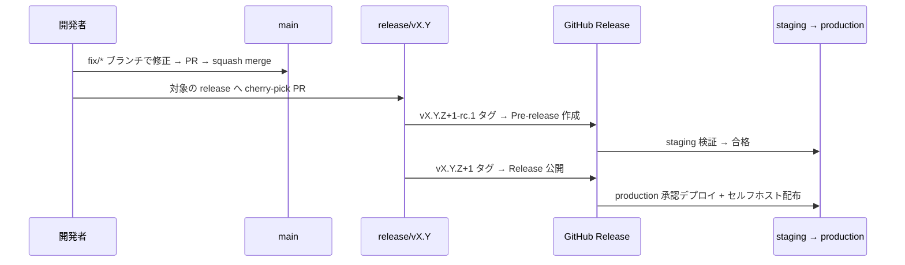

# 障害対応

ホットフィックス手順と、ロールバック / ロールフォワード方針を定める。全体像は[概要](./)を参照。

## ホットフィックス手順

1. 修正はまず `main` に入れる（次期バージョンへの取り込みを保証する）。
2. サポート中の各 `release/vX.Y` に cherry-pick PR を作成する。cherry-pick 漏れを防ぐため、PR に `needs-backport/vX.Y` ラベルを付与し、クローズ条件をバックポート完了とする。
3. パッチバージョン（`Z`）を上げ、RC → 検証 → GA の手順を経て出荷する。緊急度が高い場合、リリース責任者の判断で RC を省略し GA タグを直接付与できる（事後検証を必須とする）。

## ロールバック / ロールフォワード方針

### 基本方針

障害対応の選択肢は次の優先順位で検討する。

1. **Feature flag による縮退（第 0 選択）**: 問題の機能をフラグ OFF で切り離せる場合、デプロイを伴わない最速・最小リスクの手段として最優先で検討する（feature flag は[現時点では利用を見送り検討中](./versioning#feature-flag-運用)のため、この選択肢も、後述の「判断基準（早見表）」でフラグ OFF に触れる行も、いずれも導入後に有効になる）。
2. **ロールフォワード（第 1 選択）**: 修正をパッチバージョン（`vX.Y.Z+1`）として前進リリースする（本ページ「ホットフィックス手順」）。出荷物の正が GitHub Release に一本化されている本規約では、本番を「Release に対応しない状態」に置かないロールフォワードを原則とする。
3. **ロールバック（限定手段）**: サービス影響が大きく、修正リリースの見込みが立たない場合に限り、直前 GA バージョンへ切り戻す。

### SaaS のロールバック手順

- ロールバックは「**直前 GA の Release に記録されたイメージダイジェストを production へ再デプロイする**」操作として実施する。通常デプロイと同一のパイプライン・Environment 承認を経由し、コンソールや kubectl による out-of-band の直接操作は禁止する。
- ロールバック実施はインシデント記録に紐づけ、GitHub Deployments の履歴で「どのダイジェストからどのダイジェストへ戻したか」を追跡可能にする。
- ロールバックは暫定措置であり恒久化しない。原因修正を `main` → cherry-pick → パッチリリースの手順で行い、**次のパッチリリースまで**にロールフォワードで復帰する。

### ロールバック可能条件（DB スキーマ互換性）

ロールバックの成否は DB マイグレーションの互換性で決まるため、次を規約とする。

- マイグレーションは **expand-contract パターン（後方互換）** を原則とする。「バージョン N のスキーマ上でバージョン N-1 のアプリケーションが動作する」状態を保つ（列削除・リネーム・NOT NULL 化などの contract 操作は、旧バージョンが参照しなくなった次のリリース以降に分離する）。
- 後方互換を満たせない**破壊的マイグレーションを含むリリースは「ロールバック不可」**とし、GitHub Release ノートの固定セクション（「アップグレード時の注意」）に明記する。この場合の障害対応はロールフォワードのみとする。
- ロールバック時にデータの巻き戻し（リストア）が必要なケースは、SaaS ではポイントインタイムリカバリの発動を伴う重大インシデントとして扱い、本規約の範囲外（インシデント対応手順）とする。

### セルフホスト版の切り戻し

- セルフホスト版の**ダウングレードは原則サポートしない**。
- インストール/アップグレード手順に「適用前バックアップ（DB・設定ファイル）の取得」を必須ステップとして組み込み、切り戻しは「バックアップからの復元 + 旧バージョンの再インストール」として案内する。
- 破壊的マイグレーションの有無・バックアップ要件は、Release ノートの固定セクションで顧客向けに明示する。

### 判断基準（早見表）

| 事象 | 対応 |
| --- | --- |
| 軽微な不具合（回避策あり） | 次回パッチリリースで修正（通常のロールフォワード） |
| 特定機能の重大な不具合 | feature flag で当該機能を OFF → パッチリリースで修正 |
| 重大な不具合（数時間以内に修正可能） | 緊急パッチ（「ホットフィックス手順」、RC 省略可）でロールフォワード |
| 重大な不具合（修正見込み立たず）+ スキーマ後方互換 | 直前 GA ダイジェストへロールバック → 修正後パッチで復帰 |
| 重大な不具合 + 破壊的マイグレーション適用済み | ロールバック禁止。縮退運用（フラグ OFF / 機能停止）+ ロールフォワード |
