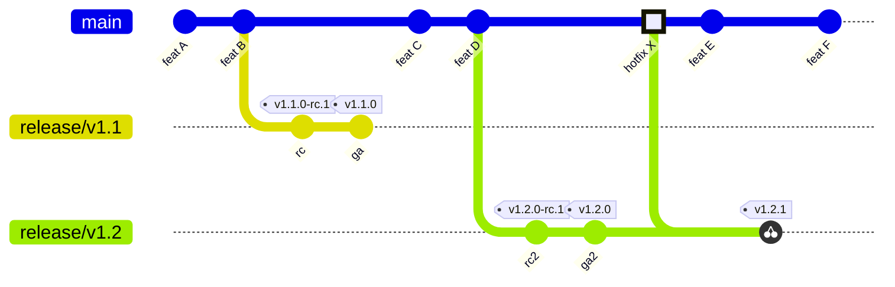
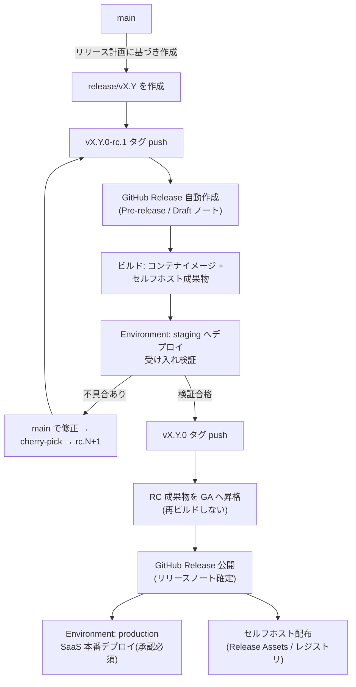
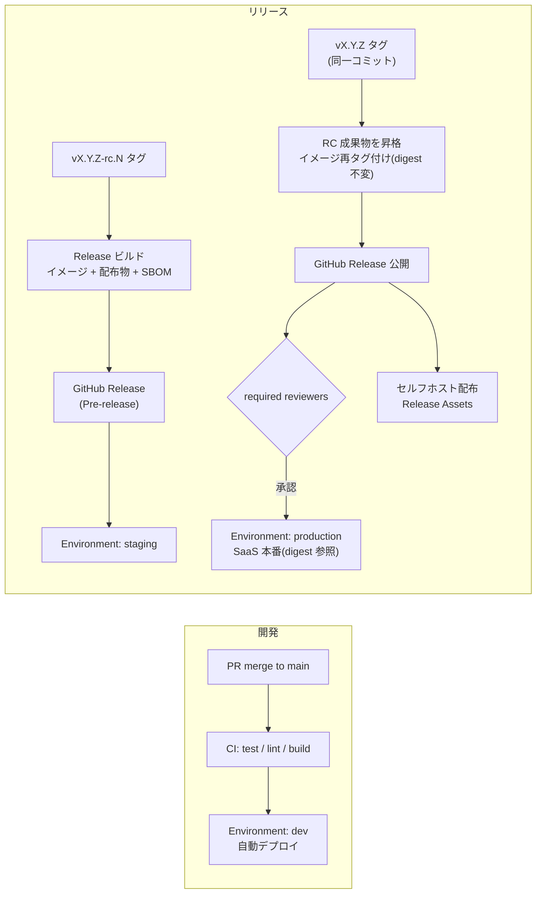
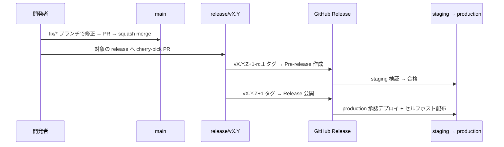
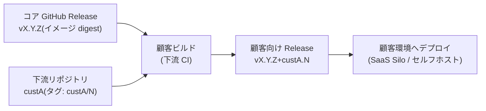
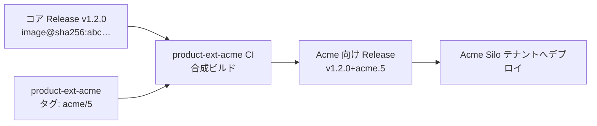

# 開発規約: ブランチ戦略とリリース・デプロイパイプライン（草案）

::: info このページについて
本ページは、この製品を開発する **チームの開発規約**（実運用ルール）です。
この *チュートリアルサイト自身* の運用ルール（GitHub Flow ベース）や、
教材として各方式を解説する[ガイド](/guide/introduction)とは **別物** です。混同しないでください。
:::

| 項目 | 内容 |
| --- | --- |
| 版数 | 0.5（草案） |
| 対象 | 本製品（SaaS 版 / セルフホスト版）の全リポジトリ |
| 最終更新 | 2026-07-07 |
| ステータス | レビュー中 |

---

## 1. 目的と基本方針

本規約は、SaaS 版とセルフホスト版を単一コードベース・**同一バージョン**で提供するためのブランチ運用・リリース運用を定める。

基本方針は次の 4 点である。

1. **trunk-based development**: `main` を唯一の統合ブランチとし、long-lived な開発ブランチを作らない。
2. **バージョン駆動リリース**: SaaS 版・セルフホスト版ともに、`release/vX.Y` ブランチ上のタグ（= GitHub Release）からビルドされた成果物を出荷する。SaaS 版も `main` から継続デプロイは行わず、リリース単位でバージョンアップする。
3. **ブランチはバージョン系統、環境はデプロイ状態**: 環境（dev / staging / production）はブランチではなく **GitHub Environments とデプロイパイプライン**で表現する。環境ブランチは作成しない。
4. **upstream first**: すべての修正はまず `main` に取り込み、必要に応じて `release/*` へ cherry-pick する。逆方向のマージは禁止する。

## 2. ブランチ体系

### 2.1 ブランチ一覧

| ブランチ | 役割 | 寿命 | 作成元 | マージ先 |
| --- | --- | --- | --- | --- |
| `main` | 唯一の統合ブランチ。次期バージョンの開発ライン | 永続 | — | — |
| `feature/*` | 機能開発・改善 | 短命（目安 3 営業日以内） | `main` | `main`（PR 経由） |
| `fix/*` | バグ修正 | 短命 | `main` | `main`（PR 経由） |
| `release/vX.Y` | バージョン X.Y の安定化・出荷・保守ライン（SaaS / セルフホスト共通） | サポート期間中 | `main` | マージしない（cherry-pick のみ受け入れる） |

### 2.2 ブランチモデル全体像



- `main` は常に「次期バージョン（N+1）」の開発ラインであり、直接デプロイ・出荷の起点にはしない。
- 出荷（SaaS 本番デプロイ / セルフホスト配布）は必ず `release/vX.Y` 上のタグから行う。
- ハイライトされた `hotfix X` のように、修正は **main → release の一方向**にのみ流れる。

### 2.3 命名規則

| 種別 | 形式 | 例 |
| --- | --- | --- |
| feature ブランチ | `feature/<issue番号>-<短い説明>` | `feature/1234-tenant-flag-api` |
| fix ブランチ | `fix/<issue番号>-<短い説明>` | `fix/1250-forecast-nan-handling` |
| release ブランチ | `release/vX.Y` | `release/v1.2` |
| リリース候補タグ | `vX.Y.Z-rc.N` | `v1.2.0-rc.1` |
| GA タグ | `vX.Y.Z`（SemVer） | `v1.2.1` |

## 3. ブランチプロテクションとマージルール

### 3.1 ブランチ・タグ保護（Repository Rulesets）

保護設定は従来の branch protection ではなく **Repository Rulesets** で行う（ブランチとタグの保護、および bypass 権限の管理を一元化できるため）。

#### `main` に適用するルール

| ルール | 設定 | 意図 |
| --- | --- | --- |
| Restrict direct pushes（PR 必須） | 有効 | すべての変更を PR 経由に強制する |
| Required approvals | 1 名以上 | レビューの担保 |
| Dismiss stale approvals on push | 有効 | 承認後の追加 push で承認を無効化し、未レビューコードの混入を防ぐ |
| Required status checks | lint / 型チェック / テスト / ビルド | CI 成功をマージ条件とする。Require branches to be up to date を有効化（頻度が高くなった場合は merge queue の導入を検討） |
| Require conversation resolution | 有効 | 指摘の放置マージを防ぐ |
| Require linear history | 有効 | squash merge 運用と整合させ、履歴を 1 PR = 1 コミットに保つ |
| Block force pushes / deletions | 有効 | 履歴改変・ブランチ消失の防止 |
| CODEOWNERS review | 有効（対象: DB マイグレーション、IaC、`.github/workflows/`） | 影響の大きい変更にドメイン責任者のレビューを必須化する。特にリリースワークフロー自体の変更はリリース責任者のレビューを必須とする |

#### `release/*` に適用するルール

- `main` と同一のルールセットを適用する。
- 加えて、ブランチの**作成をリリース責任者（またはリリースワークフロー）に限定**する（creation restriction）。
- release ブランチへの PR は cherry-pick PR のみを想定し、PR テンプレートで元 PR（main 側）へのリンクを必須項目とする。

#### タグ `v*` に適用するルール

- 作成: リリースワークフロー（GitHub App / 専用ロール）のみに限定する。
- 更新・削除: 全員禁止（bypass 対象なし）。公開済みバージョンの改変を構造的に不可能にする。

#### Bypass 権限の方針

- 組織管理者を含め、bypass list への恒常的な登録は行わない。緊急時は bypass ではなく、規約で定めた緊急手順（6 章: RC 省略の緊急パッチ）で対応する。
- bypass が発生した場合（監査ログで検知）は、事後レビューを必須とする。

### 3.2 マージルール

1. `feature/*` → `main` のマージ方式は **squash merge** とする（merge commit / rebase merge はリポジトリ設定で無効化する）。
2. `main` → `release/*` への反映は **cherry-pick のみ**とする。merge / rebase による取り込みは禁止する。
3. `release/*` → `main` のマージは禁止する（upstream first の徹底）。
4. PR は小さく保つ（目安: 差分 400 行以内）。大きくなる場合は feature flag を活用して分割する。

## 4. リリースフロー（GitHub Release）

### 4.1 リリースの位置づけ

GitHub Release を「**出荷されたバージョンの単一の正（single source of truth）**」とする。SaaS 本番デプロイとセルフホスト配布は、いずれも同一の GitHub Release に紐づく成果物から行う。

| Release の種別 | タグ | GitHub Release 設定 | 用途 |
| --- | --- | --- | --- |
| リリース候補 | `vX.Y.Z-rc.N` | **Pre-release** としてマーク | staging 検証、先行顧客向け評価版 |
| 正式リリース | `vX.Y.Z` | Latest release | SaaS 本番デプロイ、セルフホスト正式配布 |

### 4.2 リリース手順



1. リリース計画に基づき `main` から `release/vX.Y` を作成する（目安: 四半期ごと）。作成後は新機能の追加を禁止し、cherry-pick による修正のみ受け入れる。
2. `vX.Y.Z-rc.N` タグを push すると、CI が **Pre-release の GitHub Release** を自動作成し、成果物をビルド・添付する。**ビルドが行われるのはこの RC 時点のみ**である。
3. staging での受け入れ検証に合格したら、**同一コミットに** `vX.Y.Z` タグを付与する（RC と GA でコミットをずらさない）。
4. GA タグ push をトリガーに、GA ワークフローが **RC 成果物を GA へ昇格（promotion）** する（4.4 参照）。ビルドは実行しない。
5. GitHub Release を正式公開し、リリースノートを確定する。公開された Release の成果物を用いて、SaaS 本番デプロイとセルフホスト配布を行う。

### 4.3 GitHub Release 運用規約

- **自動作成**: Release はタグ push をトリガーに GitHub Actions で作成する。手動での Release 作成は禁止する（タグ・Release・成果物の対応ずれを防ぐ）。
- **リリースノート**: `.github/release.yml` によるカテゴリ設定（新機能 / 改善 / 不具合修正 / 破壊的変更 / 依存関係）を用いて自動生成し、リリース責任者が公開前に編集・確定する。PR ラベルをカテゴリ分類に使用するため、PR には種別ラベルの付与を必須とする。
- **成果物（Release Assets）**: セルフホスト版インストーラ・展開用パッケージ・チェックサム（SHA-256）・SBOM を添付する。コンテナイメージはコンテナレジストリに `vX.Y.Z` タグで push し、Release ノートにイメージダイジェストを記載する。
- **Pre-release の扱い**: `-rc.N` タグの Release は必ず Pre-release としてマークし、Latest release に昇格させない。
- **不変性**: 公開済み Release のタグ付け直し（force push / タグ削除→再作成）は禁止する。修正が必要な場合はパッチバージョンを上げて新しい Release を発行する。

### 4.4 GA 昇格規約（再ビルドの禁止）

**GA ワークフローではビルドを一切実行しない。** ビルドは再現性が完全には保証されない（ビルド時刻・依存解決・ベースイメージの差異でダイジェストが変わり得る）ため、GA 時に再ビルドすると「staging で検証した成果物」と「出荷される成果物」の同一性が検証不能になる。GA は最終 RC 成果物への**参照の付け替え（昇格）** として実装する。

| 成果物 | 昇格方法 |
| --- | --- |
| コンテナイメージ | 最終 RC イメージの**ダイジェストに対して** `vX.Y.Z` タグを追加付与する（`crane tag` / `skopeo copy` / `docker buildx imagetools create` 等）。イメージ本体は 1 バイトも変化しない |
| Release Assets（インストーラ・パッケージ） | 最終 RC Release の資産を GA Release へそのままコピーする。チェックサム（SHA-256）は再計算せず RC 時の値を引き継ぎ、GA ワークフローで一致検証する |
| 署名・アテステーション | RC ビルド時に署名・provenance を生成し、GA 昇格時は**検証のみ**行う。GA での再署名が必要な場合もダイジェスト不変を前提とする |

運用ルール:

- GA ワークフローの冒頭で「GA タグと最終 RC タグが同一コミットを指すこと」および「昇格対象イメージのダイジェストが RC Release に記録された値と一致すること」を検証し、不一致時はワークフローを失敗させる。
- production へのデプロイはタグ名ではなく**イメージダイジェスト（`@sha256:...`）で参照**する。タグは人間向けの別名にすぎず、デプロイの同一性はダイジェストで担保する。
- **バージョン文字列の埋め込みに注意**: 成果物内に埋め込むバージョン情報は `X.Y.Z` + git SHA とし、`-rc.N` サフィックスをバイナリに焼き込まない。RC / GA の区別はタグと Release のメタデータでのみ表現する（焼き込むと GA 昇格時に成果物の書き換えが必要になり、再ビルド禁止と矛盾する）。

## 5. 環境とデプロイ（GitHub Environments）

### 5.1 環境定義

環境はブランチではなく GitHub Environments として定義し、**同一アーティファクトの昇格（build once, deploy many）** を原則とする。

| Environment | 用途 | デプロイ元 | 保護ルール |
| --- | --- | --- | --- |
| `dev` | 開発検証（次期バージョンの動作確認） | `main` への push で自動デプロイ | なし（自動）。deployment branch policy: `main` のみ |
| `staging` | リリース候補の受け入れ検証 | `vX.Y.Z-rc.N` タグの成果物 | deployment branch/tag policy: `v*-rc*` タグのみ |
| `production` | SaaS 本番 | `vX.Y.Z`（GA）タグの成果物 | **required reviewers（承認者 1 名以上）**、deployment tag policy: `v*` GA タグのみ |

- `dev` のみ `main` 直結とし、次期バージョンの継続的な動作確認に用いる。`dev` の状態は出荷品質を意味しない。
- `staging` と `production` はタグ（= GitHub Release）起点でのみデプロイされる。SaaS 本番が `main` から直接デプロイされる経路は存在しない。

### 5.2 Deployment protection rules 設定規約

環境ごとの保護設定を次の通り定める。

| 設定項目 | `dev` | `staging` | `production` |
| --- | --- | --- | --- |
| Deployment branch/tag policy | `main` のみ | タグ `v*-rc*` のみ | タグ `v*`（GA のみ、`-rc` を除外） |
| Required reviewers | なし | なし（任意で 1 名） | **1 名以上（リリース責任者ロール）** |
| デプロイ実行者による自己承認 | — | — | **禁止**（prevent self-review を有効化） |
| Wait timer | なし | なし | 5 分（誤操作時の取り消し猶予。値はチームで調整） |
| Admin bypass | — | 無効 | **無効**（"Allow administrators to bypass" をオフ） |
| Environment secrets | dev 用資格情報 | staging 用資格情報 | 本番資格情報（この環境のみに格納） |

補足規約:

- **承認記録**: production への required reviewers 承認は GitHub Deployments の履歴として残り、これを正式なデプロイ承認記録とする（別途の承認書類は作成しない）。
- **同時実行制御**: production デプロイのワークフローには `concurrency` グループを設定して直列化し、進行中デプロイへの割り込みを防ぐ（`cancel-in-progress: false`）。
- **シークレット管理**: 資格情報（接続文字列等）は Environment secrets に格納し、リポジトリシークレットに本番資格情報を置かない。AWS 認証は OIDC（`id-token: write`）を用い、長期アクセスキーを保存しない。
- **OIDC ロールの環境分離**: AWS IAM ロールは環境ごとに分離し、trust policy の条件で `sub` クレームに `environment:production` 等を要求する。これにより「production の Environment protection を通過したジョブ以外は本番ロールを引き受けられない」ことを AWS 側でも強制する。
- **Custom deployment protection rules（拡張）**: 将来的に GitHub Apps による外部ゲート（監視アラートの静穏確認、変更管理チケットの存在確認、デプロイ可能時間帯の制限）を production に追加できる。導入時は本規約を改訂する。
- 環境ごとの設定差分（エンドポイント、フラグ既定値等）は Environment variables または構成リポジトリで管理し、アプリケーションコードのブランチ分岐で表現しない。

### 5.3 デプロイパイプライン全体像



- ビルドが実行されるのは **RC タグ push 時の 1 回のみ**。GA タグは既存成果物への再タグ付け（昇格）であり、ビルドを伴わない（4.4 参照）。
- GA 昇格時に「同一コミット」「ダイジェスト一致」「チェックサム一致」をパイプラインで検証し、不一致時は失敗させる。

## 6. ホットフィックス手順



1. 修正はまず `main` に入れる（次期バージョンへの取り込みを保証する）。
2. サポート中の各 `release/vX.Y` に cherry-pick PR を作成する。cherry-pick 漏れを防ぐため、PR に `needs-backport/vX.Y` ラベルを付与し、クローズ条件をバックポート完了とする。
3. パッチバージョン（`Z`）を上げ、RC → 検証 → GA の手順を経て出荷する。緊急度が高い場合、リリース責任者の判断で RC を省略し GA タグを直接付与できる（事後検証を必須とする）。

## 7. ロールバック / ロールフォワード方針

### 7.1 基本方針

障害対応の選択肢は次の優先順位で検討する。

1. **Feature flag による縮退（第 0 選択）**: 問題の機能をフラグ OFF で切り離せる場合、デプロイを伴わない最速・最小リスクの手段として最優先で検討する。
2. **ロールフォワード（第 1 選択）**: 修正をパッチバージョン（`vX.Y.Z+1`）として前進リリースする（6 章のホットフィックス手順）。出荷物の正が GitHub Release に一本化されている本規約では、本番を「Release に対応しない状態」に置かないロールフォワードを原則とする。
3. **ロールバック（限定手段）**: サービス影響が大きく、修正リリースの見込みが立たない場合に限り、直前 GA バージョンへ切り戻す。

### 7.2 SaaS のロールバック手順

- ロールバックは「**直前 GA の Release に記録されたイメージダイジェストを production へ再デプロイする**」操作として実施する。通常デプロイと同一のパイプライン・Environment 承認を経由し、コンソールや kubectl による out-of-band の直接操作は禁止する。
- ロールバック実施はインシデント記録に紐づけ、GitHub Deployments の履歴で「どのダイジェストからどのダイジェストへ戻したか」を追跡可能にする。
- ロールバックは暫定措置であり恒久化しない。原因修正を `main` → cherry-pick → パッチリリースの手順で行い、**次のパッチリリースまで**にロールフォワードで復帰する。

### 7.3 ロールバック可能条件（DB スキーマ互換性）

ロールバックの成否は DB マイグレーションの互換性で決まるため、次を規約とする。

- マイグレーションは **expand-contract パターン（後方互換）** を原則とする。「バージョン N のスキーマ上でバージョン N-1 のアプリケーションが動作する」状態を保つ（列削除・リネーム・NOT NULL 化などの contract 操作は、旧バージョンが参照しなくなった次のリリース以降に分離する）。
- 後方互換を満たせない**破壊的マイグレーションを含むリリースは「ロールバック不可」**とし、GitHub Release ノートの固定セクション（「アップグレード時の注意」）に明記する。この場合の障害対応はロールフォワードのみとする。
- ロールバック時にデータの巻き戻し（リストア）が必要なケースは、SaaS ではポイントインタイムリカバリの発動を伴う重大インシデントとして扱い、本規約の範囲外（インシデント対応手順）とする。

### 7.4 セルフホスト版の切り戻し

- セルフホスト版の**ダウングレードは原則サポートしない**。
- インストール/アップグレード手順に「適用前バックアップ（DB・設定ファイル）の取得」を必須ステップとして組み込み、切り戻しは「バックアップからの復元 + 旧バージョンの再インストール」として案内する。
- 破壊的マイグレーションの有無・バックアップ要件は、Release ノートの固定セクションで顧客向けに明示する。

### 7.5 判断基準（早見表）

| 事象 | 対応 |
| --- | --- |
| 軽微な不具合（回避策あり） | 次回パッチリリースで修正（通常のロールフォワード） |
| 特定機能の重大な不具合 | feature flag で当該機能を OFF → パッチリリースで修正 |
| 重大な不具合（数時間以内に修正可能） | 緊急パッチ（6 章、RC 省略可）でロールフォワード |
| 重大な不具合（修正見込み立たず）+ スキーマ後方互換 | 直前 GA ダイジェストへロールバック → 修正後パッチで復帰 |
| 重大な不具合 + 破壊的マイグレーション適用済み | ロールバック禁止。縮退運用（フラグ OFF / 機能停止）+ ロールフォワード |

## 8. バージョニングとサポートポリシー

- バージョン番号は SemVer（`MAJOR.MINOR.PATCH`）に従い、リリース候補は `-rc.N` サフィックスで表す。
- **SaaS 本番は常に最新 GA バージョン（N）のみ**を稼働させる。SaaS のバージョンアップは Release 公開後、計画メンテナンスとして実施する。
- セルフホスト版のサポート対象は **最新（N）と 1 つ前（N-1）の MINOR バージョン**とする。
  - N: 機能修正・不具合修正・セキュリティ修正
  - N-1: 不具合修正・セキュリティ修正のみ
- EOL を迎えた `release/*` ブランチは最終タグを付与のうえアーカイブ（read-only 化）する。GitHub Release は EOL 後も削除しない（過去バージョンの追跡可能性を維持する）。

## 9. Feature Flag 運用

次期バージョン開発中の機能差はブランチではなく feature flag で吸収する。

- 開発中の機能はフラグ配下に置き、`main` へのマージをブロックしない（`dev` 環境ではフラグ ON で検証できる）。
- `release/vX.Y` を切る時点で、各フラグの GA 可否（既定値 ON / OFF / コード削除）を判定する。
- テナント別・顧客別のフラグ制御は設定として管理し、ビルド成果物は SaaS / セルフホストで共通とする。
- 役目を終えたフラグは 2 リリース以内に削除する（フラグ負債の防止）。

## 10. 顧客別カスタマイズ運用

### 10.1 カスタマイズ階層（Tier）

顧客別カスタマイズは次の 3 階層で管理する。**下位の Tier で吸収できる要求を上位の Tier で実現してはならない。**

| Tier | 手段 | 対象 | 承認 |
| --- | --- | --- | --- |
| Tier 0 | 標準機能のみ | カスタマイズなし | 不要 |
| Tier 1（既定） | 設定値・feature flag・テンプレート差し替え | パラメータ化可能な差異（閾値、帳票レイアウト、画面項目、連携先設定 等） | 不要（構成変更の通常レビュー） |
| Tier 2（例外） | 拡張ポイント + 下流リポジトリ（downstream） | コードレベルの差異（顧客固有ロジック） | **アーキテクト + リリース責任者の承認必須** |

顧客ブランチ・顧客別フォークによるカスタマイズ（Tier 3 相当）は**禁止**する（11 章）。

### 10.2 Tier 1: 設定・フラグによるカスタマイズ

- 顧客別の設定値・フラグは、アプリケーションコードとは分離した**構成管理（構成リポジトリまたはコントロールプレーン）**で管理する。ビルド成果物は全顧客共通とする（build once の維持）。
- 設定スキーマは製品バージョンと同期してバージョン管理し、CI で設定値のバリデーションを行う（スキーマ外の設定・未定義フラグの混入を防ぐ）。
- **顧客識別子によるコード分岐（`if customer == A` 等）は禁止**する。コード上の分岐が必要になった時点で、それは Tier 1 の範囲外であり、フラグの抽象化（「顧客 A 向け」ではなく「機能 X の有効化」）または Tier 2 への昇格を検討する。
- 設定で表現できない要求が発生した場合の手順: まず**コアへの拡張（全顧客が使える形の機能追加・パラメータ追加）**として `main` への PR を検討し、それでも吸収できない顧客固有ロジックのみ Tier 2 とする。

### 10.3 Tier 2: 拡張ポイントと下流リポジトリ（downstream）

#### 構成

- コア製品は差し替え可能な**拡張ポイント（プラグイン interface / フック）**を定義する。顧客固有ロジックは拡張ポイントの実装としてのみ記述できる。
- 顧客固有コードは**顧客ごとの独立したリポジトリ（下流リポジトリ / downstream）**に置く。コアリポジトリに顧客固有コードを含めない（顧客間のコード分離 = 契約境界）。
- 下流リポジトリにも本規約のブランチ運用（trunk-based、PR 必須、Rulesets）を適用する。

#### ビルドとバージョニング



- 顧客ビルドは「**公開済みコア GA 成果物（ダイジェスト参照）+ 下流の拡張実装**」の合成として、下流リポジトリ側の CI で組み立てる。**コアの再ビルドは行わない**（4.4 の原則を維持）。
- 顧客向け成果物のバージョンは SemVer ビルドメタデータで `vX.Y.Z+custA.N` と表現し、下流リポジトリの GitHub Release として管理する。コアの `vX.Y.Z` との対応が常に機械的に特定できる。

#### 拡張 API の互換性ポリシー

- 拡張ポイントの interface は公開 API として扱い、**破壊的変更は MAJOR バージョンでのみ**行う。
- MINOR で拡張 API を非推奨化する場合、最低 1 MINOR バージョンの非推奨期間を置き、Release ノートの固定セクションで告知する。

### 10.4 バージョン追従の運用（追従義務への対応）

カスタマイズ顧客にもバージョン追従義務があるため、コアのリリースごとに全下流リポジトリの追従を保証する仕組みを規約とする。

- **RC 段階での互換性検証**: コアの `vX.Y.Z-rc.N` Release 公開をトリガーに、全 Tier 2 下流リポジトリで互換性テスト（拡張 API のビルド + 契約テスト）を自動実行する。**GA 判定の条件に「全下流リポジトリの互換性テスト合格」を含める**。互換性破壊が GA 後に発覚する事態を構造的に防ぐ。
- **追従期限**: コア GA 公開後、各下流リポジトリは既定の期限（目安: 10 営業日）以内に `vX.Y.Z+custA.N` を発行し、顧客環境のバージョンアップを完了する。
- **セキュリティパッチ**: コアのパッチリリース（`Z` 更新）は拡張 API を変更しないため、下流リポジトリは原則として**依存バージョンの更新のみ（コード変更なし）**で追従できる。下流 CI の再実行と顧客向け Release の再発行を自動化する。
- Tier 2 顧客数と追従コストは比例するため、四半期ごとに「Tier 2 カスタマイズの Tier 1 への引き下げ（コア機能化・パラメータ化）」を棚卸しする。

### 10.5 適用例（Acme Company の場合）

Tier 判定と Tier 2 の運用イメージを示すための例示である（呼称・要求内容は一般化したものであり、特定顧客・特定機能を指すものではない）。

**前提**: コア製品は `v1.2.0`（公開済み GitHub Release）。Acme は SaaS の Silo テナントとして契約。Acme から次の 3 要求が提示されたとする。

| 要求 | 内容 | Tier 判定 |
| --- | --- | --- |
| 要求 A | 出力帳票へのロゴ表示と、閾値超過時の通知先の追加 | **Tier 1**（ロゴ・閾値・通知先はいずれもパラメータ。構成管理側に Acme 設定として保持し、成果物は共通。コード変更なし） |
| 要求 B | 顧客固有の補正ロジックを予測処理へ組み込む | **要検討 → Tier 2**（設定では表現できない計算ロジック。まずコア汎用機能化を検討し、汎用化の見込みがない場合のみ Tier 2 とする） |
| 要求 C | 顧客の社内システムからの実績データ取り込み | **Tier 2**（既存のデータ取り込み拡張ポイントの Acme 実装として記述） |

大半の要求（A、および汎用化できれば B）は Tier 1 で吸収され、コード実装を要するのは残りのみとなる。

#### Tier 2 の実装手順（要求 B・C）

1. 必要な拡張ポイントがコアに存在するか確認する。データ取り込み用フック（要求 C）は既存とする。予測後処理用フック（要求 B）が未提供であれば、まず**コアへ汎用の拡張ポイントを追加する PR** を `main` に出す（全顧客が使える口であり、通常の開発フロー。承認は 10.1 に従う）。
2. 拡張ポイントが揃ったら、Acme 専用の下流リポジトリ（`product-ext-acme`、コアの downstream）を作成し、各フックの Acme 実装と契約テストを配置する。このリポジトリにも本規約のブランチ運用（trunk + PR + Rulesets）を適用する。

```text
product-ext-acme/                  # Acme 下流リポジトリ（downstream）
  src/
    forecast_postprocess_ext.py    # 予測後処理フックの実装（要求B）
    external_ingest_connector.py   # データ取り込みフックの実装（要求C）
  tests/
    contract/                      # 拡張ポイントの契約テスト
  .github/workflows/build.yml
```

#### ビルド（合成）



- コアイメージ（`@sha256:abc…`）をベースに Acme 拡張を重ねるのみで、**コアは再ビルドしない**（4.4 維持）。
- 成果物バージョンは `v1.2.0+acme.5`（コア 1.2.0 + Acme 拡張 5 回目）として、コアとの対応が機械的に特定できる。

#### コアのバージョンアップ時（追従義務の担保）

コアが次期バージョンの RC（`v1.3.0-rc.1`）を公開すると、これをトリガーに Acme を含む全拡張リポジトリの互換性テストが自動実行される（10.4）。

| ケース | 挙動 |
| --- | --- |
| 拡張ポイントの interface に変更なし | Acme の契約テストは合格。依存を 1.3.0 に更新するのみで `v1.3.0+acme.6` を自動生成。**コード変更なしで追従** |
| 拡張ポイントに破壊的変更あり | Acme の契約テストが失敗 → **GA をブロック**（10.4）。コア側は破壊的変更を MAJOR へ回すか、downstream 修正を待つかを RC 段階で決着させる。「追従できないまま GA する」ことを構造的に防ぐ |
| セキュリティパッチ（`v1.2.1`） | 拡張 API 不変のため、Acme は依存更新のみで `v1.2.1+acme.6` を自動発行 → テナントへ再デプロイ。顧客数が増えても自動化経路でスケールする |

この例のように、顧客要求の多くは Tier 1 で完結し、コード実装を要する部分のみが顧客専用リポジトリに隔離される。これにより顧客間のコード分離を保ちつつ、コアのバージョンアップにも自動追従の仕組みで追従できる。

## 11. 禁止事項（アンチパターン）

| 禁止事項 | 理由 |
| --- | --- |
| 環境ブランチ（`develop`, `staging`, `production` 等）の作成 | 環境間ドリフトとマージ経路の組み合わせ爆発を招く。環境は GitHub Environments で表現する |
| 顧客別ブランチ（`customer/*`）・顧客別フォークの作成 | パッチ展開コストが「サポート中バージョン数 × 顧客数」に爆発する。カスタマイズは Tier 1（設定/フラグ）または Tier 2（下流リポジトリ）で実現する（10 章） |
| 顧客識別子によるコード分岐（`if customer == A` 等） | コードベース内部に実質的なフォークが増殖する。機能単位のフラグ抽象化または拡張ポイントで表現する |
| コアリポジトリへの顧客固有コードの混入 | 顧客間のコード分離（契約境界）が崩れる。Tier 2 は下流リポジトリに置く |
| `main` から staging / production への直接デプロイ | 出荷バージョンの追跡不能化。デプロイは必ずタグ（GitHub Release）起点とする |
| `release/*` で修正し `main` へマージ（upstream first 違反） | main への取り込み漏れにより次バージョンでバグが再発する。修正は常に `main` を起点とする |
| `main` → `release/*` の merge / rebase | release ラインに未検証の新機能が混入する |
| GA タグ・環境ごと・配布形態ごとの再ビルド | ビルドは完全な再現性を持たず、RC で検証した成果物と出荷成果物の同一性が検証不能になる。GA は再タグ付けによる昇格とする（4.4） |
| `-rc.N` サフィックスの成果物への焼き込み | GA 昇格時に成果物の書き換えが必要になり、再ビルド禁止と矛盾する。RC / GA の区別はタグと Release メタデータで表現する |
| 公開済みタグ・Release の付け直し | 出荷済みバージョンの改変。修正はパッチバージョンで発行する |
| 手動での GitHub Release 作成 | タグ・Release・成果物の対応ずれの原因となる |
| 本番環境への out-of-band 操作（コンソール / kubectl による直接変更・手動ロールバック） | デプロイ履歴と実環境の乖離を生む。ロールバックも必ずパイプライン経由で行う（7 章） |
| long-lived feature ブランチ（1 週間超） | マージコンフリクトの肥大化。feature flag + 小さな PR で代替する |
| 本番資格情報のリポジトリシークレット格納 | 環境スコープ外からの参照リスク。Environment secrets + OIDC を用いる |

## 12. 用語

| 用語 | 定義 |
| --- | --- |
| trunk-based development | 単一の統合ブランチ（`main`）へ高頻度に統合する開発スタイル |
| upstream first | 修正を最上流へ先に取り込み、下流へ配布する原則。本規約では 2 つの軸に適用される: (1) `main`（upstream）→ `release/*`（downstream）、(2) コア（upstream）→ 下流リポジトリ（downstream） |
| build once, deploy many | 1 度ビルドした同一アーティファクトを全環境・全配布形態へ用いる原則 |
| GA（General Availability） | 正式リリース。`vX.Y.Z` タグおよび公開済み GitHub Release を指す |
| RC（Release Candidate） | リリース候補。`vX.Y.Z-rc.N` タグおよび Pre-release を指す |
| GitHub Environments | デプロイ先環境ごとに保護ルール・シークレット・履歴を管理する GitHub の機能 |
| GitHub Release | タグに紐づくリリースノート・成果物の公開単位。本規約における出荷の正 |
| 拡張ポイント | コアが定義する差し替え可能な interface / フック。顧客固有ロジックの唯一の実装場所 |
| 下流リポジトリ（downstream） | 拡張ポイントの顧客別実装を格納する顧客ごとの独立リポジトリ。コア（upstream）を追従する。SemVer ビルドメタデータ（`+custX.N`）で成果物を表現する |
| Tier（カスタマイズ階層） | カスタマイズの実現手段の分類。Tier 1 = 設定/フラグ、Tier 2 = 下流リポジトリ（10 章） |

---

## 付録 A: 意思決定の背景

- GitLab Flow には「環境ブランチ版」と「リリースブランチ版」の 2 方式があるが、両者の併用はマージ経路の組み合わせ爆発を招くため、本規約では**リリースブランチ版（Microsoft Release Flow と同型）を採用**し、環境管理を GitHub Environments / デプロイパイプラインへ委譲する。
- SaaS 版とセルフホスト版が同一バージョンを提供するため、両者の出荷起点を GitHub Release に一本化した。これにより「SaaS で稼働しているコード」と「顧客環境で稼働しているコード」が同一タグで特定でき、障害調査・脆弱性対応時のバージョン特定が単純化される。
- 顧客別カスタマイズ（顧客の約半数が対象、大半は軽微）は、設定/フラグ（Tier 1）を既定とし、コードレベルの差異のみ拡張ポイント + 下流リポジトリ（Tier 2）で実現する階層方式を採用した。顧客別ブランチ方式は、パッチ展開コストが「サポート中バージョン数 × 顧客数」に比例して爆発し、従来のオンプレ製品が抱えていた顧客ごと個別保守の問題を Git 上に再生産するため禁止事項とした。全顧客にバージョン追従義務があることを前提に、コア RC 段階での全下流リポジトリ互換性検証を GA 判定条件へ組み込み、追従不能なリリースが公開される事態を防いでいる。
- 環境ブランチが正当化されるのは GitOps 構成リポジトリ（マニフェスト・環境別設定）をアプリケーションと分離して持つ場合に限る。その場合もアプリケーションリポジトリ側は本規約（trunk + release）に従う。
