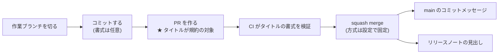

# PR タイトル規約

PR タイトルの書式を定める。**日々の開発で開発者が手で守る規約は、このページの書式だけである。**

## このページの要点

- 開発者が PR ごとに守るのは、タイトルの書式である。ブランチ内のコミットメッセージは squash により `main` へ残らず、マージ方式はリポジトリ設定で固定されているため選ぶ場面がない。
- PR タイトルは `main` の履歴とリリースノートの両方に残る。だから書式を規約にする。
- 書式は CI が検証する。要約が具体的かどうかは機械では判定できないため、レビューで見る。

## 開発フローと、そこで課される規約

| 開発の段階 | 開発者がすること | そこで課される規約 |
| --- | --- | --- |
| ブランチを切る | `main` から作業ブランチを作る | 命名規則（[ブランチ運用](./branching#命名規則)） |
| コミットする | 何度でもコミットしてよい | なし。squash により `main` へ残らないため、書式は必須にしない（揃えることは推奨する） |
| PR を作る | タイトルと本文を書く | **本ページの書式。** CI が検証し、非準拠ならマージできない。粒度の目安は[マージルール](./merge-rules#pr-の粒度と未完成の機能)に定める |
| レビューを受ける | 指摘に対応する | なし |
| マージする | `Squash and merge` を押す | なし。方式はリポジトリ設定で固定され、選択肢が出ない（マージルールに定める） |

開発者が規約として意識するのは、PR を作るときのタイトル 1 行である。

## タイトルだけを規約にする理由

PR タイトルは、次の 2 か所に残る文字列である。

- squash merge では、**PR タイトルがそのまま `main` のコミットメッセージ**になる。
- GitHub の自動リリースノートは、マージ済み PR のタイトルを見出しとして列挙する（[リリースとデプロイ](./release#github-release-運用規約)）。

一方、ブランチ内の個々のコミットメッセージは squash で 1 つに畳まれ、`main` には残らない。残らないものを規約で縛っても、履歴の品質には効かない。したがって規約の対象はタイトルとし、コミットメッセージは推奨に留める（レビュアーが変更の過程を追いやすくなるため、揃えることは勧める）。

## 書式

1. PR タイトルは **Conventional Commits**（`<type>(<scope>): <要約>`）に準拠させる。`<scope>` は任意で、省略してよい。
2. 後方互換性を壊す変更は type の直後に `!` を付ける（例: `feat(api)!: ...`）。破壊的変更の内容は PR 本文に記載する。
3. 要約は変更内容を利用者視点で具体的に書く。`修正` `対応` のような内容を持たない要約は認めない（リリースノートの見出しとして読まれるため）。
4. 許可する type の一覧は、**設定ファイルを単一の情報源**とする（例: `.github/conventions.json` の `commit.conventional.types`）。本規約は一覧を持たない。

### 例

| 判定 | タイトル | 理由 |
| --- | --- | --- |
| ✅ | `feat(billing): 請求書 PDF を月次で一括ダウンロードできるようにする` | 利用者から見て何ができるようになるかが分かる |
| ✅ | `fix(forecast): 実績が 0 件の月に予測値が NaN になるのを修正する` | 事象と対象が特定できる |
| ✅ | `feat(api)!: レポート API のレスポンスから deprecated な total を削除する` | 破壊的変更に `!` が付いている |
| ❌ | `修正` | type が無く、書式で弾かれる |
| ❌ | `fix: バグ修正` | 書式は通るが、リリースノートの見出しとして読めない（規約 3 に反する） |
| ❌ | `fix: レビュー指摘対応` | 変更が利用者に何をもたらすかが分からない |

`fix: バグ修正` のように、**書式は通るが規約 3 に反するタイトルは CI では止まらない。** ここはレビューで見る。

### CI に弾かれたとき

PR タイトルを編集して直す。コミットを積み直す必要はなく、タイトルを更新すれば検証が再実行される。多いのは次の 3 つである。

- type が許可一覧に無い（`update` `modify` など）。許可する type は設定ファイルにある。
- `:` の後ろに半角スペースが無い。
- type と要約の区切りに全角コロン `：` を使っている。

## 規約を担保する仕組み

機械で判定できるのは書式（規約 1・2・4）である。要約が具体的か（規約 3）は判定できないため、レビューに委ねる（[規約の担保状況](./enforcement)）。

| 対象 | 設定 | 効果 |
| --- | --- | --- |
| CI | PR タイトルの書式を検証し、Required status checks に含める | 非準拠の PR をマージできなくする |
| リポジトリ設定 | squash merge 時のコミットメッセージを **PR のタイトルと本文**に固定する | 検証を通ったタイトルがそのまま `main` に着地する（マージルールの「squash merge のコミットメッセージ」に定める） |

この 2 つは対になっている。CI だけでは、検証を通ったタイトルが `main` に着地する保証がない。理由はマージルールの補足に記す。

## 補足: type の一覧を設定ファイルへ置く理由

規約と検証スクリプトの二重管理を避けるためで、type の追加・削除は設定ファイルの変更だけで済ませる。置き場所は、規約を強制するゲートである CI 自身が持つ場所（`.github/` 配下など）とする。特定のエディタや AI エージェント向けの設定ディレクトリには置かない。そのツールを使わない者にも効く規約が、任意のツールの設定に依存してしまうためである。検証スクリプトが設定ファイルを読めない環境向けに既定値を内蔵する場合は、その既定値が設定ファイルと一致することを CI で検査する。
