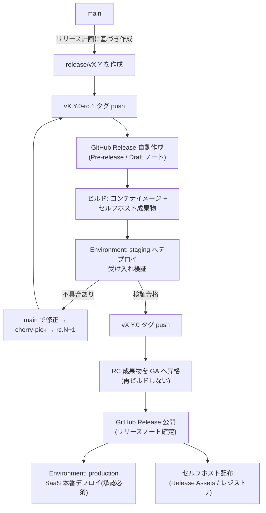
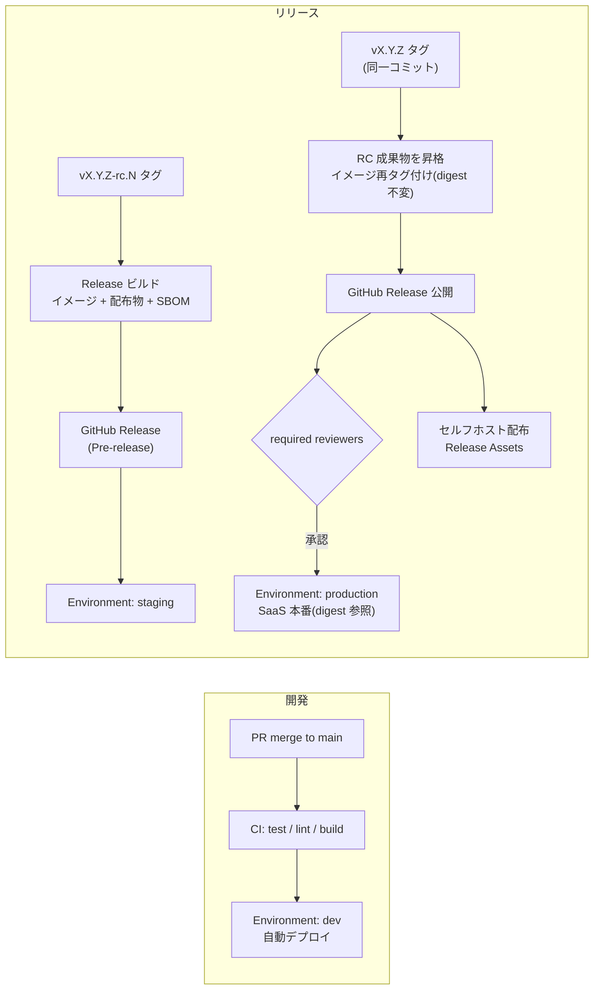

# リリースとデプロイ

本ページはリリースフロー（GitHub Release）と、環境・デプロイ（GitHub Environments）を扱う。全体像は[概要](./)を参照。

## リリースフロー（GitHub Release）

### リリースの位置づけ

GitHub Release を「**出荷されたバージョンの単一の正（single source of truth）**」とする。SaaS 本番デプロイとセルフホスト配布は、いずれも同一の GitHub Release に紐づく成果物から行う。

| Release の種別 | タグ | GitHub Release 設定 | 用途 |
| --- | --- | --- | --- |
| リリース候補 | `vX.Y.Z-rc.N` | **Pre-release** としてマーク | staging 検証、先行顧客向け評価版 |
| 正式リリース | `vX.Y.Z` | Latest release | SaaS 本番デプロイ、セルフホスト正式配布 |

### リリース手順

1. リリース計画に基づき `main` から `release/vX.Y` を作成する（目安: 四半期ごと）。作成後は新機能の追加を禁止し、cherry-pick による修正のみ受け入れる。
2. `vX.Y.Z-rc.N` タグを push すると、CI が **Pre-release の GitHub Release** を自動作成し、成果物をビルド・添付する。**ビルドが行われるのはこの RC 時点のみ**である。
3. staging での受け入れ検証に合格したら、**同一コミットに** `vX.Y.Z` タグを付与する（RC と GA でコミットをずらさない）。
4. GA タグ push をトリガーに、GA ワークフローが **RC 成果物を GA へ昇格（promotion）** する（本ページ「GA 昇格規約（再ビルドの禁止）」を参照）。ビルドは実行しない。
5. GitHub Release を正式公開し、リリースノートを確定する。公開された Release の成果物を用いて、SaaS 本番デプロイとセルフホスト配布を行う。

### GitHub Release 運用規約

- **自動作成**: Release はタグ push をトリガーに GitHub Actions で作成する。手動での Release 作成は禁止する（タグ・Release・成果物の対応ずれを防ぐ）。
- **リリースノート**: `.github/release.yml` によるカテゴリ設定（新機能 / 改善 / 不具合修正 / 破壊的変更 / 依存関係）を用いて自動生成し、リリース責任者が公開前に編集・確定する。PR ラベルをカテゴリ分類に使用するため、PR には種別ラベルの付与を必須とする。
- **成果物（Release Assets）**: セルフホスト版インストーラ・展開用パッケージ・チェックサム（SHA-256）・SBOM を添付する。コンテナイメージはコンテナレジストリに `vX.Y.Z` タグで push し、Release ノートにイメージダイジェストを記載する。
- **Pre-release の扱い**: `-rc.N` タグの Release は必ず Pre-release としてマークし、Latest release に昇格させない。
- **不変性**: 公開済み Release のタグ付け直し（force push / タグ削除→再作成）は禁止する。修正が必要な場合はパッチバージョンを上げて新しい Release を発行する。

### GA 昇格規約（再ビルドの禁止）

**GA ワークフローではビルドを一切実行しない。** ビルドは再現性が完全には保証されない（ビルド時刻・依存解決・ベースイメージの差異でダイジェストが変わり得る）ため、GA 時に再ビルドすると「staging で検証した成果物」と「出荷される成果物」の同一性が検証不能になる。GA は最終 RC 成果物への**参照の付け替え（昇格）** として実装する。

| 成果物 | 昇格方法 |
| --- | --- |
| コンテナイメージ | 最終 RC イメージの**ダイジェストに対して** `vX.Y.Z` タグを追加付与する（`crane tag` / `skopeo copy` / `docker buildx imagetools create` 等）。イメージ本体は 1 バイトも変化しない |
| Release Assets（インストーラ・パッケージ） | 最終 RC Release の資産を GA Release へそのままコピーする。チェックサム（SHA-256）は再計算せず RC 時の値を引き継ぎ、GA ワークフローで一致検証する |
| 署名・アテステーション | RC ビルド時に署名・provenance を生成し、GA 昇格時は**検証のみ**行う。GA での再署名が必要な場合もダイジェスト不変を前提とする |

運用ルール:

- GA ワークフローの冒頭で「GA タグと最終 RC タグが同一コミットを指すこと」および「昇格対象イメージのダイジェストが RC Release に記録された値と一致すること」を検証し、不一致時はワークフローを失敗させる。
- production へのデプロイはタグ名ではなく**イメージダイジェスト（`@sha256:...`）で参照**する。タグは人間向けの別名にすぎず、デプロイの同一性はダイジェストで担保する。
- **バージョン文字列の埋め込みに注意**: 成果物内に埋め込むバージョン情報は `X.Y.Z` + git SHA とし、`-rc.N` サフィックスをバイナリに焼き込まない。RC / GA の区別はタグと Release のメタデータでのみ表現する（焼き込むと GA 昇格時に成果物の書き換えが必要になり、再ビルド禁止と矛盾する）。

## 環境とデプロイ（GitHub Environments）

### 環境定義

環境はブランチではなく GitHub Environments として定義し、**同一アーティファクトの昇格（build once, deploy many）** を原則とする。

| Environment | 用途 | デプロイ元 | 保護ルール |
| --- | --- | --- | --- |
| `dev` | 開発検証（次期バージョンの動作確認） | `main` への push で自動デプロイ | なし（自動）。deployment branch policy: `main` のみ |
| `staging` | リリース候補の受け入れ検証 | `vX.Y.Z-rc.N` タグの成果物 | deployment branch/tag policy: `v*-rc*` タグのみ |
| `production` | SaaS 本番 | `vX.Y.Z`（GA）タグの成果物 | **required reviewers（承認者 1 名以上）**、deployment tag policy: `v*` GA タグのみ |

- `dev` のみ `main` 直結とし、次期バージョンの継続的な動作確認に用いる。`dev` の状態は出荷品質を意味しない。
- `staging` と `production` はタグ（= GitHub Release）起点でのみデプロイされる。SaaS 本番が `main` から直接デプロイされる経路は存在しない。

### Deployment protection rules 設定規約

環境ごとの保護設定を次の通り定める。

| 設定項目 | `dev` | `staging` | `production` |
| --- | --- | --- | --- |
| Deployment branch/tag policy | `main` のみ | タグ `v*-rc*` のみ | タグ `v*`（GA のみ、`-rc` を除外） |
| Required reviewers | なし | なし（任意で 1 名） | **1 名以上（リリース責任者ロール）** |
| デプロイ実行者による自己承認 | — | — | **禁止**（prevent self-review を有効化） |
| Wait timer | なし | なし | 5 分（誤操作時の取り消し猶予。値はチームで調整） |
| Admin bypass | — | 無効 | **無効**（"Allow administrators to bypass" をオフ） |
| Environment secrets | dev 用資格情報 | staging 用資格情報 | 本番資格情報（この環境のみに格納） |

補足規約:

- **承認記録**: production への required reviewers 承認は GitHub Deployments の履歴として残り、これを正式なデプロイ承認記録とする（別途の承認書類は作成しない）。
- **同時実行制御**: production デプロイのワークフローには `concurrency` グループを設定して直列化し、進行中デプロイへの割り込みを防ぐ（`cancel-in-progress: false`）。
- **シークレット管理**: 資格情報（接続文字列等）は Environment secrets に格納し、リポジトリシークレットに本番資格情報を置かない。AWS 認証は OIDC（`id-token: write`）を用い、長期アクセスキーを保存しない。
- **OIDC ロールの環境分離**: AWS IAM ロールは環境ごとに分離し、trust policy の条件で `sub` クレームに `environment:production` 等を要求する。これにより「production の Environment protection を通過したジョブ以外は本番ロールを引き受けられない」ことを AWS 側でも強制する。
- **Custom deployment protection rules（拡張）**: 将来的に GitHub Apps による外部ゲート（監視アラートの静穏確認、変更管理チケットの存在確認、デプロイ可能時間帯の制限）を production に追加できる。導入時は本規約を改訂する。
- 環境ごとの設定差分（エンドポイント、フラグ既定値等）は Environment variables または構成リポジトリで管理し、アプリケーションコードのブランチ分岐で表現しない。

### デプロイパイプライン全体像

- ビルドが実行されるのは **RC タグ push 時の 1 回のみ**。GA タグは既存成果物への再タグ付け（昇格）であり、ビルドを伴わない（「GA 昇格規約（再ビルドの禁止）」を参照）。
- GA 昇格時に「同一コミット」「ダイジェスト一致」「チェックサム一致」をパイプラインで検証し、不一致時は失敗させる。
