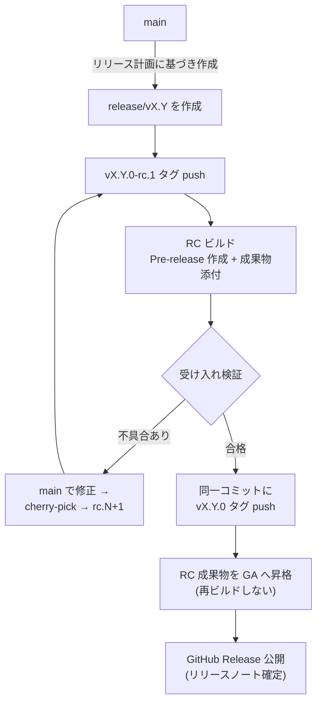
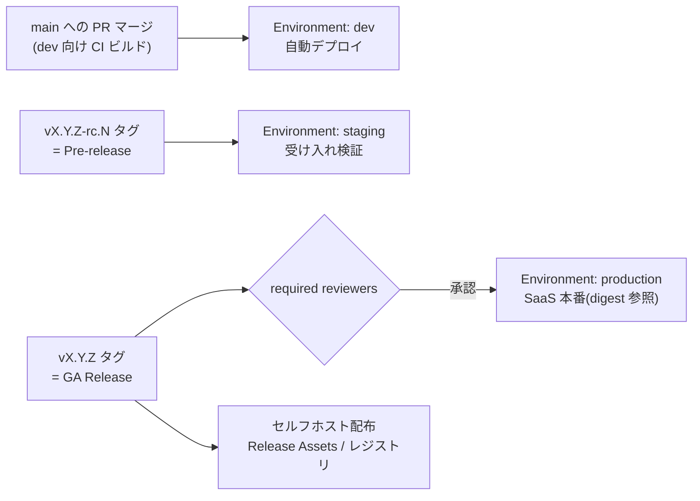

# リリースとデプロイ

リリースフロー（GitHub Release）と、環境・デプロイ（GitHub Environments）を定める。全体像は[概要](./)を参照。

## このページの要点

- GitHub Release を出荷バージョンの単一の正とする。SaaS もセルフホストも同一の Release から出荷する。
- 出荷成果物のビルドは RC タグ push 時の 1 回だけとする。GA は再ビルドせず、RC 成果物を昇格させる。
- 環境はブランチではなく GitHub Environments で表す。`staging` / `production` へはタグ起点でのみデプロイする。

## リリースフロー（GitHub Release）

### リリースの位置づけ

GitHub Release を「**出荷されたバージョンの単一の正（single source of truth）**」とする。SaaS 本番デプロイとセルフホスト配布は、いずれも同一の GitHub Release に紐づく成果物から行う。

| Release の種別 | タグ | GitHub Release 設定 | 用途 |
| --- | --- | --- | --- |
| リリース候補 | `vX.Y.Z-rc.N` | **Pre-release** としてマーク | staging 検証、先行顧客向け評価版 |
| 正式リリース | `vX.Y.Z` | Latest release | SaaS 本番デプロイ、セルフホスト正式配布 |

### リリース手順

タグ操作と成果物の流れは次のとおり。どの環境へデプロイされるかは「[デプロイパイプライン全体像](#デプロイパイプライン全体像)」に示す。

1. リリース計画に基づき `main` から `release/vX.Y` を作成する。作成後は新機能の追加を禁止し、cherry-pick による修正のみ受け入れる。
2. `vX.Y.Z-rc.N` タグを push すると、CI が **Pre-release の GitHub Release** を自動作成し、成果物をビルド・添付する。出荷成果物のビルドはこの 1 回だけである（[GA 昇格規約（再ビルドの禁止）](#ga-昇格規約-再ビルドの禁止)）。
3. staging での受け入れ検証に合格したら、**同一コミットに** `vX.Y.Z` タグを付与する（RC と GA でコミットをずらさない）。
4. GA タグ push をトリガーに、GA ワークフローが **RC 成果物を GA へ昇格（promotion）** する。ビルドは実行しない。
5. GitHub Release を正式公開し、リリースノートを確定する。公開された Release の成果物を用いて、SaaS 本番へデプロイし、セルフホスト向けに配布する。

### GitHub Release 運用規約

- **自動作成**: Release はタグ push をトリガーに GitHub Actions で作成する。手動での Release 作成は禁止する（タグ・Release・成果物の対応ずれを防ぐ）。
- **リリースノート**: `.github/release.yml` のカテゴリ設定（新機能 / 改善 / 不具合修正 / 破壊的変更 / 依存関係）で自動生成し、リリース責任者が公開前に編集・確定する。カテゴリ分類には PR ラベルを使うため、PR には種別ラベルの付与を必須とする。
- **リリースノートの見出し**: 自動生成されるノートの各行は、当該リリースに含まれる**マージ済み PR のタイトル**である。したがって PR タイトルの品質がそのままリリースノートの品質になる。PR タイトルは Conventional Commits に準拠させ（[PR タイトル規約](./merge-rules#pr-タイトル規約)）、type をラベルへ、要約を見出し行へ対応させる。リリース責任者による公開前の編集は、この自動生成結果の補正に留める。
- **成果物（Release Assets）**: セルフホスト版インストーラ・展開用パッケージ・チェックサム（SHA-256）・SBOM を添付する。コンテナイメージはコンテナレジストリに `vX.Y.Z` タグで push し、Release ノートにイメージダイジェストを記載する。
- **Pre-release の扱い**: `-rc.N` タグの Release は必ず Pre-release としてマークし、Latest release に昇格させない。
- **不変性**: 公開済み Release のタグ付け直し（force push / タグ削除→再作成）は禁止する。修正が必要な場合はパッチバージョンを上げて新しい Release を発行する。

### GA 昇格規約（再ビルドの禁止）

**GA ワークフローではビルドを一切実行しない。** GA は最終 RC 成果物への**参照の付け替え（昇格）** として実装する。

理由はビルドの再現性にある。ビルド時刻・依存解決・ベースイメージの差異で、ダイジェストは変わり得る。GA 時に再ビルドすると、「staging で検証した成果物」と「出荷される成果物」の同一性を検証できなくなる。

この規定が対象とするのは**出荷成果物**であり、`main` への push で走る `dev` 向けの CI ビルドは含まない。`dev` 向けの成果物は GitHub Release に紐づかず、`staging` にも `production` にも、セルフホスト配布物にも昇格しない。

| 成果物 | 昇格方法 |
| --- | --- |
| コンテナイメージ | 最終 RC イメージの**ダイジェストに対して** `vX.Y.Z` タグを追加付与する（`crane tag` / `skopeo copy` / `docker buildx imagetools create` 等）。イメージ本体は 1 バイトも変化しない |
| Release Assets（インストーラ・パッケージ） | 最終 RC Release の資産を GA Release へそのままコピーする。チェックサム（SHA-256）は再計算せず RC 時の値を引き継ぎ、GA ワークフローで一致検証する |
| 署名・アテステーション | RC ビルド時に署名・provenance を生成し、GA 昇格時は**検証のみ**行う。GA での再署名が必要な場合もダイジェスト不変を前提とする |

運用ルール:

- GA ワークフローの冒頭で次の 2 点を検証し、不一致ならワークフローを失敗させる。
  - GA タグと最終 RC タグが同一コミットを指すこと
  - 昇格対象イメージのダイジェストが、RC Release に記録された値と一致すること
- production へのデプロイはタグ名ではなく**イメージダイジェスト（`@sha256:...`）で参照**する。タグは人間向けの別名にすぎず、デプロイの同一性はダイジェストで担保する。
- **バージョン文字列の埋め込みに注意**: 成果物内に埋め込むバージョン情報は `X.Y.Z` + git SHA とし、`-rc.N` サフィックスをバイナリに焼き込まない。RC / GA の区別はタグと Release のメタデータでのみ表現する（焼き込むと GA 昇格時に成果物の書き換えが必要になり、再ビルド禁止と矛盾する）。

### 緊急時の短縮経路

障害対応で時間的猶予がない場合、リリース責任者の判断で **手順 3 の staging 受け入れ検証（soak）を省略**できる（[障害対応](./incident#ホットフィックス手順)）。このとき `vX.Y.Z-rc.1` タグを push して RC ビルドを走らせ、その完了後に**同一コミットへ** `vX.Y.Z` タグを付与する。

**RC タグ自体は省略しない**。省略すると、次が同時に崩れる。

- 昇格元となる RC 成果物が存在しないため、GA ワークフローは昇格すべきイメージ・資産を持たず、前掲の GA 昇格規約が定める同一コミット検証・ダイジェスト検証も参照先を失う
- 「staging で検証した成果物と出荷する成果物が同一である」という build once の前提が、そもそも成立しない

RC タグを打つ短縮経路なら、省略されるのは *検証にかける時間* だけであり、build once・同一コミット検証・ダイジェスト検証の不変条件はすべて保たれる。省略した受け入れ検証は、GA 後に事後検証として必ず実施する。

## 環境とデプロイ（GitHub Environments）

### 環境定義

環境はブランチではなく GitHub Environments として定義し、**同一アーティファクトの昇格（build once, deploy many）** を原則とする。用途とデプロイ元、および Deployment protection rules による保護設定を、環境ごとに次のとおり定める。

| 設定項目 | `dev` | `staging` | `production` |
| --- | --- | --- | --- |
| 用途 | 開発検証（次期バージョンの動作確認） | リリース候補の受け入れ検証 | SaaS 本番 |
| デプロイ元 | `main` への push（自動デプロイ） | `vX.Y.Z-rc.N` タグの成果物 | `vX.Y.Z`（GA）タグの成果物 |
| Deployment branch/tag policy | `main` のみ | タグ `v*-rc*` のみ | タグ `v*`（`-rc` を含むタグはワークフロー側で拒否） |
| Required reviewers | なし | なし（任意で 1 名） | **1 名以上（リリース責任者ロール）** |
| デプロイ実行者による自己承認 | — | — | **禁止**（prevent self-review を有効化） |
| Wait timer | なし | なし | 5 分（誤操作時の取り消し猶予。値はチームで調整） |
| Admin bypass | — | 無効 | **無効**（"Allow administrators to bypass" をオフ） |
| Environment secrets | dev 用資格情報 | staging 用資格情報 | 本番資格情報（この環境のみに格納） |

- `dev` のみ `main` 直結とし、次期バージョンの継続的な動作確認に用いる。`dev` の状態は出荷品質を意味しない。
- `staging` と `production` はタグ（= GitHub Release）起点でのみデプロイされる。SaaS 本番が `main` から直接デプロイされる経路は存在しない。
- **タグのパターンに否定は書けない。** `production` の `v*` は `vX.Y.Z-rc.N` にも一致するため、環境の設定だけでは RC を締め出せない。production デプロイのワークフロー冒頭で、タグ名が `-rc` を含む場合は失敗させる（「[GA 昇格規約（再ビルドの禁止）](#ga-昇格規約-再ビルドの禁止)」の同一コミット検証・ダイジェスト検証と同じ場所で行う）。

### 環境運用の補足規約

- **承認記録**: production への required reviewers 承認は GitHub Deployments の履歴に残る。これを正式なデプロイ承認記録とし、別途の承認書類は作成しない。
- **同時実行制御**: production デプロイのワークフローには `concurrency` グループを設定して直列化する（`cancel-in-progress: false`）。進行中デプロイへの割り込みを防ぐため。
- **シークレット管理**: 資格情報（接続文字列等）は Environment secrets に格納し、リポジトリシークレットに本番資格情報を置かない。AWS 認証は OIDC（`id-token: write`）を用い、長期アクセスキーを保存しない。
- **OIDC ロールの環境分離**: AWS IAM ロールは環境ごとに分離し、trust policy の条件で `sub` クレームに `environment:production` 等を要求する。これにより「production の Environment protection を通過したジョブ以外は本番ロールを引き受けられない」ことを AWS 側でも強制する。
- **Custom deployment protection rules（拡張）**: production には、GitHub Apps による外部ゲートを将来的に追加できる。監視アラートの静穏確認、変更管理チケットの存在確認、デプロイ可能時間帯の制限などが該当する。導入時は本規約を改訂する。
- 環境ごとの設定差分（エンドポイント、フラグ既定値等）は Environment variables または構成リポジトリで管理し、アプリケーションコードのブランチ分岐で表現しない。

### デプロイパイプライン全体像

どの成果物がどの環境へ入り、どこに承認ゲートが立つかは次のとおり。

