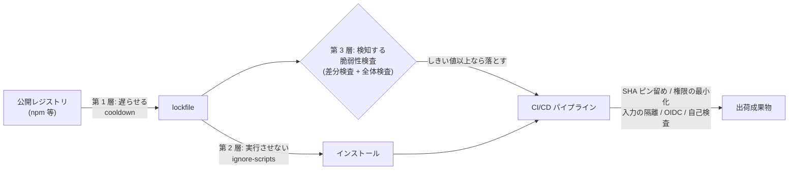

# 依存とサプライチェーン

依存の取り込み方、脆弱性への対処、CI/CD パイプライン自体の防御を定める。

このページの規約が何によって守られるかは、[規約の担保状況](./enforcement)に一覧としてまとめる。

## このページの要点

- 守る対象は 2 つの軸に分かれる。**依存**（何を取り込むか）と、**パイプライン**（取り込んだものをどう出荷物へ変えるか）。
- 依存に対する防御は **遅らせる → 実行させない → 検知する** の 3 層。どの層も単独では破られる前提で重ねる。
- パイプラインに対する防御は 5 つ。Actions の SHA ピン留め・権限の最小化・信頼できない入力の隔離・シークレットと OIDC・ワークフロー自身の検査。

## 脅威モデル

攻撃者が狙うのは、自分たちが書いたコードではなく、**そこへ合流してくるもの**と、**それを出荷物へ変える経路**である。

### 防御の全体像

- **軸 1: 依存**（図の左側）は「[依存の取り込み](#依存の取り込み)」と「[脆弱性の検知と対処](#脆弱性の検知と対処)」で扱う。3 層のうち第 1・第 2 層が前者、第 3 層が後者にあたる。
- **軸 2: パイプライン**（図の右側）は「[パイプラインの防御](#パイプラインの防御)」で扱う。3 層とは別の軸である。

### 流入口ごとの対処

| 流入口 | 攻撃の形 | 本規約の対処 | 定める節 |
| --- | --- | --- | --- |
| 直接依存 | 保守者アカウントの侵害や引き継ぎ詐取により、悪性バージョンが公開される | 公開直後のバージョンを寝かせる | [依存の取り込み](#依存の取り込み) |
| 推移的依存（直接依存が引き連れてくる依存） | 直接は使っていないパッケージが lockfile へ間接的に引き込まれる | インストール時スクリプトを実行しない | [依存の取り込み](#依存の取り込み) |
| インストール処理 | `postinstall` 等のライフサイクルスクリプト（インストール時に自動実行されるスクリプト）で任意コードが走り、資格情報が外部送信される | 同上 | [依存の取り込み](#依存の取り込み) |
| 既知の脆弱性 | 取り込み済みの依存に後から [advisory](./glossary)（脆弱性の公開情報）が生える | lockfile 全体を CI で検査する | [脆弱性の検知と対処](#脆弱性の検知と対処) |
| CI ワークフロー | Action のタグ再付与、フォーク PR からの昇格トークン奪取、`run:` への[スクリプトインジェクション](./glossary) | SHA ピン留め・最小権限・入力の隔離 | [パイプラインの防御](#パイプラインの防御) |
| ビルド成果物 | 出荷物が検証済みのものと別物にすり替わる | タグ起点デプロイと再ビルド禁止 | [リリースとデプロイ](./release) |
| 資格情報 | 長期有効なシークレットの窃取 | Environment secrets と [OIDC](./glossary) | [パイプラインの防御](#パイプラインの防御) |

## 依存の取り込み

**3 層のうち第 1 層（遅らせる）と第 2 層（実行させない）をここで定める。** 第 3 層は次の「[脆弱性の検知と対処](#脆弱性の検知と対処)」で扱う。

### lockfile を単一の情報源とする（3 層の土台）

1. [lockfile](./glossary)（`package-lock.json` 等）を必ずコミットする。直接依存と推移的依存の解決済みバージョン、および完全性ハッシュを固定するため。
2. CI は lockfile 固定のインストール（`npm ci` 等）を用いる。バージョン範囲を再解決するインストールを CI で使ってはならない。
3. lockfile を伴わない依存追加は認めない。

### 第 1 層: cooldown で新しいバージョンを寝かせる

npm エコシステムへの攻撃は「悪性バージョンを公開し、気付かれて取り下げられるまでの数時間から数日で拡散させる」形をとる。したがって**新しいバージョンを数日寝かせるだけで大半を回避できる**。

1. 依存更新ボット（Dependabot 等）に [cooldown](./glossary)（公開直後のバージョンを取り込まない待機期間）を設定する。既定は通常の更新で 7 日、メジャー更新で 14 日とする。
2. **cooldown は version update にのみ適用し、security update には適用しない**。脆弱性の修正まで待たせると、cooldown で減らしたリスクより大きいリスクを抱える。
3. cooldown を適用するエコシステムは、実装の成熟度を確認したうえで選ぶ。**cooldown が更新そのものを止めてしまう不具合が既知のエコシステムには適用しない**。更新が止まると古いバージョンを指したまま固定され、既知の脆弱性を抱え続ける。

**本リポジトリでの適用**: `.github/dependabot.yml` で npm にのみ cooldown を設定し、GitHub Actions には設定していない。後者は cooldown の判定がリリース公開日ではなくタグのコミット日で行われ、更新が事実上停止する報告があるためである。Action の改竄については、後述の SHA ピン留めがすでに対処している。

**cooldown は推移的依存には効かないことがある**。lockfile へ間接的に引き込まれる依存は、公開直後でも入りうる。この穴は次節（第 2 層）が受け持つ。

### 第 2 層: インストール時スクリプトを実行しない

1. パッケージのインストール時に走るライフサイクルスクリプト（`preinstall` / `install` / `postinstall` / `prepare`）を無効化する。npm であれば `.npmrc` に `ignore-scripts=true` を置く。
2. 悪性パッケージが任意コードを走らせる主要な経路がここである。無効化しておけば、取り込んでしまってもインストール段階では実行されない。cooldown が取りこぼす推移的依存は、この層で受け止める。
3. 無効化により壊れる依存が現れた場合、**ビルドが目に見えて失敗する**。設定を黙って戻すのではなく、その依存が本当に必要かを PR で判断する。

### 依存の追加・更新をレビューする

1. 新規依存の追加 PR には、解決したい課題・検討した代替・保守状況（最終更新、保守者数）を記載する。
2. 依存を増やさない選択肢を先に検討する。数行のために依存を 1 つ増やす判断は、攻撃面を恒久的に広げる。
3. 更新ボットが作った PR も**自動マージしない**。CI の成功に加えて人のレビューを要する。

## 脆弱性の検知と対処

**3 層のうち第 3 層（検知する）をここで定める。** 第 1・第 2 層をすり抜けて取り込まれた依存、および取り込み後に脆弱性が判明した依存を捕まえる層である。

### 検知は 2 層で行う

| 層 | 対象 | 検知できないもの |
| --- | --- | --- |
| 差分検査（例: `dependency-review`） | その PR が追加・更新した依存 | すでに lockfile に載っている依存 |
| 全体検査（例: `npm audit` の CI ゲート） | lockfile 全体 | — |

差分検査だけでは不十分である。**すでに取り込み済みの依存に後から advisory が生えた場合、どの PR も依存を触らないため差分検査は何も報告せず、CI は緑のまま素通りする**。lockfile 全体を対象とする検査を必ず併設する。

### しきい値をそろえる

1. 2 つの検査には同じ深刻度しきい値を用いる（既定は high 以上で失敗）。
2. 同じ値を 2 か所で宣言せざるを得ない場合は、**両者が一致することを CI で検査する**。片方だけが変更されると、PR が持ち込む依存と既存の依存とで基準が食い違う。

### 期限付き例外（allowlist）

上流に修正が存在しない advisory は必ず出る。CI が恒常的に赤いままだと、しきい値を緩める圧力がかかり、いずれ何も検知しない検査になる。これを避けるため、例外を認める。ただし**放置できない形**で認める。

1. 例外は **[advisory](./glossary) 単位**（GHSA 等、脆弱性 1 件ごとに振られる識別子）で登録する。パッケージ単位で検査を無効化してはならない。同じパッケージの別の脆弱性まで見逃すため。
2. 各例外に **理由** と **再評価期限** を必須とする。理由には「なぜ影響が無いか」を書く。「上流に修正が無い」は状況の説明であり、影響が無い理由にはならない。
3. **期限を過ぎた例外は CI を失敗させる**。除外したまま忘れることを防ぐ。
4. 理由や期限を欠く例外は、設定不正として CI で弾く。

**本リポジトリでの適用**: `.github/security.json` の `audit.allow` がこれにあたる。設定ファイルは、規約を強制するゲートである CI 自身が持つ場所に置く（[PR タイトル規約](./merge-rules#pr-タイトル規約)と同じ理由による）。

## パイプラインの防御

**ここからは軸 2（パイプライン）である。** 依存への 3 層防御とは別に、取り込んだものを出荷物へ変える経路そのものを守る。ここを取られると、リポジトリ上のコードが健全でも出荷物は汚染される。

### Actions はコミット SHA で固定する

1. `uses:` の参照はタグやブランチではなく **40 桁のコミット SHA** とする（[SHA ピン留め](./glossary)）。可読性のため `# vX.Y.Z` のバージョンコメントを添える。
2. タグは可変である。攻撃者が保守者権限を得れば、同じタグを別のコミットへ付け替えて内容を差し替えられる。SHA は内容に紐づくため、タグを付け替えても参照先は変わらない。
3. ピンが古いまま残らないよう、SHA の更新は依存更新ボットに任せる。

### 権限を最小化する

1. ワークフローの既定を `permissions: contents: read` とし、書き込み権限は必要な job にだけ宣言する。
2. チェックアウト時に `persist-credentials: false` を指定し、後続ステップへ資格情報を残さない。
3. すべての job に `timeout-minutes` を設定する。暴走したワークフローは課金だけでなく、攻撃者にとっての実行時間にもなる。

### 信頼できない入力を実行しない

フォークからの PR は、そのリポジトリで最も信頼できない入力である。

1. `pull_request_target`（フォークからの PR でも base 側の設定で動くトリガー）は base のコードで動作し、**書き込み権限を持つトークンを与えられる**。このトリガーで **PR head をチェックアウトしてはならない**。検証ロジックとその設定は必ず base 側から読む。
2. PR タイトル・本文・ブランチ名・コミットメッセージを `run:` へ直接展開してはならない（[スクリプトインジェクション](./glossary)）。`env:` 経由で環境変数として渡す。
3. 書き込み権限を要する処理（ラベル付与など）は、PR head のコードを一切実行せずに完結させる。

### シークレットと OIDC

1. 長期有効なクラウド資格情報をリポジトリシークレットに格納しない。**[OIDC](./glossary) による短期資格情報の取得**を用いる（CI が ID トークンを提示して、その場限りの資格情報を得る仕組み）。
2. 本番資格情報は Environment secrets に閉じ、保護ルールを課した環境からのみ参照可能にする（[リリースとデプロイ](./release)）。
3. ログにシークレットの値を出力しない。混入を検知する仕組みは、値ではなく検出位置のみを報告する。

### ワークフロー自身を検査する

1. ワークフロー定義の静的解析（actionlint 等）を CI に含め、blocking とする。
2. Actions のセキュリティ監査（zizmor 等）を導入し、`pull_request_target` の誤用・スクリプトインジェクション・過剰権限を機械検知する。
3. 段階導入する場合は、まず非ブロッキングで findings を可視化し、既知の安全な事例を整理してから blocking へ切り替える。**非ブロッキングのまま放置しない**。

## 出荷成果物

ビルド済み成果物のすり替えに対しては、タグ起点のデプロイと再ビルドの禁止で対処する（[リリースとデプロイ](./release)）。成果物の来歴（SBOM＝構成部品の一覧、provenance＝どこで何から作られたかの証明、および署名）に関する規約は今後定める。

## 関連

- 禁止事項の一覧は[禁止事項](./anti-patterns)にまとめる。
- 用語は[用語と背景](./glossary)を参照。
